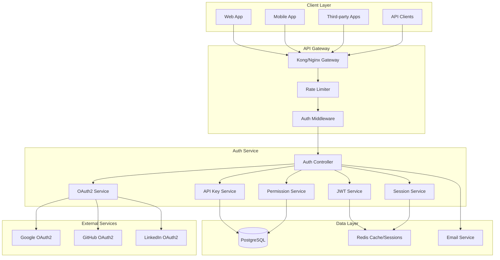
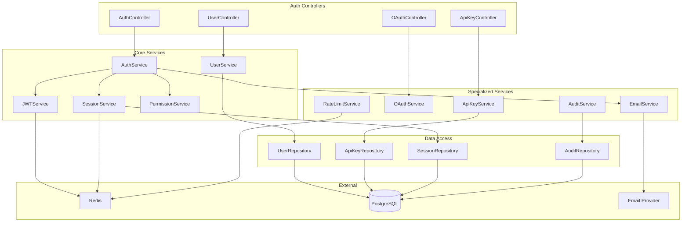

# Design Document - Système d'Authentification

## Overview

Le système d'authentification ROMAPI fournit une solution complète de gestion des identités, incluant l'authentification JWT, OAuth2, la gestion des API keys, le rate limiting, et le contrôle d'accès basé sur les rôles (RBAC). Le design suit une architecture microservice avec Redis pour les sessions et le cache, intégré avec le Backend API Core.

L'architecture privilégie la sécurité, la scalabilité et l'interopérabilité avec les autres microservices de l'écosystème ROMAPI.

## Architecture

### Architecture Globale du Système d'Auth



### Architecture Détaillée du Service Auth



## Components and Interfaces

### 1. Auth Controller

**Responsabilités :**
- Gestion des endpoints d'authentification
- Validation des credentials
- Génération et validation des tokens
- Gestion des sessions utilisateur

```typescript
@Controller('auth')
@ApiTags('Authentication')
export class AuthController {
  constructor(
    private readonly authService: AuthService,
    private readonly jwtService: JWTService,
    private readonly sessionService: SessionService
  ) {}

  @Post('register')
  @ApiOperation({ summary: 'Register new user' })
  async register(@Body() registerDto: RegisterDto): Promise<AuthResponseDto> {
    const user = await this.authService.register(registerDto);
    const tokens = await this.jwtService.generateTokens(user);
    await this.sessionService.createSession(user.id, tokens.refreshToken);
    
    return {
      user: this.authService.toUserResponseDto(user),
      accessToken: tokens.accessToken,
      refreshToken: tokens.refreshToken,
      expiresIn: tokens.expiresIn,
    };
  }

  @Post('login')
  @ApiOperation({ summary: 'Login user' })
  async login(@Body() loginDto: LoginDto): Promise<AuthResponseDto> {
    const user = await this.authService.validateUser(loginDto.email, loginDto.password);
    const tokens = await this.jwtService.generateTokens(user);
    await this.sessionService.createSession(user.id, tokens.refreshToken);
    
    return {
      user: this.authService.toUserResponseDto(user),
      accessToken: tokens.accessToken,
      refreshToken: tokens.refreshToken,
      expiresIn: tokens.expiresIn,
    };
  }

  @Post('refresh')
  @ApiOperation({ summary: 'Refresh access token' })
  async refresh(@Body() refreshDto: RefreshTokenDto): Promise<TokenResponseDto> {
    const tokens = await this.jwtService.refreshTokens(refreshDto.refreshToken);
    return tokens;
  }

  @Post('logout')
  @UseGuards(JwtAuthGuard)
  @ApiOperation({ summary: 'Logout user' })
  async logout(@Req() req: AuthenticatedRequest): Promise<void> {
    await this.sessionService.invalidateSession(req.user.id, req.token);
  }

  @Post('forgot-password')
  @ApiOperation({ summary: 'Request password reset' })
  async forgotPassword(@Body() forgotDto: ForgotPasswordDto): Promise<void> {
    await this.authService.requestPasswordReset(forgotDto.email);
  }

  @Post('reset-password')
  @ApiOperation({ summary: 'Reset password with token' })
  async resetPassword(@Body() resetDto: ResetPasswordDto): Promise<void> {
    await this.authService.resetPassword(resetDto.token, resetDto.newPassword);
  }
}
```

### 2. JWT Service

**Stratégie de gestion des tokens :**

```typescript
@Injectable()
export class JWTService {
  constructor(
    private readonly configService: ConfigService,
    private readonly sessionService: SessionService,
    private readonly auditService: AuditService
  ) {}

  async generateTokens(user: User): Promise<TokenPair> {
    const payload: JWTPayload = {
      sub: user.id,
      email: user.email,
      userType: user.userType,
      plan: user.plan,
      permissions: await this.getUserPermissions(user),
      iat: Math.floor(Date.now() / 1000),
    };

    const accessToken = jwt.sign(payload, this.configService.get('JWT_SECRET'), {
      expiresIn: this.configService.get('JWT_ACCESS_EXPIRES', '15m'),
    });

    const refreshToken = jwt.sign(
      { sub: user.id, type: 'refresh' },
      this.configService.get('JWT_REFRESH_SECRET'),
      { expiresIn: this.configService.get('JWT_REFRESH_EXPIRES', '7d') }
    );

    await this.auditService.logTokenGeneration(user.id, 'access_token');

    return {
      accessToken,
      refreshToken,
      expiresIn: this.getTokenExpiration('JWT_ACCESS_EXPIRES'),
    };
  }

  async validateToken(token: string): Promise<JWTPayload> {
    try {
      const payload = jwt.verify(token, this.configService.get('JWT_SECRET')) as JWTPayload;
      
      // Check if token is blacklisted
      const isBlacklisted = await this.sessionService.isTokenBlacklisted(token);
      if (isBlacklisted) {
        throw new UnauthorizedException('Token has been revoked');
      }

      return payload;
    } catch (error) {
      if (error instanceof jwt.TokenExpiredError) {
        throw new UnauthorizedException('Token has expired');
      }
      throw new UnauthorizedException('Invalid token');
    }
  }

  async refreshTokens(refreshToken: string): Promise<TokenPair> {
    try {
      const payload = jwt.verify(
        refreshToken,
        this.configService.get('JWT_REFRESH_SECRET')
      ) as { sub: string; type: string };

      if (payload.type !== 'refresh') {
        throw new UnauthorizedException('Invalid refresh token');
      }

      const session = await this.sessionService.validateRefreshToken(payload.sub, refreshToken);
      if (!session) {
        throw new UnauthorizedException('Refresh token not found or expired');
      }

      const user = await this.userService.findById(payload.sub);
      const newTokens = await this.generateTokens(user);
      
      // Update session with new refresh token
      await this.sessionService.updateSession(session.id, newTokens.refreshToken);

      return newTokens;
    } catch (error) {
      throw new UnauthorizedException('Invalid refresh token');
    }
  }

  private async getUserPermissions(user: User): Promise<string[]> {
    // Implementation depends on your permission system
    const basePermissions = ['read:profile', 'update:profile'];
    
    if (user.userType === UserType.BUSINESS) {
      basePermissions.push('read:business', 'update:business');
    }
    
    if (user.userType === UserType.ADMIN) {
      basePermissions.push('admin:*');
    }

    return basePermissions;
  }
}

interface JWTPayload {
  sub: string;
  email: string;
  userType: UserType;
  plan: Plan;
  permissions: string[];
  iat: number;
  exp?: number;
}

interface TokenPair {
  accessToken: string;
  refreshToken: string;
  expiresIn: number;
}
```

### 3. API Key Service

**Gestion des clés API :**

```typescript
@Injectable()
export class ApiKeyService {
  constructor(
    private readonly apiKeyRepository: ApiKeyRepository,
    private readonly rateLimitService: RateLimitService,
    private readonly auditService: AuditService
  ) {}

  async createApiKey(userId: string, createDto: CreateApiKeyDto): Promise<ApiKeyResponseDto> {
    // Generate secure API key
    const keyValue = this.generateSecureKey();
    const keyPrefix = keyValue.substring(0, 8);
    const keyHash = await bcrypt.hash(keyValue, 12);

    const apiKey = await this.apiKeyRepository.create({
      userId,
      name: createDto.name,
      keyHash,
      keyPrefix,
      permissions: createDto.permissions || [],
      rateLimit: createDto.rateLimit || 1000,
      expiresAt: createDto.expiresAt,
    });

    await this.auditService.logApiKeyCreation(userId, apiKey.id);

    return {
      id: apiKey.id,
      name: apiKey.name,
      keyPrefix,
      keyValue, // Only returned once during creation
      permissions: apiKey.permissions,
      rateLimit: apiKey.rateLimit,
      expiresAt: apiKey.expiresAt,
      createdAt: apiKey.createdAt,
    };
  }

  async validateApiKey(keyValue: string): Promise<ApiKeyValidationResult> {
    const keyPrefix = keyValue.substring(0, 8);
    const apiKey = await this.apiKeyRepository.findByPrefix(keyPrefix);

    if (!apiKey || !apiKey.isActive) {
      throw new UnauthorizedException('Invalid API key');
    }

    if (apiKey.expiresAt && apiKey.expiresAt < new Date()) {
      await this.apiKeyRepository.deactivate(apiKey.id);
      throw new UnauthorizedException('API key has expired');
    }

    const isValid = await bcrypt.compare(keyValue, apiKey.keyHash);
    if (!isValid) {
      throw new UnauthorizedException('Invalid API key');
    }

    // Check rate limit
    const rateLimitResult = await this.rateLimitService.checkApiKeyLimit(
      apiKey.id,
      apiKey.rateLimit
    );

    if (!rateLimitResult.allowed) {
      throw new TooManyRequestsException('API key rate limit exceeded');
    }

    // Update last used timestamp
    await this.apiKeyRepository.updateLastUsed(apiKey.id);

    return {
      apiKey,
      user: apiKey.user,
      rateLimitRemaining: rateLimitResult.remaining,
      rateLimitReset: rateLimitResult.resetTime,
    };
  }

  async listUserApiKeys(userId: string): Promise<ApiKeyListResponseDto[]> {
    const apiKeys = await this.apiKeyRepository.findByUserId(userId);
    
    return apiKeys.map(key => ({
      id: key.id,
      name: key.name,
      keyPrefix: key.keyPrefix,
      permissions: key.permissions,
      rateLimit: key.rateLimit,
      isActive: key.isActive,
      lastUsedAt: key.lastUsedAt,
      expiresAt: key.expiresAt,
      createdAt: key.createdAt,
    }));
  }

  async revokeApiKey(userId: string, keyId: string): Promise<void> {
    const apiKey = await this.apiKeyRepository.findByIdAndUserId(keyId, userId);
    if (!apiKey) {
      throw new NotFoundException('API key not found');
    }

    await this.apiKeyRepository.deactivate(keyId);
    await this.auditService.logApiKeyRevocation(userId, keyId);
  }

  private generateSecureKey(): string {
    const prefix = 'rk_'; // ROMAPI Key prefix
    const randomBytes = crypto.randomBytes(32).toString('hex');
    return `${prefix}${randomBytes}`;
  }
}

interface ApiKeyValidationResult {
  apiKey: ApiKey;
  user: User;
  rateLimitRemaining: number;
  rateLimitReset: Date;
}
```

### 4. OAuth2 Service

**Intégration avec les providers externes :**

```typescript
@Injectable()
export class OAuthService {
  constructor(
    private readonly userService: UserService,
    private readonly jwtService: JWTService,
    private readonly auditService: AuditService,
    private readonly configService: ConfigService
  ) {}

  async initiateOAuth(provider: OAuthProvider, redirectUri: string): Promise<OAuthInitiateResponseDto> {
    const config = this.getProviderConfig(provider);
    const state = this.generateSecureState();
    
    // Store state in Redis with expiration
    await this.storeOAuthState(state, { provider, redirectUri });

    const authUrl = this.buildAuthUrl(config, state, redirectUri);

    return {
      authUrl,
      state,
    };
  }

  async handleOAuthCallback(
    provider: OAuthProvider,
    code: string,
    state: string
  ): Promise<AuthResponseDto> {
    // Validate state
    const storedState = await this.validateOAuthState(state);
    if (!storedState) {
      throw new UnauthorizedException('Invalid OAuth state');
    }

    // Exchange code for access token
    const providerConfig = this.getProviderConfig(provider);
    const tokenResponse = await this.exchangeCodeForToken(providerConfig, code);
    
    // Get user info from provider
    const userInfo = await this.getUserInfoFromProvider(provider, tokenResponse.access_token);
    
    // Find or create user
    let user = await this.userService.findByEmail(userInfo.email);
    
    if (!user) {
      // Create new user from OAuth info
      user = await this.userService.createFromOAuth({
        email: userInfo.email,
        name: userInfo.name,
        userType: UserType.INDIVIDUAL,
        oauthProvider: provider,
        oauthId: userInfo.id,
        emailVerified: true, // OAuth providers verify emails
      });
    } else {
      // Link OAuth account to existing user
      await this.userService.linkOAuthAccount(user.id, provider, userInfo.id);
    }

    // Generate JWT tokens
    const tokens = await this.jwtService.generateTokens(user);
    
    await this.auditService.logOAuthLogin(user.id, provider);

    return {
      user: this.userService.toUserResponseDto(user),
      accessToken: tokens.accessToken,
      refreshToken: tokens.refreshToken,
      expiresIn: tokens.expiresIn,
    };
  }

  private getProviderConfig(provider: OAuthProvider): OAuthProviderConfig {
    const configs = {
      [OAuthProvider.GOOGLE]: {
        clientId: this.configService.get('GOOGLE_CLIENT_ID'),
        clientSecret: this.configService.get('GOOGLE_CLIENT_SECRET'),
        authUrl: 'https://accounts.google.com/o/oauth2/v2/auth',
        tokenUrl: 'https://oauth2.googleapis.com/token',
        userInfoUrl: 'https://www.googleapis.com/oauth2/v2/userinfo',
        scopes: ['openid', 'email', 'profile'],
      },
      [OAuthProvider.GITHUB]: {
        clientId: this.configService.get('GITHUB_CLIENT_ID'),
        clientSecret: this.configService.get('GITHUB_CLIENT_SECRET'),
        authUrl: 'https://github.com/login/oauth/authorize',
        tokenUrl: 'https://github.com/login/oauth/access_token',
        userInfoUrl: 'https://api.github.com/user',
        scopes: ['user:email'],
      },
      [OAuthProvider.LINKEDIN]: {
        clientId: this.configService.get('LINKEDIN_CLIENT_ID'),
        clientSecret: this.configService.get('LINKEDIN_CLIENT_SECRET'),
        authUrl: 'https://www.linkedin.com/oauth/v2/authorization',
        tokenUrl: 'https://www.linkedin.com/oauth/v2/accessToken',
        userInfoUrl: 'https://api.linkedin.com/v2/people/~',
        scopes: ['r_liteprofile', 'r_emailaddress'],
      },
    };

    return configs[provider];
  }
}

enum OAuthProvider {
  GOOGLE = 'google',
  GITHUB = 'github',
  LINKEDIN = 'linkedin',
}
```

## Data Models

### Prisma Schema Extensions

```prisma
// Extensions to the existing schema for auth system

model User {
  // ... existing fields from backend-api-core
  
  // Auth specific fields
  passwordHash     String?   @map("password_hash") // Nullable for OAuth-only users
  emailVerified    Boolean   @default(false) @map("email_verified")
  emailVerifiedAt  DateTime? @map("email_verified_at")
  lastLoginAt      DateTime? @map("last_login_at")
  loginAttempts    Int       @default(0) @map("login_attempts")
  lockedUntil      DateTime? @map("locked_until")
  
  // OAuth fields
  oauthProviders   OAuthAccount[]
  
  // Relations
  sessions         Session[]
  apiKeys          ApiKey[] // Already exists
  auditLogs        AuditLog[]
  passwordResets   PasswordReset[]
}

model OAuthAccount {
  id           String        @id @default(dbgenerated("gen_random_uuid()")) @db.Uuid
  userId       String        @map("user_id") @db.Uuid
  provider     OAuthProvider
  providerId   String        @map("provider_id")
  accessToken  String?       @map("access_token")
  refreshToken String?       @map("refresh_token")
  expiresAt    DateTime?     @map("expires_at")
  createdAt    DateTime      @default(now()) @map("created_at")
  updatedAt    DateTime      @updatedAt @map("updated_at")

  user User @relation(fields: [userId], references: [id], onDelete: Cascade)

  @@unique([provider, providerId])
  @@map("oauth_accounts")
}

model Session {
  id           String    @id @default(dbgenerated("gen_random_uuid()")) @db.Uuid
  userId       String    @map("user_id") @db.Uuid
  refreshToken String    @map("refresh_token")
  userAgent    String?   @map("user_agent")
  ipAddress    String?   @map("ip_address") @db.Inet
  isActive     Boolean   @default(true) @map("is_active")
  expiresAt    DateTime  @map("expires_at")
  createdAt    DateTime  @default(now()) @map("created_at")
  lastUsedAt   DateTime  @default(now()) @map("last_used_at")

  user User @relation(fields: [userId], references: [id], onDelete: Cascade)

  @@index([userId, isActive])
  @@map("sessions")
}

model PasswordReset {
  id        String   @id @default(dbgenerated("gen_random_uuid()")) @db.Uuid
  userId    String   @map("user_id") @db.Uuid
  token     String   @unique
  expiresAt DateTime @map("expires_at")
  usedAt    DateTime? @map("used_at")
  createdAt DateTime @default(now()) @map("created_at")

  user User @relation(fields: [userId], references: [id], onDelete: Cascade)

  @@map("password_resets")
}

model AuditLog {
  id        String   @id @default(dbgenerated("gen_random_uuid()")) @db.Uuid
  userId    String?  @map("user_id") @db.Uuid
  action    String
  resource  String?
  details   Json     @default("{}")
  ipAddress String?  @map("ip_address") @db.Inet
  userAgent String?  @map("user_agent")
  createdAt DateTime @default(now()) @map("created_at")

  user User? @relation(fields: [userId], references: [id], onDelete: SetNull)

  @@index([userId, createdAt(sort: Desc)])
  @@index([action, createdAt(sort: Desc)])
  @@map("audit_logs")
}

enum OAuthProvider {
  GOOGLE
  GITHUB
  LINKEDIN
}
```

## Error Handling

### Auth-Specific Exceptions

```typescript
export class InvalidCredentialsException extends UnauthorizedException {
  constructor() {
    super('Invalid email or password');
  }
}

export class AccountLockedException extends UnauthorizedException {
  constructor(lockedUntil: Date) {
    super(`Account is locked until ${lockedUntil.toISOString()}`);
  }
}

export class EmailNotVerifiedException extends UnauthorizedException {
  constructor() {
    super('Email address not verified');
  }
}

export class TokenExpiredException extends UnauthorizedException {
  constructor() {
    super('Token has expired');
  }
}

export class ApiKeyInvalidException extends UnauthorizedException {
  constructor() {
    super('Invalid or expired API key');
  }
}

export class RateLimitExceededException extends TooManyRequestsException {
  constructor(resetTime: Date) {
    super(`Rate limit exceeded. Resets at ${resetTime.toISOString()}`);
  }
}

export class InsufficientPermissionsException extends ForbiddenException {
  constructor(requiredPermission: string) {
    super(`Insufficient permissions. Required: ${requiredPermission}`);
  }
}
```

## Security Considerations

### Password Security

```typescript
@Injectable()
export class PasswordService {
  private readonly saltRounds = 12;

  async hashPassword(password: string): Promise<string> {
    return bcrypt.hash(password, this.saltRounds);
  }

  async validatePassword(password: string, hash: string): Promise<boolean> {
    return bcrypt.compare(password, hash);
  }

  validatePasswordStrength(password: string): PasswordValidationResult {
    const minLength = 8;
    const hasUpperCase = /[A-Z]/.test(password);
    const hasLowerCase = /[a-z]/.test(password);
    const hasNumbers = /\d/.test(password);
    const hasSpecialChar = /[!@#$%^&*(),.?":{}|<>]/.test(password);

    const errors: string[] = [];

    if (password.length < minLength) {
      errors.push(`Password must be at least ${minLength} characters long`);
    }
    if (!hasUpperCase) {
      errors.push('Password must contain at least one uppercase letter');
    }
    if (!hasLowerCase) {
      errors.push('Password must contain at least one lowercase letter');
    }
    if (!hasNumbers) {
      errors.push('Password must contain at least one number');
    }
    if (!hasSpecialChar) {
      errors.push('Password must contain at least one special character');
    }

    return {
      isValid: errors.length === 0,
      errors,
    };
  }
}
```

### Rate Limiting Implementation

```typescript
@Injectable()
export class RateLimitService {
  constructor(@Inject('REDIS_CLIENT') private readonly redis: Redis) {}

  async checkUserLimit(userId: string, limit: number, windowMs: number): Promise<RateLimitResult> {
    const key = `rate_limit:user:${userId}`;
    return this.checkLimit(key, limit, windowMs);
  }

  async checkApiKeyLimit(apiKeyId: string, limit: number): Promise<RateLimitResult> {
    const key = `rate_limit:api_key:${apiKeyId}`;
    const windowMs = 60 * 60 * 1000; // 1 hour
    return this.checkLimit(key, limit, windowMs);
  }

  async checkIPLimit(ipAddress: string, limit: number, windowMs: number): Promise<RateLimitResult> {
    const key = `rate_limit:ip:${ipAddress}`;
    return this.checkLimit(key, limit, windowMs);
  }

  private async checkLimit(key: string, limit: number, windowMs: number): Promise<RateLimitResult> {
    const now = Date.now();
    const window = Math.floor(now / windowMs);
    const windowKey = `${key}:${window}`;

    const current = await this.redis.incr(windowKey);
    
    if (current === 1) {
      await this.redis.expire(windowKey, Math.ceil(windowMs / 1000));
    }

    const remaining = Math.max(0, limit - current);
    const resetTime = new Date((window + 1) * windowMs);

    return {
      allowed: current <= limit,
      remaining,
      resetTime,
      current,
    };
  }
}

interface RateLimitResult {
  allowed: boolean;
  remaining: number;
  resetTime: Date;
  current: number;
}
```

Ce design document fournit une architecture complète et sécurisée pour le système d'authentification, avec tous les composants nécessaires pour gérer l'authentification, l'autorisation, et la sécurité dans l'écosystème ROMAPI.