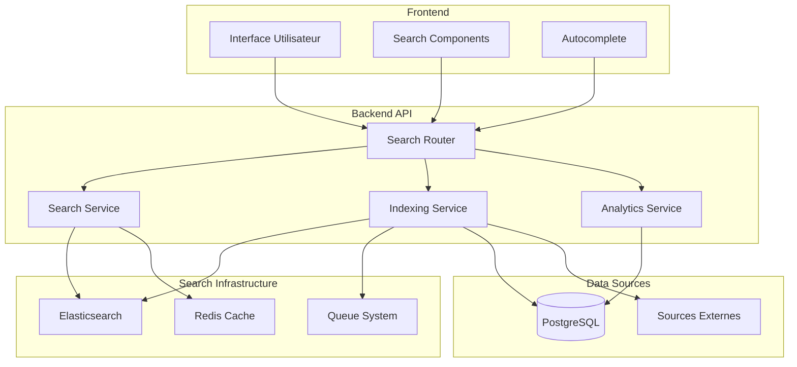
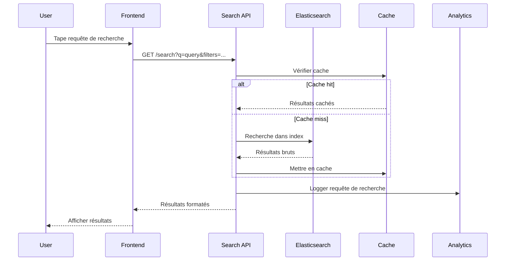

# Design Document - Système de Recherche

## Overview

Le système de recherche fournit des capacités de recherche textuelle avancée avec Elasticsearch, des filtres géographiques, des suggestions auto-complete et des analytics de recherche. Il s'intègre avec le backend ROMAPI pour indexer et rechercher dans les ressources API, entreprises et services.

## Architecture

### High-Level Architecture



### Search Flow



## Components and Interfaces

### 1. Search Service

```typescript
interface SearchService {
  // Recherche principale
  search(params: SearchParams): Promise<SearchResults>;
  
  // Suggestions auto-complete
  suggest(query: string, limit?: number): Promise<Suggestion[]>;
  
  // Recherche par catégorie
  searchByCategory(categoryId: string, params: SearchParams): Promise<SearchResults>;
  
  // Recherche géographique
  searchNearby(location: GeoLocation, radius: number, params: SearchParams): Promise<SearchResults>;
  
  // Recherche personnalisée
  personalizedSearch(userId: string, params: SearchParams): Promise<SearchResults>;
}

interface SearchParams {
  query?: string;
  filters?: SearchFilters;
  sort?: SortOptions;
  pagination?: PaginationParams;
  facets?: string[];
}

interface SearchFilters {
  categories?: string[];
  resourceTypes?: ResourceType[];
  plans?: ResourcePlan[];
  location?: GeoFilter;
  priceRange?: PriceRange;
  verified?: boolean;
}

interface SearchResults {
  hits: SearchHit[];
  total: number;
  facets: SearchFacets;
  suggestions?: string[];
  took: number;
}
```

### 2. Indexing Service

```typescript
interface IndexingService {
  // Indexation d'une ressource
  indexResource(resource: ApiResource): Promise<void>;
  
  // Mise à jour d'index
  updateResource(resourceId: string, updates: Partial<ApiResource>): Promise<void>;
  
  // Suppression d'index
  deleteResource(resourceId: string): Promise<void>;
  
  // Réindexation complète
  reindexAll(): Promise<void>;
  
  // Vérification de santé d'index
  checkIndexHealth(): Promise<IndexHealth>;
}

interface IndexHealth {
  status: 'green' | 'yellow' | 'red';
  totalDocs: number;
  indexSize: string;
  lastUpdate: Date;
  errors?: string[];
}
```

### 3. Analytics Service

```typescript
interface SearchAnalyticsService {
  // Logger une recherche
  logSearch(params: SearchLogParams): Promise<void>;
  
  // Logger un clic sur résultat
  logClick(searchId: string, resourceId: string, position: number): Promise<void>;
  
  // Obtenir les termes populaires
  getPopularTerms(period: TimePeriod): Promise<PopularTerm[]>;
  
  // Obtenir les recherches sans résultats
  getNoResultsQueries(period: TimePeriod): Promise<NoResultsQuery[]>;
  
  // Métriques de performance
  getSearchMetrics(period: TimePeriod): Promise<SearchMetrics>;
}

interface SearchLogParams {
  query: string;
  filters: SearchFilters;
  userId?: string;
  sessionId: string;
  userAgent: string;
  ipAddress: string;
  resultsCount: number;
  took: number;
}
```

## Data Models

### Elasticsearch Index Schema

```json
{
  "mappings": {
    "properties": {
      "id": { "type": "keyword" },
      "name": {
        "type": "text",
        "analyzer": "french_analyzer",
        "fields": {
          "keyword": { "type": "keyword" },
          "suggest": { "type": "completion" }
        }
      },
      "description": {
        "type": "text",
        "analyzer": "french_analyzer"
      },
      "category": {
        "type": "object",
        "properties": {
          "id": { "type": "keyword" },
          "name": { "type": "keyword" },
          "slug": { "type": "keyword" }
        }
      },
      "resourceType": { "type": "keyword" },
      "plan": { "type": "keyword" },
      "verified": { "type": "boolean" },
      "location": {
        "type": "geo_point"
      },
      "address": {
        "type": "object",
        "properties": {
          "city": { "type": "keyword" },
          "region": { "type": "keyword" },
          "country": { "type": "keyword" }
        }
      },
      "contact": {
        "type": "object",
        "properties": {
          "phone": { "type": "keyword" },
          "email": { "type": "keyword" },
          "website": { "type": "keyword" }
        }
      },
      "tags": { "type": "keyword" },
      "createdAt": { "type": "date" },
      "updatedAt": { "type": "date" },
      "popularity": { "type": "float" },
      "rating": { "type": "float" }
    }
  },
  "settings": {
    "analysis": {
      "analyzer": {
        "french_analyzer": {
          "type": "custom",
          "tokenizer": "standard",
          "filter": [
            "lowercase",
            "asciifolding",
            "french_stemmer",
            "french_stop"
          ]
        }
      },
      "filter": {
        "french_stemmer": {
          "type": "stemmer",
          "language": "french"
        },
        "french_stop": {
          "type": "stop",
          "stopwords": "_french_"
        }
      }
    }
  }
}
```

### Database Models

```typescript
// Table pour analytics de recherche
interface SearchLog {
  id: string;
  query: string;
  filters: Json;
  userId?: string;
  sessionId: string;
  userAgent: string;
  ipAddress: string;
  resultsCount: number;
  took: number;
  createdAt: Date;
}

// Table pour clics sur résultats
interface SearchClick {
  id: string;
  searchLogId: string;
  resourceId: string;
  position: number;
  createdAt: Date;
}

// Table pour recherches sauvegardées
interface SavedSearch {
  id: string;
  userId: string;
  name: string;
  query: string;
  filters: Json;
  createdAt: Date;
  updatedAt: Date;
}
```

## Error Handling

### Elasticsearch Errors

```typescript
class SearchErrorHandler {
  async handleElasticsearchError(error: ElasticsearchError): Promise<SearchResults> {
    switch (error.type) {
      case 'index_not_found_exception':
        // Déclencher réindexation
        await this.triggerReindexing();
        return this.getEmptyResults();
        
      case 'search_phase_execution_exception':
        // Simplifier la requête et réessayer
        return this.fallbackSearch();
        
      case 'timeout_exception':
        // Retourner résultats depuis cache
        return this.getCachedResults();
        
      default:
        // Logger l'erreur et retourner résultats vides
        this.logger.error('Elasticsearch error', error);
        return this.getEmptyResults();
    }
  }
}
```

### Fallback Strategies

1. **Cache Redis** : Résultats récents en cas d'indisponibilité ES
2. **Recherche PostgreSQL** : Recherche basique en base de données
3. **Résultats populaires** : Afficher les ressources les plus consultées
4. **Mode dégradé** : Interface simplifiée sans filtres avancés

## Testing Strategy

### Unit Tests

```typescript
describe('SearchService', () => {
  describe('search', () => {
    it('should return results for valid query', async () => {
      const results = await searchService.search({
        query: 'restaurant douala',
        filters: { categories: ['food'] }
      });
      
      expect(results.hits).toHaveLength(10);
      expect(results.total).toBeGreaterThan(0);
    });
    
    it('should handle empty query gracefully', async () => {
      const results = await searchService.search({ query: '' });
      expect(results.hits).toBeDefined();
    });
  });
  
  describe('suggest', () => {
    it('should return suggestions for partial query', async () => {
      const suggestions = await searchService.suggest('rest');
      expect(suggestions).toContain('restaurant');
    });
  });
});
```

### Integration Tests

```typescript
describe('Search Integration', () => {
  beforeEach(async () => {
    await setupTestIndex();
    await indexTestData();
  });
  
  it('should search and return formatted results', async () => {
    const response = await request(app)
      .get('/api/v1/search')
      .query({ q: 'test', limit: 5 })
      .expect(200);
      
    expect(response.body.hits).toHaveLength(5);
    expect(response.body.facets).toBeDefined();
  });
});
```

### Performance Tests

```typescript
describe('Search Performance', () => {
  it('should respond within 200ms for simple queries', async () => {
    const start = Date.now();
    await searchService.search({ query: 'test' });
    const duration = Date.now() - start;
    
    expect(duration).toBeLessThan(200);
  });
  
  it('should handle concurrent searches', async () => {
    const promises = Array(100).fill(null).map(() => 
      searchService.search({ query: 'concurrent test' })
    );
    
    const results = await Promise.all(promises);
    expect(results).toHaveLength(100);
  });
});
```

## Performance Optimization

### Caching Strategy

```typescript
class SearchCacheManager {
  // Cache des résultats de recherche (TTL: 5 minutes)
  async cacheSearchResults(key: string, results: SearchResults): Promise<void> {
    await this.redis.setex(`search:${key}`, 300, JSON.stringify(results));
  }
  
  // Cache des suggestions (TTL: 1 heure)
  async cacheSuggestions(query: string, suggestions: Suggestion[]): Promise<void> {
    await this.redis.setex(`suggest:${query}`, 3600, JSON.stringify(suggestions));
  }
  
  // Cache des facettes populaires (TTL: 24 heures)
  async cachePopularFacets(facets: SearchFacets): Promise<void> {
    await this.redis.setex('facets:popular', 86400, JSON.stringify(facets));
  }
}
```

### Index Optimization

```typescript
class IndexOptimizer {
  // Optimisation des requêtes Elasticsearch
  buildOptimizedQuery(params: SearchParams): ElasticsearchQuery {
    const query = {
      bool: {
        must: [],
        filter: [],
        should: []
      }
    };
    
    // Recherche textuelle avec boost
    if (params.query) {
      query.bool.must.push({
        multi_match: {
          query: params.query,
          fields: [
            'name^3',
            'description^2',
            'category.name^2',
            'tags'
          ],
          type: 'best_fields',
          fuzziness: 'AUTO'
        }
      });
    }
    
    // Filtres exacts
    if (params.filters?.categories) {
      query.bool.filter.push({
        terms: { 'category.id': params.filters.categories }
      });
    }
    
    // Boost pour ressources vérifiées
    query.bool.should.push({
      term: { verified: { value: true, boost: 1.5 } }
    });
    
    return query;
  }
}
```

## Security Considerations

### Input Validation

```typescript
class SearchValidator {
  validateSearchParams(params: SearchParams): ValidationResult {
    const errors: string[] = [];
    
    // Validation de la requête
    if (params.query && params.query.length > 200) {
      errors.push('Query too long');
    }
    
    // Validation des filtres
    if (params.filters?.priceRange) {
      if (params.filters.priceRange.min < 0) {
        errors.push('Invalid price range');
      }
    }
    
    // Protection contre injection
    if (params.query && this.containsSuspiciousPatterns(params.query)) {
      errors.push('Invalid query format');
    }
    
    return { isValid: errors.length === 0, errors };
  }
  
  private containsSuspiciousPatterns(query: string): boolean {
    const suspiciousPatterns = [
      /<script/i,
      /javascript:/i,
      /on\w+=/i,
      /\{\{.*\}\}/
    ];
    
    return suspiciousPatterns.some(pattern => pattern.test(query));
  }
}
```

### Rate Limiting

```typescript
class SearchRateLimiter {
  async checkRateLimit(userId: string, ipAddress: string): Promise<boolean> {
    const userKey = `search_rate:user:${userId}`;
    const ipKey = `search_rate:ip:${ipAddress}`;
    
    // Limite par utilisateur : 1000 recherches/heure
    const userCount = await this.redis.incr(userKey);
    if (userCount === 1) {
      await this.redis.expire(userKey, 3600);
    }
    if (userCount > 1000) {
      return false;
    }
    
    // Limite par IP : 100 recherches/heure pour non-authentifiés
    if (!userId) {
      const ipCount = await this.redis.incr(ipKey);
      if (ipCount === 1) {
        await this.redis.expire(ipKey, 3600);
      }
      if (ipCount > 100) {
        return false;
      }
    }
    
    return true;
  }
}
```

## Monitoring and Observability

### Metrics Collection

```typescript
class SearchMetrics {
  // Métriques de performance
  recordSearchLatency(duration: number): void {
    this.prometheus.histogram('search_duration_seconds').observe(duration / 1000);
  }
  
  // Métriques d'usage
  recordSearchQuery(query: string, resultsCount: number): void {
    this.prometheus.counter('search_queries_total').inc();
    this.prometheus.histogram('search_results_count').observe(resultsCount);
  }
  
  // Métriques d'erreur
  recordSearchError(errorType: string): void {
    this.prometheus.counter('search_errors_total', { type: errorType }).inc();
  }
}
```

### Health Checks

```typescript
class SearchHealthCheck {
  async checkHealth(): Promise<HealthStatus> {
    const checks = await Promise.allSettled([
      this.checkElasticsearch(),
      this.checkRedis(),
      this.checkIndexHealth()
    ]);
    
    const status = checks.every(check => check.status === 'fulfilled') 
      ? 'healthy' 
      : 'unhealthy';
      
    return {
      status,
      timestamp: new Date(),
      checks: {
        elasticsearch: checks[0].status,
        redis: checks[1].status,
        index: checks[2].status
      }
    };
  }
}
```