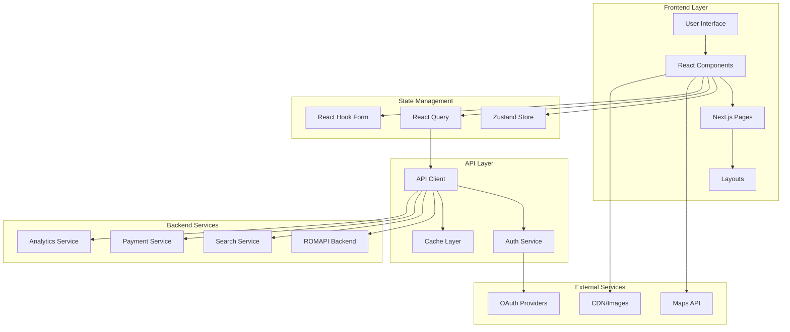
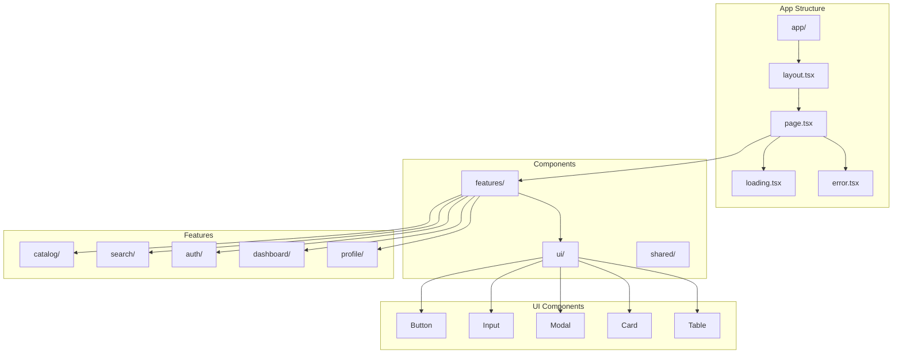

# Design Document - Frontend ECOSYSTE

## Overview

ECOSYSTE est l'interface web frontend qui permet aux utilisateurs de parcourir l'écosystème d'API, similaire à RapidAPI. Cette application Next.js 14+ avec App Router offre une expérience utilisateur moderne pour découvrir, tester et intégrer les API et services de l'écosystème ROMAPI.

## Architecture

### High-Level Architecture



### Component Architecture



## Components and Interfaces

### 1. State Management with Zustand

```typescript
// Global App Store
interface AppStore {
  // User state
  user: User | null;
  isAuthenticated: boolean;
  
  // UI state
  theme: 'light' | 'dark';
  language: 'fr' | 'en';
  sidebarOpen: boolean;
  
  // Search state
  searchQuery: string;
  searchFilters: SearchFilters;
  searchHistory: string[];
  
  // Actions
  setUser: (user: User | null) => void;
  setTheme: (theme: 'light' | 'dark') => void;
  setLanguage: (language: 'fr' | 'en') => void;
  toggleSidebar: () => void;
  setSearchQuery: (query: string) => void;
  setSearchFilters: (filters: SearchFilters) => void;
  addToSearchHistory: (query: string) => void;
}

// Auth Store
interface AuthStore {
  user: User | null;
  tokens: AuthTokens | null;
  isLoading: boolean;
  error: string | null;
  
  // Actions
  login: (credentials: LoginCredentials) => Promise<void>;
  logout: () => void;
  register: (data: RegisterData) => Promise<void>;
  refreshToken: () => Promise<void>;
  updateProfile: (data: ProfileData) => Promise<void>;
}

// Search Store
interface SearchStore {
  query: string;
  filters: SearchFilters;
  results: SearchResults | null;
  suggestions: string[];
  isLoading: boolean;
  history: SearchHistoryItem[];
  
  // Actions
  search: (query: string, filters?: SearchFilters) => Promise<void>;
  getSuggestions: (query: string) => Promise<void>;
  clearResults: () => void;
  addToHistory: (item: SearchHistoryItem) => void;
  clearHistory: () => void;
}
```

### 2. API Client with React Query

```typescript
// API Client Configuration
class ApiClient {
  private baseURL: string;
  private authStore: AuthStore;
  
  constructor(baseURL: string, authStore: AuthStore) {
    this.baseURL = baseURL;
    this.authStore = authStore;
  }
  
  private async request<T>(
    endpoint: string,
    options: RequestInit = {}
  ): Promise<T> {
    const url = `${this.baseURL}${endpoint}`;
    const token = this.authStore.tokens?.accessToken;
    
    const config: RequestInit = {
      ...options,
      headers: {
        'Content-Type': 'application/json',
        ...(token && { Authorization: `Bearer ${token}` }),
        ...options.headers,
      },
    };
    
    const response = await fetch(url, config);
    
    if (!response.ok) {
      if (response.status === 401) {
        await this.authStore.refreshToken();
        // Retry with new token
        return this.request(endpoint, options);
      }
      throw new ApiError(response.status, await response.text());
    }
    
    return response.json();
  }
  
  // Resource methods
  async getResources(params: GetResourcesParams): Promise<ResourcesResponse> {
    const searchParams = new URLSearchParams(params as any);
    return this.request(`/resources?${searchParams}`);
  }
  
  async getResource(id: string): Promise<Resource> {
    return this.request(`/resources/${id}`);
  }
  
  // Search methods
  async search(params: SearchParams): Promise<SearchResults> {
    return this.request('/search', {
      method: 'POST',
      body: JSON.stringify(params),
    });
  }
  
  async getSuggestions(query: string): Promise<string[]> {
    return this.request(`/search/suggestions?q=${encodeURIComponent(query)}`);
  }
}

// React Query Hooks
export const useResources = (params: GetResourcesParams) => {
  return useQuery({
    queryKey: ['resources', params],
    queryFn: () => apiClient.getResources(params),
    staleTime: 5 * 60 * 1000, // 5 minutes
  });
};

export const useResource = (id: string) => {
  return useQuery({
    queryKey: ['resource', id],
    queryFn: () => apiClient.getResource(id),
    enabled: !!id,
  });
};

export const useSearch = () => {
  return useMutation({
    mutationFn: (params: SearchParams) => apiClient.search(params),
    onSuccess: (data) => {
      // Update search store
      searchStore.getState().setResults(data);
    },
  });
};
```

### 3. Form Management with React Hook Form + Zod

```typescript
// Validation Schemas
const loginSchema = z.object({
  email: z.string().email('Email invalide'),
  password: z.string().min(8, 'Mot de passe trop court'),
  rememberMe: z.boolean().optional(),
});

const registerSchema = z.object({
  name: z.string().min(2, 'Nom trop court'),
  email: z.string().email('Email invalide'),
  password: z.string()
    .min(8, 'Minimum 8 caractères')
    .regex(/[A-Z]/, 'Au moins une majuscule')
    .regex(/[0-9]/, 'Au moins un chiffre'),
  confirmPassword: z.string(),
  userType: z.enum(['individual', 'business']),
  acceptTerms: z.boolean().refine(val => val, 'Vous devez accepter les conditions'),
}).refine(data => data.password === data.confirmPassword, {
  message: 'Les mots de passe ne correspondent pas',
  path: ['confirmPassword'],
});

const searchFiltersSchema = z.object({
  categories: z.array(z.string()).optional(),
  priceRange: z.object({
    min: z.number().min(0),
    max: z.number().min(0),
  }).optional(),
  location: z.object({
    city: z.string().optional(),
    radius: z.number().min(1).max(100).optional(),
  }).optional(),
  verified: z.boolean().optional(),
  plan: z.enum(['free', 'premium', 'featured']).optional(),
});

// Form Components
export const LoginForm: React.FC = () => {
  const authStore = useAuthStore();
  const router = useRouter();
  
  const form = useForm<z.infer<typeof loginSchema>>({
    resolver: zodResolver(loginSchema),
    defaultValues: {
      email: '',
      password: '',
      rememberMe: false,
    },
  });
  
  const onSubmit = async (data: z.infer<typeof loginSchema>) => {
    try {
      await authStore.login(data);
      router.push('/dashboard');
    } catch (error) {
      form.setError('root', {
        message: 'Email ou mot de passe incorrect',
      });
    }
  };
  
  return (
    <Form {...form}>
      <form onSubmit={form.handleSubmit(onSubmit)} className="space-y-4">
        <FormField
          control={form.control}
          name="email"
          render={({ field }) => (
            <FormItem>
              <FormLabel>Email</FormLabel>
              <FormControl>
                <Input placeholder="votre@email.com" {...field} />
              </FormControl>
              <FormMessage />
            </FormItem>
          )}
        />
        
        <FormField
          control={form.control}
          name="password"
          render={({ field }) => (
            <FormItem>
              <FormLabel>Mot de passe</FormLabel>
              <FormControl>
                <Input type="password" {...field} />
              </FormControl>
              <FormMessage />
            </FormItem>
          )}
        />
        
        <FormField
          control={form.control}
          name="rememberMe"
          render={({ field }) => (
            <FormItem className="flex items-center space-x-2">
              <FormControl>
                <Checkbox
                  checked={field.value}
                  onCheckedChange={field.onChange}
                />
              </FormControl>
              <FormLabel>Se souvenir de moi</FormLabel>
            </FormItem>
          )}
        />
        
        <Button type="submit" className="w-full" disabled={form.formState.isSubmitting}>
          {form.formState.isSubmitting ? 'Connexion...' : 'Se connecter'}
        </Button>
        
        {form.formState.errors.root && (
          <Alert variant="destructive">
            <AlertDescription>
              {form.formState.errors.root.message}
            </AlertDescription>
          </Alert>
        )}
      </form>
    </Form>
  );
};
```

### 4. Search Components

```typescript
// Search Bar Component
export const SearchBar: React.FC = () => {
  const [query, setQuery] = useState('');
  const [suggestions, setSuggestions] = useState<string[]>([]);
  const [showSuggestions, setShowSuggestions] = useState(false);
  const searchStore = useSearchStore();
  const router = useRouter();
  
  const debouncedQuery = useDebounce(query, 300);
  
  // Get suggestions
  const { data: suggestionsData } = useQuery({
    queryKey: ['suggestions', debouncedQuery],
    queryFn: () => apiClient.getSuggestions(debouncedQuery),
    enabled: debouncedQuery.length >= 2,
  });
  
  useEffect(() => {
    if (suggestionsData) {
      setSuggestions(suggestionsData);
      setShowSuggestions(true);
    }
  }, [suggestionsData]);
  
  const handleSearch = (searchQuery: string) => {
    searchStore.setSearchQuery(searchQuery);
    router.push(`/search?q=${encodeURIComponent(searchQuery)}`);
    setShowSuggestions(false);
  };
  
  const handleKeyDown = (e: React.KeyboardEvent) => {
    if (e.key === 'Enter') {
      handleSearch(query);
    } else if (e.key === 'Escape') {
      setShowSuggestions(false);
    }
  };
  
  return (
    <div className="relative w-full max-w-2xl">
      <div className="relative">
        <Search className="absolute left-3 top-1/2 transform -translate-y-1/2 text-gray-400 h-4 w-4" />
        <Input
          type="text"
          placeholder="Rechercher des API, entreprises, services..."
          value={query}
          onChange={(e) => setQuery(e.target.value)}
          onKeyDown={handleKeyDown}
          onFocus={() => suggestions.length > 0 && setShowSuggestions(true)}
          className="pl-10 pr-4 py-2 w-full"
        />
      </div>
      
      {showSuggestions && suggestions.length > 0 && (
        <Card className="absolute top-full left-0 right-0 mt-1 z-50 max-h-60 overflow-y-auto">
          <CardContent className="p-0">
            {suggestions.map((suggestion, index) => (
              <button
                key={index}
                className="w-full text-left px-4 py-2 hover:bg-gray-50 first:rounded-t-md last:rounded-b-md"
                onClick={() => handleSearch(suggestion)}
              >
                <div className="flex items-center">
                  <Search className="h-4 w-4 text-gray-400 mr-2" />
                  <span>{suggestion}</span>
                </div>
              </button>
            ))}
          </CardContent>
        </Card>
      )}
    </div>
  );
};

// Search Filters Component
export const SearchFilters: React.FC = () => {
  const searchStore = useSearchStore();
  const { data: categories } = useQuery({
    queryKey: ['categories'],
    queryFn: () => apiClient.getCategories(),
  });
  
  const form = useForm<z.infer<typeof searchFiltersSchema>>({
    resolver: zodResolver(searchFiltersSchema),
    defaultValues: searchStore.filters,
  });
  
  const onFiltersChange = (filters: z.infer<typeof searchFiltersSchema>) => {
    searchStore.setSearchFilters(filters);
  };
  
  return (
    <Card className="p-4">
      <CardHeader>
        <CardTitle>Filtres</CardTitle>
      </CardHeader>
      <CardContent>
        <Form {...form}>
          <div className="space-y-4">
            {/* Categories */}
            <FormField
              control={form.control}
              name="categories"
              render={({ field }) => (
                <FormItem>
                  <FormLabel>Catégories</FormLabel>
                  <div className="grid grid-cols-2 gap-2">
                    {categories?.map((category) => (
                      <FormItem key={category.id} className="flex items-center space-x-2">
                        <FormControl>
                          <Checkbox
                            checked={field.value?.includes(category.id)}
                            onCheckedChange={(checked) => {
                              const current = field.value || [];
                              if (checked) {
                                field.onChange([...current, category.id]);
                              } else {
                                field.onChange(current.filter(id => id !== category.id));
                              }
                            }}
                          />
                        </FormControl>
                        <FormLabel className="text-sm">{category.name}</FormLabel>
                      </FormItem>
                    ))}
                  </div>
                </FormItem>
              )}
            />
            
            {/* Price Range */}
            <FormField
              control={form.control}
              name="priceRange"
              render={({ field }) => (
                <FormItem>
                  <FormLabel>Fourchette de prix (FCFA)</FormLabel>
                  <div className="flex space-x-2">
                    <Input
                      type="number"
                      placeholder="Min"
                      value={field.value?.min || ''}
                      onChange={(e) => field.onChange({
                        ...field.value,
                        min: parseInt(e.target.value) || 0
                      })}
                    />
                    <Input
                      type="number"
                      placeholder="Max"
                      value={field.value?.max || ''}
                      onChange={(e) => field.onChange({
                        ...field.value,
                        max: parseInt(e.target.value) || 0
                      })}
                    />
                  </div>
                </FormItem>
              )}
            />
            
            {/* Location */}
            <FormField
              control={form.control}
              name="location.city"
              render={({ field }) => (
                <FormItem>
                  <FormLabel>Ville</FormLabel>
                  <FormControl>
                    <Input placeholder="Douala, Yaoundé..." {...field} />
                  </FormControl>
                </FormItem>
              )}
            />
            
            {/* Verified Only */}
            <FormField
              control={form.control}
              name="verified"
              render={({ field }) => (
                <FormItem className="flex items-center space-x-2">
                  <FormControl>
                    <Checkbox
                      checked={field.value}
                      onCheckedChange={field.onChange}
                    />
                  </FormControl>
                  <FormLabel>Entreprises vérifiées uniquement</FormLabel>
                </FormItem>
              )}
            />
          </div>
        </Form>
      </CardContent>
    </Card>
  );
};
```

### 5. Resource Components

```typescript
// Resource Card Component
export const ResourceCard: React.FC<{ resource: Resource }> = ({ resource }) => {
  const router = useRouter();
  
  const handleClick = () => {
    router.push(`/resources/${resource.id}`);
  };
  
  return (
    <Card className="cursor-pointer hover:shadow-lg transition-shadow" onClick={handleClick}>
      <CardHeader>
        <div className="flex items-start justify-between">
          <div className="flex items-center space-x-3">
            {resource.images?.[0] && (
              
            )}
            <div>
              <CardTitle className="text-lg">{resource.name}</CardTitle>
              <p className="text-sm text-gray-600">{resource.category.name}</p>
            </div>
          </div>
          <div className="flex items-center space-x-2">
            {resource.verified && (
              <Badge variant="secondary" className="bg-green-100 text-green-800">
                <CheckCircle className="w-3 h-3 mr-1" />
                Vérifié
              </Badge>
            )}
            {resource.plan === 'featured' && (
              <Badge variant="default">
                <Star className="w-3 h-3 mr-1" />
                Featured
              </Badge>
            )}
          </div>
        </div>
      </CardHeader>
      
      <CardContent>
        <p className="text-gray-700 mb-4 line-clamp-2">{resource.description}</p>
        
        <div className="flex items-center justify-between">
          <div className="flex items-center space-x-4 text-sm text-gray-600">
            {resource.city && (
              <div className="flex items-center">
                <MapPin className="w-4 h-4 mr-1" />
                {resource.city}
              </div>
            )}
            {resource.phone && (
              <div className="flex items-center">
                <Phone className="w-4 h-4 mr-1" />
                {resource.phone}
              </div>
            )}
          </div>
          
          <div className="flex items-center space-x-2">
            <Button variant="outline" size="sm">
              Voir détails
            </Button>
            {resource.website && (
              <Button variant="ghost" size="sm" asChild>
                <a href={resource.website} target="_blank" rel="noopener noreferrer">
                  <ExternalLink className="w-4 h-4" />
                </a>
              </Button>
            )}
          </div>
        </div>
      </CardContent>
    </Card>
  );
};

// Resource Detail Component
export const ResourceDetail: React.FC<{ id: string }> = ({ id }) => {
  const { data: resource, isLoading, error } = useResource(id);
  
  if (isLoading) return <ResourceDetailSkeleton />;
  if (error) return <ErrorMessage error={error} />;
  if (!resource) return <NotFound />;
  
  return (
    <div className="max-w-4xl mx-auto space-y-6">
      {/* Header */}
      <Card>
        <CardHeader>
          <div className="flex items-start justify-between">
            <div className="flex items-center space-x-4">
              {resource.images?.[0] && (
                
              )}
              <div>
                <h1 className="text-3xl font-bold">{resource.name}</h1>
                <p className="text-lg text-gray-600">{resource.category.name}</p>
                <div className="flex items-center space-x-2 mt-2">
                  {resource.verified && (
                    <Badge variant="secondary" className="bg-green-100 text-green-800">
                      <CheckCircle className="w-4 h-4 mr-1" />
                      Vérifié
                    </Badge>
                  )}
                  <Badge variant="outline">{resource.plan}</Badge>
                </div>
              </div>
            </div>
            
            <div className="flex space-x-2">
              <Button variant="outline">
                <Heart className="w-4 h-4 mr-2" />
                Favoris
              </Button>
              <Button variant="outline">
                <Share2 className="w-4 h-4 mr-2" />
                Partager
              </Button>
            </div>
          </div>
        </CardHeader>
        
        <CardContent>
          <p className="text-gray-700 mb-6">{resource.description}</p>
          
          {/* Contact Info */}
          <div className="grid grid-cols-1 md:grid-cols-3 gap-4">
            {resource.address && (
              <div className="flex items-center space-x-2">
                <MapPin className="w-5 h-5 text-gray-400" />
                <div>
                  <p className="font-medium">Adresse</p>
                  <p className="text-sm text-gray-600">{resource.address}</p>
                </div>
              </div>
            )}
            
            {resource.phone && (
              <div className="flex items-center space-x-2">
                <Phone className="w-5 h-5 text-gray-400" />
                <div>
                  <p className="font-medium">Téléphone</p>
                  <p className="text-sm text-gray-600">{resource.phone}</p>
                </div>
              </div>
            )}
            
            {resource.email && (
              <div className="flex items-center space-x-2">
                <Mail className="w-5 h-5 text-gray-400" />
                <div>
                  <p className="font-medium">Email</p>
                  <p className="text-sm text-gray-600">{resource.email}</p>
                </div>
              </div>
            )}
          </div>
        </CardContent>
      </Card>
      
      {/* Images Gallery */}
      {resource.images && resource.images.length > 0 && (
        <Card>
          <CardHeader>
            <CardTitle>Photos</CardTitle>
          </CardHeader>
          <CardContent>
            <div className="grid grid-cols-2 md:grid-cols-4 gap-4">
              {resource.images.map((image, index) => (
                 openImageModal(image.url)}
                />
              ))}
            </div>
          </CardContent>
        </Card>
      )}
      
      {/* Business Hours */}
      {resource.hours && resource.hours.length > 0 && (
        <Card>
          <CardHeader>
            <CardTitle>Horaires d'ouverture</CardTitle>
          </CardHeader>
          <CardContent>
            <div className="space-y-2">
              {resource.hours.map((hour, index) => (
                <div key={index} className="flex justify-between">
                  <span className="font-medium">{getDayName(hour.dayOfWeek)}</span>
                  <span>
                    {hour.isClosed ? 'Fermé' : `${hour.openTime} - ${hour.closeTime}`}
                  </span>
                </div>
              ))}
            </div>
          </CardContent>
        </Card>
      )}
      
      {/* Map */}
      {resource.latitude && resource.longitude && (
        <Card>
          <CardHeader>
            <CardTitle>Localisation</CardTitle>
          </CardHeader>
          <CardContent>
            <div className="h-64 rounded-lg overflow-hidden">
              <Map
                center={[resource.latitude, resource.longitude]}
                zoom={15}
                markers={[{
                  position: [resource.latitude, resource.longitude],
                  popup: resource.name
                }]}
              />
            </div>
          </CardContent>
        </Card>
      )}
    </div>
  );
};
```

## Responsive Design and Mobile

### Mobile-First Approach

```typescript
// Responsive Breakpoints (Tailwind CSS)
const breakpoints = {
  sm: '640px',   // Mobile landscape
  md: '768px',   // Tablet
  lg: '1024px',  // Desktop
  xl: '1280px',  // Large desktop
  '2xl': '1536px' // Extra large
};

// Mobile Navigation Component
export const MobileNavigation: React.FC = () => {
  const [isOpen, setIsOpen] = useState(false);
  const { user } = useAuthStore();
  
  return (
    <>
      {/* Mobile Menu Button */}
      <Button
        variant="ghost"
        size="sm"
        className="md:hidden"
        onClick={() => setIsOpen(true)}
      >
        <Menu className="h-6 w-6" />
      </Button>
      
      {/* Mobile Sidebar */}
      <Sheet open={isOpen} onOpenChange={setIsOpen}>
        <SheetContent side="left" className="w-80">
          <SheetHeader>
            <SheetTitle>ECOSYSTE</SheetTitle>
          </SheetHeader>
          
          <div className="py-4 space-y-4">
            <nav className="space-y-2">
              <MobileNavLink href="/" icon={Home}>Accueil</MobileNavLink>
              <MobileNavLink href="/catalog" icon={Grid}>Catalogue</MobileNavLink>
              <MobileNavLink href="/search" icon={Search}>Recherche</MobileNavLink>
              {user && (
                <>
                  <MobileNavLink href="/dashboard" icon={BarChart}>Dashboard</MobileNavLink>
                  <MobileNavLink href="/profile" icon={User}>Profil</MobileNavLink>
                </>
              )}
            </nav>
            
            <Separator />
            
            {user ? (
              <div className="space-y-2">
                <div className="flex items-center space-x-3 p-2">
                  <Avatar className="h-8 w-8">
                    <AvatarImage src={user.avatar} />
                    <AvatarFallback>{user.name[0]}</AvatarFallback>
                  </Avatar>
                  <div>
                    <p className="font-medium text-sm">{user.name}</p>
                    <p className="text-xs text-gray-600">{user.email}</p>
                  </div>
                </div>
                <Button variant="outline" className="w-full" onClick={() => authStore.logout()}>
                  Déconnexion
                </Button>
              </div>
            ) : (
              <div className="space-y-2">
                <Button className="w-full" asChild>
                  <Link href="/login">Se connecter</Link>
                </Button>
                <Button variant="outline" className="w-full" asChild>
                  <Link href="/register">S'inscrire</Link>
                </Button>
              </div>
            )}
          </div>
        </SheetContent>
      </Sheet>
    </>
  );
};

// Touch-Optimized Components
export const TouchOptimizedCard: React.FC<{ children: React.ReactNode }> = ({ children }) => {
  return (
    <Card className="touch-manipulation active:scale-95 transition-transform">
      {children}
    </Card>
  );
};

// Responsive Grid
export const ResponsiveGrid: React.FC<{ children: React.ReactNode }> = ({ children }) => {
  return (
    <div className="grid grid-cols-1 sm:grid-cols-2 lg:grid-cols-3 xl:grid-cols-4 gap-4 md:gap-6">
      {children}
    </div>
  );
};
```

## SEO and Performance

### SEO Optimization

```typescript
// SEO Component
export const SEOHead: React.FC<{
  title: string;
  description: string;
  keywords?: string[];
  image?: string;
  url?: string;
}> = ({ title, description, keywords, image, url }) => {
  const siteUrl = process.env.NEXT_PUBLIC_SITE_URL || 'https://ecosyste.cm';
  const fullUrl = url ? `${siteUrl}${url}` : siteUrl;
  const ogImage = image || `${siteUrl}/og-default.jpg`;
  
  return (
    <Head>
      {/* Basic Meta Tags */}
      <title>{title} | ECOSYSTE</title>
      <meta name="description" content={description} />
      {keywords && <meta name="keywords" content={keywords.join(', ')} />}
      <meta name="robots" content="index, follow" />
      <link rel="canonical" href={fullUrl} />
      
      {/* Open Graph */}
      <meta property="og:type" content="website" />
      <meta property="og:title" content={title} />
      <meta property="og:description" content={description} />
      <meta property="og:image" content={ogImage} />
      <meta property="og:url" content={fullUrl} />
      <meta property="og:site_name" content="ECOSYSTE" />
      <meta property="og:locale" content="fr_FR" />
      
      {/* Twitter Card */}
      <meta name="twitter:card" content="summary_large_image" />
      <meta name="twitter:title" content={title} />
      <meta name="twitter:description" content={description} />
      <meta name="twitter:image" content={ogImage} />
      
      {/* Additional Meta */}
      <meta name="viewport" content="width=device-width, initial-scale=1" />
      <meta name="theme-color" content="#3B82F6" />
      <link rel="icon" href="/favicon.ico" />
      <link rel="apple-touch-icon" href="/apple-touch-icon.png" />
    </Head>
  );
};

// Dynamic SEO for Resource Pages
export const generateResourceSEO = (resource: Resource) => {
  const title = `${resource.name} - ${resource.category.name}`;
  const description = resource.description || `Découvrez ${resource.name}, ${resource.category.name} à ${resource.city || 'Cameroun'}`;
  const keywords = [
    resource.name,
    resource.category.name,
    resource.city,
    'Cameroun',
    'API',
    'entreprise',
    'service'
  ].filter(Boolean);
  
  return {
    title,
    description,
    keywords,
    image: resource.images?.[0]?.url,
    url: `/resources/${resource.id}`
  };
};

// Sitemap Generation
export const generateSitemap = async (): Promise<string> => {
  const resources = await apiClient.getAllResources();
  const categories = await apiClient.getCategories();
  
  const urls = [
    { url: '/', priority: 1.0 },
    { url: '/catalog', priority: 0.9 },
    { url: '/search', priority: 0.8 },
    ...categories.map(cat => ({
      url: `/categories/${cat.slug}`,
      priority: 0.7
    })),
    ...resources.map(resource => ({
      url: `/resources/${resource.id}`,
      priority: 0.6,
      lastmod: resource.updatedAt
    }))
  ];
  
  return `<?xml version="1.0" encoding="UTF-8"?>
    <urlset xmlns="http://www.sitemaps.org/schemas/sitemap/0.9">
      ${urls.map(({ url, priority, lastmod }) => `
        <url>
          <loc>${process.env.NEXT_PUBLIC_SITE_URL}${url}</loc>
          <priority>${priority}</priority>
          ${lastmod ? `<lastmod>${lastmod}</lastmod>` : ''}
        </url>
      `).join('')}
    </urlset>`;
};
```

### Performance Optimization

```typescript
// Image Optimization Component
export const OptimizedImage: React.FC<{
  src: string;
  alt: string;
  width: number;
  height: number;
  className?: string;
  priority?: boolean;
}> = ({ src, alt, width, height, className, priority = false }) => {
  return (
    <Image
      src={src}
      alt={alt}
      width={width}
      height={height}
      className={className}
      priority={priority}
      placeholder="blur"
      blurDataURL="data:image/jpeg;base64,/9j/4AAQSkZJRgABAQAAAQABAAD/2wBDAAYEBQYFBAYGBQYHBwYIChAKCgkJChQODwwQFxQYGBcUFhYaHSUfGhsjHBYWICwgIyYnKSopGR8tMC0oMCUoKSj/2wBDAQcHBwoIChMKChMoGhYaKCgoKCgoKCgoKCgoKCgoKCgoKCgoKCgoKCgoKCgoKCgoKCgoKCgoKCgoKCgoKCgoKCj/wAARCAAIAAoDASIAAhEBAxEB/8QAFQABAQAAAAAAAAAAAAAAAAAAAAv/xAAhEAACAQMDBQAAAAAAAAAAAAABAgMABAUGIWGRkqGx0f/EABUBAQEAAAAAAAAAAAAAAAAAAAMF/8QAGhEAAgIDAAAAAAAAAAAAAAAAAAECEgMRkf/aAAwDAQACEQMRAD8AltJagyeH0AthI5xdrLcNM91BF5pX2HaH9bcfaSXWGaRmknyJckliyjqTzSlT54b6bk+h0R//2Q=="
      sizes="(max-width: 768px) 100vw, (max-width: 1200px) 50vw, 33vw"
    />
  );
};

// Lazy Loading Component
export const LazyComponent: React.FC<{
  children: React.ReactNode;
  fallback?: React.ReactNode;
}> = ({ children, fallback = <div>Chargement...</div> }) => {
  return (
    <Suspense fallback={fallback}>
      {children}
    </Suspense>
  );
};

// Virtual Scrolling for Large Lists
export const VirtualizedResourceList: React.FC<{
  resources: Resource[];
  itemHeight: number;
}> = ({ resources, itemHeight }) => {
  const [containerHeight, setContainerHeight] = useState(600);
  const [scrollTop, setScrollTop] = useState(0);
  
  const visibleStart = Math.floor(scrollTop / itemHeight);
  const visibleEnd = Math.min(
    visibleStart + Math.ceil(containerHeight / itemHeight) + 1,
    resources.length
  );
  
  const visibleItems = resources.slice(visibleStart, visibleEnd);
  
  return (
    <div
      className="overflow-auto"
      style={{ height: containerHeight }}
      onScroll={(e) => setScrollTop(e.currentTarget.scrollTop)}
    >
      <div style={{ height: resources.length * itemHeight, position: 'relative' }}>
        {visibleItems.map((resource, index) => (
          <div
            key={resource.id}
            style={{
              position: 'absolute',
              top: (visibleStart + index) * itemHeight,
              height: itemHeight,
              width: '100%'
            }}
          >
            <ResourceCard resource={resource} />
          </div>
        ))}
      </div>
    </div>
  );
};

// Performance Monitoring
export const usePerformanceMonitoring = () => {
  useEffect(() => {
    // Core Web Vitals
    const observer = new PerformanceObserver((list) => {
      list.getEntries().forEach((entry) => {
        if (entry.entryType === 'largest-contentful-paint') {
          console.log('LCP:', entry.startTime);
          // Send to analytics
        }
        if (entry.entryType === 'first-input') {
          console.log('FID:', entry.processingStart - entry.startTime);
          // Send to analytics
        }
        if (entry.entryType === 'layout-shift') {
          console.log('CLS:', entry.value);
          // Send to analytics
        }
      });
    });
    
    observer.observe({ entryTypes: ['largest-contentful-paint', 'first-input', 'layout-shift'] });
    
    return () => observer.disconnect();
  }, []);
};
```

## Internationalization

### i18n Configuration

```typescript
// i18n Configuration
export const i18nConfig = {
  locales: ['fr', 'en'],
  defaultLocale: 'fr',
  localeDetection: true,
};

// Translation Hook
export const useTranslation = (namespace?: string) => {
  const { language } = useAppStore();
  const [translations, setTranslations] = useState<Record<string, string>>({});
  
  useEffect(() => {
    const loadTranslations = async () => {
      const module = await import(`../locales/${language}/${namespace || 'common'}.json`);
      setTranslations(module.default);
    };
    
    loadTranslations();
  }, [language, namespace]);
  
  const t = useCallback((key: string, params?: Record<string, string>) => {
    let translation = translations[key] || key;
    
    if (params) {
      Object.entries(params).forEach(([param, value]) => {
        translation = translation.replace(`{{${param}}}`, value);
      });
    }
    
    return translation;
  }, [translations]);
  
  return { t, language };
};

// Translation Files Structure
// locales/fr/common.json
{
  "navigation": {
    "home": "Accueil",
    "catalog": "Catalogue",
    "search": "Recherche",
    "dashboard": "Tableau de bord",
    "profile": "Profil"
  },
  "search": {
    "placeholder": "Rechercher des API, entreprises, services...",
    "filters": "Filtres",
    "results": "{{count}} résultats trouvés",
    "noResults": "Aucun résultat trouvé"
  },
  "auth": {
    "login": "Se connecter",
    "register": "S'inscrire",
    "logout": "Se déconnecter",
    "email": "Email",
    "password": "Mot de passe"
  }
}

// locales/en/common.json
{
  "navigation": {
    "home": "Home",
    "catalog": "Catalog",
    "search": "Search",
    "dashboard": "Dashboard",
    "profile": "Profile"
  },
  "search": {
    "placeholder": "Search for APIs, businesses, services...",
    "filters": "Filters",
    "results": "{{count}} results found",
    "noResults": "No results found"
  },
  "auth": {
    "login": "Sign In",
    "register": "Sign Up",
    "logout": "Sign Out",
    "email": "Email",
    "password": "Password"
  }
}
```

## Testing Strategy

### Unit Tests

```typescript
// Component Tests
describe('SearchBar', () => {
  it('should display suggestions when typing', async () => {
    const mockSuggestions = ['restaurant', 'retail', 'real estate'];
    
    render(<SearchBar />);
    
    const input = screen.getByPlaceholderText(/rechercher/i);
    fireEvent.change(input, { target: { value: 're' } });
    
    await waitFor(() => {
      mockSuggestions.forEach(suggestion => {
        expect(screen.getByText(suggestion)).toBeInTheDocument();
      });
    });
  });
  
  it('should navigate to search page on enter', () => {
    const mockPush = jest.fn();
    (useRouter as jest.Mock).mockReturnValue({ push: mockPush });
    
    render(<SearchBar />);
    
    const input = screen.getByPlaceholderText(/rechercher/i);
    fireEvent.change(input, { target: { value: 'test query' } });
    fireEvent.keyDown(input, { key: 'Enter' });
    
    expect(mockPush).toHaveBeenCalledWith('/search?q=test%20query');
  });
});

describe('ResourceCard', () => {
  const mockResource: Resource = {
    id: '1',
    name: 'Test Business',
    description: 'Test description',
    category: { id: '1', name: 'Restaurant' },
    city: 'Douala',
    verified: true,
    plan: 'premium'
  };
  
  it('should display resource information correctly', () => {
    render(<ResourceCard resource={mockResource} />);
    
    expect(screen.getByText('Test Business')).toBeInTheDocument();
    expect(screen.getByText('Restaurant')).toBeInTheDocument();
    expect(screen.getByText('Douala')).toBeInTheDocument();
    expect(screen.getByText('Vérifié')).toBeInTheDocument();
  });
  
  it('should navigate to resource detail on click', () => {
    const mockPush = jest.fn();
    (useRouter as jest.Mock).mockReturnValue({ push: mockPush });
    
    render(<ResourceCard resource={mockResource} />);
    
    fireEvent.click(screen.getByRole('button'));
    
    expect(mockPush).toHaveBeenCalledWith('/resources/1');
  });
});
```

### Integration Tests

```typescript
describe('Search Flow', () => {
  it('should complete full search flow', async () => {
    const mockSearchResults = {
      hits: [mockResource],
      total: 1,
      facets: {}
    };
    
    // Mock API calls
    (apiClient.search as jest.Mock).mockResolvedValue(mockSearchResults);
    
    render(<SearchPage />);
    
    // Enter search query
    const searchInput = screen.getByPlaceholderText(/rechercher/i);
    fireEvent.change(searchInput, { target: { value: 'restaurant' } });
    fireEvent.keyDown(searchInput, { key: 'Enter' });
    
    // Wait for results
    await waitFor(() => {
      expect(screen.getByText('1 résultats trouvés')).toBeInTheDocument();
      expect(screen.getByText('Test Business')).toBeInTheDocument();
    });
    
    // Apply filters
    const categoryFilter = screen.getByLabelText('Restaurant');
    fireEvent.click(categoryFilter);
    
    // Verify API call with filters
    expect(apiClient.search).toHaveBeenCalledWith({
      query: 'restaurant',
      filters: {
        categories: ['restaurant']
      }
    });
  });
});
```