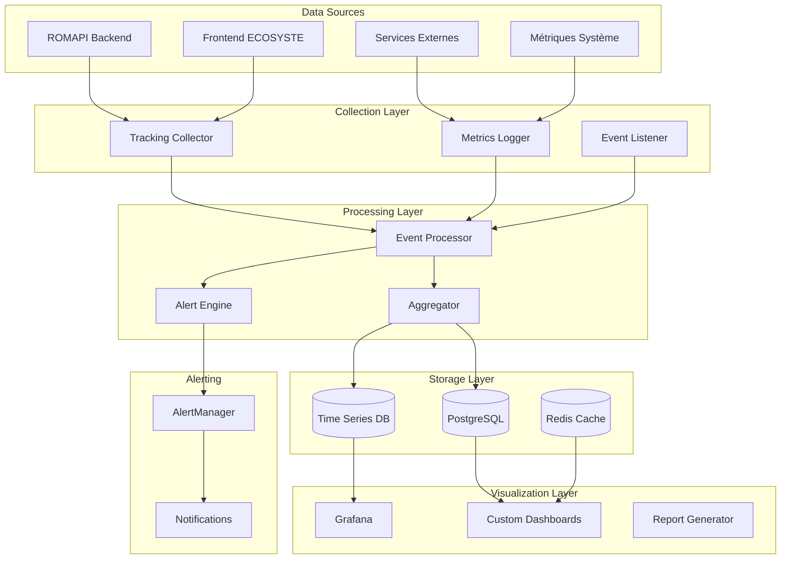
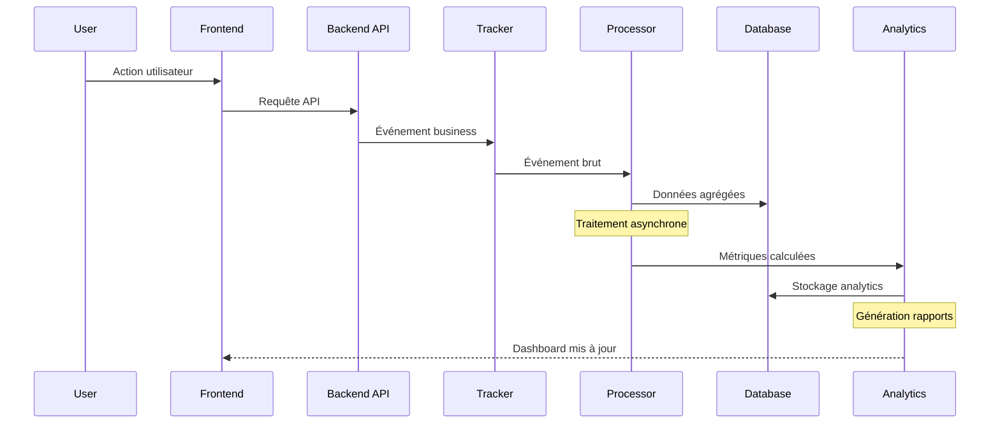

# Design Document - Analytics et Monitoring

## Overview

Le système d'analytics et monitoring fournit le tracking des métriques business, les tableaux de bord personnalisés, le monitoring technique avec Prometheus/Grafana, et les rapports d'usage. Il collecte, traite et visualise les données de performance et d'usage de l'écosystème ROMAPI.

## Architecture

### High-Level Architecture



### Event Flow Architecture



## Components and Interfaces

### 1. Analytics Service

```typescript
interface AnalyticsService {
  // Tracking des événements
  trackEvent(event: AnalyticsEvent): Promise<void>;
  trackPageView(pageView: PageViewEvent): Promise<void>;
  trackApiCall(apiCall: ApiCallEvent): Promise<void>;
  
  // Métriques business
  getBusinessMetrics(params: MetricsParams): Promise<BusinessMetrics>;
  getUserMetrics(userId: string, period: TimePeriod): Promise<UserMetrics>;
  getRevenueMetrics(period: TimePeriod): Promise<RevenueMetrics>;
  
  // Analytics d'usage
  getApiUsageMetrics(period: TimePeriod): Promise<ApiUsageMetrics>;
  getPopularResources(limit: number): Promise<PopularResource[]>;
  getUserEngagement(period: TimePeriod): Promise<EngagementMetrics>;
}

interface AnalyticsEvent {
  type: EventType;
  userId?: string;
  sessionId: string;
  resourceId?: string;
  properties: Record<string, any>;
  timestamp: Date;
  metadata: EventMetadata;
}

interface EventMetadata {
  userAgent: string;
  ipAddress: string;
  referrer?: string;
  source: string;
  device: DeviceInfo;
  location?: GeoLocation;
}

interface BusinessMetrics {
  totalUsers: number;
  activeUsers: number;
  newUsers: number;
  revenue: number;
  conversionRate: number;
  churnRate: number;
  period: TimePeriod;
}
```

### 2. Monitoring Service

```typescript
interface MonitoringService {
  // Métriques système
  collectSystemMetrics(): Promise<void>;
  getSystemHealth(): Promise<SystemHealth>;
  
  // Métriques application
  recordApiLatency(endpoint: string, duration: number): void;
  recordApiError(endpoint: string, error: Error): void;
  recordDatabaseQuery(query: string, duration: number): void;
  
  // Alerting
  checkAlerts(): Promise<Alert[]>;
  sendAlert(alert: Alert): Promise<void>;
  
  // Health checks
  checkDatabaseHealth(): Promise<HealthStatus>;
  checkRedisHealth(): Promise<HealthStatus>;
  checkElasticsearchHealth(): Promise<HealthStatus>;
}

interface SystemHealth {
  status: 'healthy' | 'degraded' | 'unhealthy';
  services: ServiceHealth[];
  metrics: SystemMetrics;
  timestamp: Date;
}

interface SystemMetrics {
  cpu: number;
  memory: number;
  disk: number;
  network: NetworkMetrics;
  database: DatabaseMetrics;
}
```

### 3. Dashboard Service

```typescript
interface DashboardService {
  // Dashboards prédéfinis
  getBusinessDashboard(userId: string): Promise<Dashboard>;
  getSystemDashboard(): Promise<Dashboard>;
  getApiUsageDashboard(): Promise<Dashboard>;
  
  // Dashboards personnalisés
  createCustomDashboard(config: DashboardConfig): Promise<Dashboard>;
  updateDashboard(id: string, config: DashboardConfig): Promise<Dashboard>;
  deleteDashboard(id: string): Promise<void>;
  
  // Widgets
  getAvailableWidgets(): Promise<Widget[]>;
  createWidget(config: WidgetConfig): Promise<Widget>;
  
  // Export et partage
  exportDashboard(id: string, format: ExportFormat): Promise<Buffer>;
  shareDashboard(id: string, permissions: SharePermissions): Promise<string>;
}

interface Dashboard {
  id: string;
  name: string;
  description?: string;
  widgets: Widget[];
  layout: LayoutConfig;
  permissions: DashboardPermissions;
  createdAt: Date;
  updatedAt: Date;
}

interface Widget {
  id: string;
  type: WidgetType;
  title: string;
  config: WidgetConfig;
  data: any;
  position: WidgetPosition;
}
```

### 4. Report Service

```typescript
interface ReportService {
  // Génération de rapports
  generateReport(config: ReportConfig): Promise<Report>;
  scheduleReport(config: ScheduledReportConfig): Promise<string>;
  
  // Templates de rapports
  getReportTemplates(): Promise<ReportTemplate[]>;
  createReportTemplate(template: ReportTemplate): Promise<ReportTemplate>;
  
  // Export
  exportReport(reportId: string, format: ExportFormat): Promise<Buffer>;
  
  // Historique
  getReportHistory(userId: string): Promise<Report[]>;
  deleteReport(reportId: string): Promise<void>;
}

interface ReportConfig {
  name: string;
  type: ReportType;
  metrics: string[];
  filters: ReportFilters;
  period: TimePeriod;
  format: ExportFormat;
  recipients?: string[];
}

interface Report {
  id: string;
  name: string;
  type: ReportType;
  data: ReportData;
  generatedAt: Date;
  status: ReportStatus;
  downloadUrl?: string;
}
```

## Data Models

### Analytics Events Schema

```typescript
// Table principale des événements
interface AnalyticsEvent {
  id: string;
  type: EventType;
  userId?: string;
  sessionId: string;
  resourceId?: string;
  properties: Json;
  metadata: Json;
  createdAt: Date;
}

// Agrégations pré-calculées
interface DailyMetrics {
  id: string;
  date: Date;
  metric: string;
  value: number;
  dimensions: Json;
  createdAt: Date;
}

// Métriques utilisateur
interface UserMetrics {
  id: string;
  userId: string;
  date: Date;
  pageViews: number;
  apiCalls: number;
  sessionDuration: number;
  actions: Json;
  createdAt: Date;
}

// Métriques API
interface ApiMetrics {
  id: string;
  endpoint: string;
  method: string;
  date: Date;
  calls: number;
  avgLatency: number;
  errors: number;
  uniqueUsers: number;
  createdAt: Date;
}
```

### Monitoring Schema

```typescript
// Métriques système
interface SystemMetric {
  id: string;
  metric: string;
  value: number;
  labels: Json;
  timestamp: Date;
}

// Alertes
interface Alert {
  id: string;
  name: string;
  condition: string;
  threshold: number;
  status: AlertStatus;
  lastTriggered?: Date;
  createdAt: Date;
  updatedAt: Date;
}

// Logs d'audit
interface AuditLog {
  id: string;
  userId?: string;
  action: string;
  resource: string;
  details: Json;
  ipAddress: string;
  userAgent: string;
  createdAt: Date;
}
```

### Time Series Data Structure

```typescript
// Structure pour InfluxDB/TimescaleDB
interface TimeSeriesPoint {
  measurement: string;
  tags: Record<string, string>;
  fields: Record<string, number>;
  timestamp: Date;
}

// Exemples de mesures
const apiCallMetric: TimeSeriesPoint = {
  measurement: 'api_calls',
  tags: {
    endpoint: '/api/v1/resources',
    method: 'GET',
    status: '200',
    userId: 'user123'
  },
  fields: {
    duration: 150,
    responseSize: 2048
  },
  timestamp: new Date()
};

const businessMetric: TimeSeriesPoint = {
  measurement: 'business_metrics',
  tags: {
    metric: 'revenue',
    plan: 'premium',
    userType: 'business'
  },
  fields: {
    value: 99.99,
    count: 1
  },
  timestamp: new Date()
};
```

## Event Processing Pipeline

### Event Collection

```typescript
class EventCollector {
  async collectEvent(event: AnalyticsEvent): Promise<void> {
    // Validation de l'événement
    const validatedEvent = await this.validateEvent(event);
    
    // Enrichissement avec métadonnées
    const enrichedEvent = await this.enrichEvent(validatedEvent);
    
    // Envoi vers pipeline de traitement
    await this.sendToProcessingQueue(enrichedEvent);
    
    // Cache pour accès rapide
    await this.cacheRecentEvent(enrichedEvent);
  }
  
  private async enrichEvent(event: AnalyticsEvent): Promise<AnalyticsEvent> {
    // Géolocalisation IP
    if (event.metadata.ipAddress) {
      event.metadata.location = await this.geolocateIP(event.metadata.ipAddress);
    }
    
    // Détection device/browser
    if (event.metadata.userAgent) {
      event.metadata.device = this.parseUserAgent(event.metadata.userAgent);
    }
    
    // Enrichissement utilisateur
    if (event.userId) {
      const user = await this.getUserInfo(event.userId);
      event.properties.userType = user.userType;
      event.properties.plan = user.plan;
    }
    
    return event;
  }
}
```

### Real-time Processing

```typescript
class EventProcessor {
  async processEvent(event: AnalyticsEvent): Promise<void> {
    // Traitement en temps réel
    await Promise.all([
      this.updateRealTimeMetrics(event),
      this.checkAlertConditions(event),
      this.updateUserSession(event)
    ]);
    
    // Stockage pour agrégation
    await this.storeForAggregation(event);
  }
  
  private async updateRealTimeMetrics(event: AnalyticsEvent): Promise<void> {
    const metrics = this.extractMetrics(event);
    
    for (const metric of metrics) {
      // Mise à jour Redis pour métriques temps réel
      await this.redis.hincrby(
        `metrics:realtime:${metric.name}`,
        metric.dimension,
        metric.value
      );
      
      // TTL pour nettoyage automatique
      await this.redis.expire(`metrics:realtime:${metric.name}`, 3600);
    }
  }
}
```

### Batch Aggregation

```typescript
class MetricsAggregator {
  async aggregateDailyMetrics(): Promise<void> {
    const yesterday = new Date();
    yesterday.setDate(yesterday.getDate() - 1);
    
    // Agrégation par type de métrique
    await Promise.all([
      this.aggregateUserMetrics(yesterday),
      this.aggregateApiMetrics(yesterday),
      this.aggregateBusinessMetrics(yesterday),
      this.aggregateSystemMetrics(yesterday)
    ]);
  }
  
  private async aggregateUserMetrics(date: Date): Promise<void> {
    const query = `
      INSERT INTO daily_user_metrics (user_id, date, page_views, api_calls, session_duration)
      SELECT 
        user_id,
        DATE(created_at) as date,
        COUNT(CASE WHEN type = 'page_view' THEN 1 END) as page_views,
        COUNT(CASE WHEN type = 'api_call' THEN 1 END) as api_calls,
        AVG(CASE WHEN type = 'session_end' THEN 
          (properties->>'duration')::integer END) as session_duration
      FROM analytics_events 
      WHERE DATE(created_at) = $1 AND user_id IS NOT NULL
      GROUP BY user_id, DATE(created_at)
      ON CONFLICT (user_id, date) DO UPDATE SET
        page_views = EXCLUDED.page_views,
        api_calls = EXCLUDED.api_calls,
        session_duration = EXCLUDED.session_duration
    `;
    
    await this.db.query(query, [date]);
  }
}
```

## Monitoring and Alerting

### Prometheus Metrics

```typescript
class PrometheusMetrics {
  private readonly httpRequestDuration = new prometheus.Histogram({
    name: 'http_request_duration_seconds',
    help: 'Duration of HTTP requests in seconds',
    labelNames: ['method', 'route', 'status_code'],
    buckets: [0.1, 0.3, 0.5, 0.7, 1, 3, 5, 7, 10]
  });
  
  private readonly apiCallsTotal = new prometheus.Counter({
    name: 'api_calls_total',
    help: 'Total number of API calls',
    labelNames: ['endpoint', 'method', 'status', 'user_type']
  });
  
  private readonly activeUsers = new prometheus.Gauge({
    name: 'active_users_current',
    help: 'Current number of active users',
    labelNames: ['time_window']
  });
  
  recordApiCall(endpoint: string, method: string, status: number, duration: number, userType?: string): void {
    this.httpRequestDuration
      .labels(method, endpoint, status.toString())
      .observe(duration);
      
    this.apiCallsTotal
      .labels(endpoint, method, status.toString(), userType || 'anonymous')
      .inc();
  }
  
  updateActiveUsers(count: number, timeWindow: string): void {
    this.activeUsers.labels(timeWindow).set(count);
  }
}
```

### Alert Engine

```typescript
class AlertEngine {
  async checkAlerts(): Promise<void> {
    const alerts = await this.getActiveAlerts();
    
    for (const alert of alerts) {
      const shouldTrigger = await this.evaluateAlert(alert);
      
      if (shouldTrigger && !alert.isTriggered) {
        await this.triggerAlert(alert);
      } else if (!shouldTrigger && alert.isTriggered) {
        await this.resolveAlert(alert);
      }
    }
  }
  
  private async evaluateAlert(alert: Alert): Promise<boolean> {
    const query = this.buildMetricQuery(alert.condition);
    const result = await this.queryMetrics(query);
    
    return this.compareWithThreshold(result, alert.threshold, alert.operator);
  }
  
  private async triggerAlert(alert: Alert): Promise<void> {
    // Marquer comme déclenché
    await this.updateAlertStatus(alert.id, 'triggered');
    
    // Envoyer notifications
    await Promise.all([
      this.sendEmailAlert(alert),
      this.sendSlackAlert(alert),
      this.sendWebhookAlert(alert)
    ]);
    
    // Logger l'événement
    this.logger.warn('Alert triggered', {
      alertId: alert.id,
      alertName: alert.name,
      threshold: alert.threshold,
      currentValue: alert.currentValue
    });
  }
}
```

## Dashboard and Visualization

### Dashboard Configuration

```typescript
interface DashboardConfig {
  name: string;
  description?: string;
  layout: {
    columns: number;
    rows: number;
  };
  widgets: WidgetConfig[];
  filters: DashboardFilter[];
  refreshInterval: number;
  permissions: {
    public: boolean;
    users: string[];
    roles: string[];
  };
}

interface WidgetConfig {
  type: 'chart' | 'metric' | 'table' | 'map';
  title: string;
  position: { x: number; y: number; w: number; h: number };
  dataSource: {
    query: string;
    parameters: Record<string, any>;
  };
  visualization: {
    chartType?: 'line' | 'bar' | 'pie' | 'area';
    colors?: string[];
    axes?: AxisConfig[];
  };
}
```

### Real-time Dashboard Updates

```typescript
class DashboardService {
  async setupRealTimeUpdates(dashboardId: string, socketId: string): Promise<void> {
    const dashboard = await this.getDashboard(dashboardId);
    
    // Abonnement aux métriques en temps réel
    for (const widget of dashboard.widgets) {
      const metrics = this.extractMetricsFromWidget(widget);
      
      for (const metric of metrics) {
        await this.subscribeToMetric(metric, (data) => {
          this.socketService.emit(socketId, 'dashboard:update', {
            widgetId: widget.id,
            data: data
          });
        });
      }
    }
  }
  
  private async subscribeToMetric(metric: string, callback: (data: any) => void): Promise<void> {
    // Abonnement Redis pub/sub pour mises à jour temps réel
    this.redis.subscribe(`metrics:${metric}`);
    this.redis.on('message', (channel, message) => {
      if (channel === `metrics:${metric}`) {
        callback(JSON.parse(message));
      }
    });
  }
}
```

## Performance Optimization

### Data Retention and Archiving

```typescript
class DataRetentionManager {
  async manageRetention(): Promise<void> {
    // Politique de rétention par type de données
    const policies = [
      { table: 'analytics_events', retention: '90 days' },
      { table: 'daily_metrics', retention: '2 years' },
      { table: 'system_metrics', retention: '30 days' },
      { table: 'audit_logs', retention: '7 years' }
    ];
    
    for (const policy of policies) {
      await this.archiveOldData(policy.table, policy.retention);
    }
  }
  
  private async archiveOldData(table: string, retention: string): Promise<void> {
    // Archivage vers stockage froid
    const archiveQuery = `
      INSERT INTO ${table}_archive 
      SELECT * FROM ${table} 
      WHERE created_at < NOW() - INTERVAL '${retention}'
    `;
    
    await this.db.query(archiveQuery);
    
    // Suppression des données archivées
    const deleteQuery = `
      DELETE FROM ${table} 
      WHERE created_at < NOW() - INTERVAL '${retention}'
    `;
    
    await this.db.query(deleteQuery);
  }
}
```

### Query Optimization

```typescript
class QueryOptimizer {
  async optimizeMetricsQuery(query: MetricsQuery): Promise<MetricsQuery> {
    // Utiliser agrégations pré-calculées si disponibles
    if (this.hasPrecomputedAggregation(query)) {
      return this.usePrecomputedQuery(query);
    }
    
    // Optimiser les filtres temporels
    query = this.optimizeTimeFilters(query);
    
    // Ajouter indices appropriés
    query = this.addIndexHints(query);
    
    return query;
  }
  
  private hasPrecomputedAggregation(query: MetricsQuery): boolean {
    // Vérifier si une agrégation pré-calculée existe
    const aggregationKey = this.generateAggregationKey(query);
    return this.precomputedAggregations.has(aggregationKey);
  }
}
```

## Security and Privacy

### Data Anonymization

```typescript
class DataAnonymizer {
  async anonymizeEvent(event: AnalyticsEvent): Promise<AnalyticsEvent> {
    // Anonymiser les données personnelles
    if (event.metadata.ipAddress) {
      event.metadata.ipAddress = this.anonymizeIP(event.metadata.ipAddress);
    }
    
    // Hasher les identifiants utilisateur pour analytics
    if (event.userId && event.type === 'analytics') {
      event.userId = this.hashUserId(event.userId);
    }
    
    // Supprimer les données sensibles
    event.properties = this.removeSensitiveData(event.properties);
    
    return event;
  }
  
  private anonymizeIP(ip: string): string {
    // Garder seulement les 3 premiers octets pour IPv4
    const parts = ip.split('.');
    if (parts.length === 4) {
      return `${parts[0]}.${parts[1]}.${parts[2]}.0`;
    }
    return ip;
  }
}
```

### GDPR Compliance

```typescript
class GDPRComplianceService {
  async handleDataDeletionRequest(userId: string): Promise<void> {
    // Supprimer toutes les données personnelles
    await Promise.all([
      this.deleteAnalyticsEvents(userId),
      this.deleteUserMetrics(userId),
      this.deleteAuditLogs(userId),
      this.anonymizeHistoricalData(userId)
    ]);
    
    // Logger la suppression pour audit
    await this.logDataDeletion(userId);
  }
  
  async exportUserData(userId: string): Promise<UserDataExport> {
    // Exporter toutes les données utilisateur
    const data = await Promise.all([
      this.exportAnalyticsEvents(userId),
      this.exportUserMetrics(userId),
      this.exportDashboards(userId),
      this.exportReports(userId)
    ]);
    
    return {
      userId,
      exportDate: new Date(),
      data: Object.assign({}, ...data)
    };
  }
}
```

## Testing Strategy

### Unit Tests

```typescript
describe('AnalyticsService', () => {
  describe('trackEvent', () => {
    it('should track event with proper validation', async () => {
      const event: AnalyticsEvent = {
        type: 'page_view',
        sessionId: 'session123',
        properties: { page: '/dashboard' },
        timestamp: new Date(),
        metadata: {
          userAgent: 'test-agent',
          ipAddress: '127.0.0.1',
          source: 'web'
        }
      };
      
      await analyticsService.trackEvent(event);
      
      expect(mockEventCollector.collectEvent).toHaveBeenCalledWith(event);
    });
  });
  
  describe('getBusinessMetrics', () => {
    it('should return aggregated business metrics', async () => {
      const params = {
        period: { start: new Date('2024-01-01'), end: new Date('2024-01-31') }
      };
      
      const metrics = await analyticsService.getBusinessMetrics(params);
      
      expect(metrics.totalUsers).toBeGreaterThan(0);
      expect(metrics.revenue).toBeDefined();
    });
  });
});
```

### Integration Tests

```typescript
describe('Analytics Integration', () => {
  beforeEach(async () => {
    await setupTestDatabase();
    await seedTestData();
  });
  
  it('should process events end-to-end', async () => {
    // Envoyer événement
    await request(app)
      .post('/api/v1/analytics/track')
      .send({
        type: 'api_call',
        properties: { endpoint: '/test' }
      })
      .expect(200);
    
    // Attendre traitement asynchrone
    await new Promise(resolve => setTimeout(resolve, 1000));
    
    // Vérifier stockage
    const events = await db.query('SELECT * FROM analytics_events WHERE type = $1', ['api_call']);
    expect(events.rows).toHaveLength(1);
  });
});
```