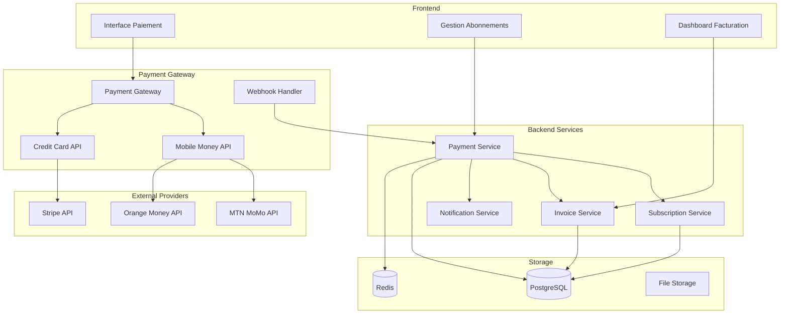
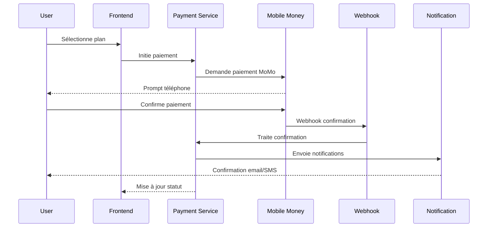

# Design Document - Système de Paiement

## Overview

Le système de paiement gère les abonnements, les paiements Mobile Money camerounais (MTN MoMo, Orange Money), la facturation automatique et les webhooks de paiement. Il intègre les solutions de paiement locales et gère les plans tarifaires différenciés selon le type d'utilisateur.

## Architecture

### High-Level Architecture



### Payment Flow Architecture



## Components and Interfaces

### 1. Payment Service

```typescript
interface PaymentService {
  // Initiation de paiements
  initiatePayment(request: PaymentRequest): Promise<PaymentResponse>;
  
  // Gestion des méthodes de paiement
  addPaymentMethod(userId: string, method: PaymentMethod): Promise<PaymentMethod>;
  removePaymentMethod(userId: string, methodId: string): Promise<void>;
  listPaymentMethods(userId: string): Promise<PaymentMethod[]>;
  
  // Traitement des webhooks
  processWebhook(provider: PaymentProvider, payload: any): Promise<void>;
  
  // Historique et statuts
  getPaymentHistory(userId: string, filters?: PaymentFilters): Promise<Payment[]>;
  getPaymentStatus(paymentId: string): Promise<PaymentStatus>;
  
  // Remboursements
  refundPayment(paymentId: string, amount?: number): Promise<Refund>;
}

interface PaymentRequest {
  userId: string;
  amount: number;
  currency: string;
  planId: string;
  paymentMethodId: string;
  metadata?: Record<string, any>;
}

interface PaymentResponse {
  paymentId: string;
  status: PaymentStatus;
  redirectUrl?: string;
  qrCode?: string;
  instructions?: string;
  expiresAt: Date;
}

interface PaymentMethod {
  id: string;
  type: PaymentMethodType;
  provider: PaymentProvider;
  details: PaymentMethodDetails;
  isDefault: boolean;
  isActive: boolean;
  createdAt: Date;
}

enum PaymentMethodType {
  MOBILE_MONEY = 'mobile_money',
  CREDIT_CARD = 'credit_card',
  BANK_TRANSFER = 'bank_transfer'
}

enum PaymentProvider {
  MTN_MOMO = 'mtn_momo',
  ORANGE_MONEY = 'orange_money',
  STRIPE = 'stripe'
}
```

### 2. Subscription Service

```typescript
interface SubscriptionService {
  // Gestion des abonnements
  createSubscription(request: SubscriptionRequest): Promise<Subscription>;
  updateSubscription(id: string, updates: SubscriptionUpdate): Promise<Subscription>;
  cancelSubscription(id: string, reason?: string): Promise<void>;
  
  // Renouvellement automatique
  processRenewals(): Promise<RenewalResult[]>;
  retryFailedPayment(subscriptionId: string): Promise<PaymentResult>;
  
  // Changements de plan
  changePlan(subscriptionId: string, newPlanId: string): Promise<Subscription>;
  calculateProration(subscriptionId: string, newPlanId: string): Promise<ProrationDetails>;
  
  // Historique et métriques
  getSubscriptionHistory(userId: string): Promise<Subscription[]>;
  getSubscriptionMetrics(period: TimePeriod): Promise<SubscriptionMetrics>;
}

interface SubscriptionRequest {
  userId: string;
  planId: string;
  paymentMethodId: string;
  billingCycle: BillingCycle;
  startDate?: Date;
  trialDays?: number;
}

interface Subscription {
  id: string;
  userId: string;
  planId: string;
  status: SubscriptionStatus;
  currentPeriodStart: Date;
  currentPeriodEnd: Date;
  cancelAtPeriodEnd: boolean;
  trialEnd?: Date;
  metadata: Record<string, any>;
  createdAt: Date;
  updatedAt: Date;
}

enum SubscriptionStatus {
  ACTIVE = 'active',
  PAST_DUE = 'past_due',
  CANCELED = 'canceled',
  UNPAID = 'unpaid',
  TRIALING = 'trialing'
}

enum BillingCycle {
  MONTHLY = 'monthly',
  YEARLY = 'yearly'
}
```

### 3. Invoice Service

```typescript
interface InvoiceService {
  // Génération de factures
  generateInvoice(subscriptionId: string, period: BillingPeriod): Promise<Invoice>;
  
  // Gestion des factures
  getInvoice(invoiceId: string): Promise<Invoice>;
  listInvoices(userId: string, filters?: InvoiceFilters): Promise<Invoice[]>;
  
  // Export et envoi
  generateInvoicePDF(invoiceId: string): Promise<Buffer>;
  sendInvoiceEmail(invoiceId: string): Promise<void>;
  
  // Taxes et conformité
  calculateTaxes(amount: number, userLocation: Location): Promise<TaxCalculation>;
  generateTaxReport(period: TimePeriod): Promise<TaxReport>;
}

interface Invoice {
  id: string;
  number: string;
  userId: string;
  subscriptionId: string;
  status: InvoiceStatus;
  amount: number;
  taxAmount: number;
  totalAmount: number;
  currency: string;
  dueDate: Date;
  paidAt?: Date;
  items: InvoiceItem[];
  taxDetails: TaxDetails;
  createdAt: Date;
}

interface InvoiceItem {
  description: string;
  quantity: number;
  unitPrice: number;
  amount: number;
  period?: BillingPeriod;
}

enum InvoiceStatus {
  DRAFT = 'draft',
  OPEN = 'open',
  PAID = 'paid',
  VOID = 'void',
  OVERDUE = 'overdue'
}
```

### 4. Mobile Money Integration

```typescript
interface MobileMoneyService {
  // MTN MoMo
  initiateMTNPayment(request: MTNPaymentRequest): Promise<MTNPaymentResponse>;
  checkMTNPaymentStatus(transactionId: string): Promise<MTNPaymentStatus>;
  
  // Orange Money
  initiateOrangePayment(request: OrangePaymentRequest): Promise<OrangePaymentResponse>;
  checkOrangePaymentStatus(transactionId: string): Promise<OrangePaymentStatus>;
  
  // Commun
  validatePhoneNumber(phoneNumber: string, provider: MobileProvider): boolean;
  formatPhoneNumber(phoneNumber: string, provider: MobileProvider): string;
}

interface MTNPaymentRequest {
  amount: number;
  currency: string;
  phoneNumber: string;
  externalId: string;
  payerMessage?: string;
  payeeNote?: string;
}

interface MTNPaymentResponse {
  referenceId: string;
  status: string;
  reason?: string;
}

interface OrangePaymentRequest {
  amount: number;
  currency: string;
  phoneNumber: string;
  merchantTransactionId: string;
  description?: string;
}

enum MobileProvider {
  MTN = 'mtn',
  ORANGE = 'orange'
}
```

## Data Models

### Payment Schema

```typescript
// Table des paiements
interface Payment {
  id: string;
  userId: string;
  subscriptionId?: string;
  invoiceId?: string;
  amount: number;
  currency: string;
  status: PaymentStatus;
  provider: PaymentProvider;
  providerTransactionId?: string;
  paymentMethodId: string;
  failureReason?: string;
  processedAt?: Date;
  createdAt: Date;
  updatedAt: Date;
}

// Table des méthodes de paiement
interface PaymentMethod {
  id: string;
  userId: string;
  type: PaymentMethodType;
  provider: PaymentProvider;
  details: Json; // Détails chiffrés
  fingerprint: string; // Hash pour déduplication
  isDefault: boolean;
  isActive: boolean;
  expiresAt?: Date;
  createdAt: Date;
  updatedAt: Date;
}

// Table des abonnements
interface Subscription {
  id: string;
  userId: string;
  planId: string;
  status: SubscriptionStatus;
  currentPeriodStart: Date;
  currentPeriodEnd: Date;
  cancelAtPeriodEnd: boolean;
  canceledAt?: Date;
  trialStart?: Date;
  trialEnd?: Date;
  defaultPaymentMethodId?: string;
  metadata: Json;
  createdAt: Date;
  updatedAt: Date;
}

// Table des factures
interface Invoice {
  id: string;
  number: string;
  userId: string;
  subscriptionId?: string;
  status: InvoiceStatus;
  subtotal: number;
  taxAmount: number;
  total: number;
  currency: string;
  description?: string;
  dueDate: Date;
  paidAt?: Date;
  voidedAt?: Date;
  createdAt: Date;
  updatedAt: Date;
}

// Table des éléments de facture
interface InvoiceItem {
  id: string;
  invoiceId: string;
  description: string;
  quantity: number;
  unitPrice: number;
  amount: number;
  periodStart?: Date;
  periodEnd?: Date;
  metadata: Json;
}
```

### Pricing Schema

```typescript
// Table des plans tarifaires
interface Plan {
  id: string;
  name: string;
  description?: string;
  amount: number;
  currency: string;
  interval: BillingInterval;
  intervalCount: number;
  trialPeriodDays?: number;
  userType: UserType; // individual, business
  features: Json;
  isActive: boolean;
  createdAt: Date;
  updatedAt: Date;
}

// Table des prix par région/devise
interface PlanPrice {
  id: string;
  planId: string;
  currency: string;
  amount: number;
  region?: string;
  userType: UserType;
  createdAt: Date;
  updatedAt: Date;
}

enum BillingInterval {
  DAY = 'day',
  WEEK = 'week',
  MONTH = 'month',
  YEAR = 'year'
}
```

## Mobile Money Integration

### MTN MoMo Implementation

```typescript
class MTNMoMoProvider implements PaymentProvider {
  private readonly apiKey: string;
  private readonly userId: string;
  private readonly subscriptionKey: string;
  private readonly baseUrl: string;
  
  constructor(config: MTNConfig) {
    this.apiKey = config.apiKey;
    this.userId = config.userId;
    this.subscriptionKey = config.subscriptionKey;
    this.baseUrl = config.sandbox ? MTN_SANDBOX_URL : MTN_PRODUCTION_URL;
  }
  
  async initiatePayment(request: PaymentRequest): Promise<PaymentResponse> {
    // Générer token d'accès
    const accessToken = await this.getAccessToken();
    
    // Préparer la requête de paiement
    const paymentRequest = {
      amount: request.amount.toString(),
      currency: request.currency,
      externalId: request.externalId,
      payer: {
        partyIdType: 'MSISDN',
        partyId: this.formatPhoneNumber(request.phoneNumber)
      },
      payerMessage: request.description,
      payeeNote: `Payment for ${request.planName}`
    };
    
    // Envoyer la requête
    const response = await this.httpClient.post('/collection/v1_0/requesttopay', paymentRequest, {
      headers: {
        'Authorization': `Bearer ${accessToken}`,
        'X-Reference-Id': request.referenceId,
        'X-Target-Environment': this.environment,
        'Ocp-Apim-Subscription-Key': this.subscriptionKey
      }
    });
    
    return {
      transactionId: request.referenceId,
      status: 'pending',
      instructions: 'Veuillez confirmer le paiement sur votre téléphone',
      expiresAt: new Date(Date.now() + 5 * 60 * 1000) // 5 minutes
    };
  }
  
  async checkPaymentStatus(transactionId: string): Promise<PaymentStatus> {
    const accessToken = await this.getAccessToken();
    
    const response = await this.httpClient.get(`/collection/v1_0/requesttopay/${transactionId}`, {
      headers: {
        'Authorization': `Bearer ${accessToken}`,
        'X-Target-Environment': this.environment,
        'Ocp-Apim-Subscription-Key': this.subscriptionKey
      }
    });
    
    return this.mapMTNStatusToPaymentStatus(response.data.status);
  }
  
  private async getAccessToken(): Promise<string> {
    // Vérifier cache Redis
    const cachedToken = await this.redis.get(`mtn_token:${this.userId}`);
    if (cachedToken) {
      return cachedToken;
    }
    
    // Obtenir nouveau token
    const response = await this.httpClient.post('/collection/token/', {}, {
      headers: {
        'Authorization': `Basic ${Buffer.from(`${this.userId}:${this.apiKey}`).toString('base64')}`,
        'Ocp-Apim-Subscription-Key': this.subscriptionKey
      }
    });
    
    const token = response.data.access_token;
    const expiresIn = response.data.expires_in;
    
    // Mettre en cache
    await this.redis.setex(`mtn_token:${this.userId}`, expiresIn - 60, token);
    
    return token;
  }
}
```

### Orange Money Implementation

```typescript
class OrangeMoneyProvider implements PaymentProvider {
  private readonly clientId: string;
  private readonly clientSecret: string;
  private readonly merchantKey: string;
  private readonly baseUrl: string;
  
  async initiatePayment(request: PaymentRequest): Promise<PaymentResponse> {
    // Obtenir token d'accès
    const accessToken = await this.getAccessToken();
    
    // Préparer la requête
    const paymentRequest = {
      merchant_key: this.merchantKey,
      currency: request.currency,
      order_id: request.externalId,
      amount: request.amount,
      return_url: request.returnUrl,
      cancel_url: request.cancelUrl,
      notif_url: request.webhookUrl,
      lang: 'fr',
      reference: request.description
    };
    
    const response = await this.httpClient.post('/omcoreapis/1.0.2/mp/pay', paymentRequest, {
      headers: {
        'Authorization': `Bearer ${accessToken}`,
        'Accept': 'application/json',
        'Content-Type': 'application/json'
      }
    });
    
    return {
      transactionId: response.data.pay_token,
      status: 'pending',
      redirectUrl: response.data.payment_url,
      expiresAt: new Date(Date.now() + 15 * 60 * 1000) // 15 minutes
    };
  }
  
  async checkPaymentStatus(transactionId: string): Promise<PaymentStatus> {
    const accessToken = await this.getAccessToken();
    
    const response = await this.httpClient.get(`/omcoreapis/1.0.2/mp/paymentstatus/${transactionId}`, {
      headers: {
        'Authorization': `Bearer ${accessToken}`,
        'Accept': 'application/json'
      }
    });
    
    return this.mapOrangeStatusToPaymentStatus(response.data.status);
  }
}
```

## Subscription Management

### Subscription Lifecycle

```typescript
class SubscriptionManager {
  async createSubscription(request: SubscriptionRequest): Promise<Subscription> {
    // Valider le plan et l'utilisateur
    const plan = await this.planService.getPlan(request.planId);
    const user = await this.userService.getUser(request.userId);
    
    // Vérifier éligibilité au plan
    this.validatePlanEligibility(user, plan);
    
    // Calculer les dates de facturation
    const billingDates = this.calculateBillingDates(plan, request.startDate);
    
    // Créer l'abonnement
    const subscription = await this.db.subscription.create({
      data: {
        userId: request.userId,
        planId: request.planId,
        status: request.trialDays ? 'trialing' : 'active',
        currentPeriodStart: billingDates.start,
        currentPeriodEnd: billingDates.end,
        trialEnd: request.trialDays ? 
          new Date(Date.now() + request.trialDays * 24 * 60 * 60 * 1000) : 
          null,
        defaultPaymentMethodId: request.paymentMethodId
      }
    });
    
    // Initier le premier paiement si pas de trial
    if (!request.trialDays) {
      await this.processInitialPayment(subscription, plan);
    }
    
    // Mettre à jour les quotas utilisateur
    await this.updateUserQuotas(user.id, plan);
    
    return subscription;
  }
  
  async processRenewals(): Promise<void> {
    // Trouver les abonnements à renouveler
    const subscriptionsToRenew = await this.db.subscription.findMany({
      where: {
        status: 'active',
        currentPeriodEnd: {
          lte: new Date(Date.now() + 24 * 60 * 60 * 1000) // Dans les 24h
        }
      },
      include: {
        user: true,
        plan: true,
        defaultPaymentMethod: true
      }
    });
    
    for (const subscription of subscriptionsToRenew) {
      try {
        await this.renewSubscription(subscription);
      } catch (error) {
        this.logger.error('Renewal failed', { subscriptionId: subscription.id, error });
        await this.handleRenewalFailure(subscription, error);
      }
    }
  }
  
  private async renewSubscription(subscription: Subscription): Promise<void> {
    // Générer la facture
    const invoice = await this.invoiceService.generateInvoice(subscription.id, {
      start: subscription.currentPeriodEnd,
      end: this.calculateNextPeriodEnd(subscription)
    });
    
    // Tenter le paiement
    const payment = await this.paymentService.processPayment({
      userId: subscription.userId,
      amount: invoice.total,
      currency: invoice.currency,
      paymentMethodId: subscription.defaultPaymentMethodId,
      invoiceId: invoice.id
    });
    
    if (payment.status === 'succeeded') {
      // Mettre à jour l'abonnement
      await this.db.subscription.update({
        where: { id: subscription.id },
        data: {
          currentPeriodStart: subscription.currentPeriodEnd,
          currentPeriodEnd: this.calculateNextPeriodEnd(subscription),
          status: 'active'
        }
      });
      
      // Marquer la facture comme payée
      await this.invoiceService.markAsPaid(invoice.id, payment.id);
      
      // Envoyer confirmation
      await this.notificationService.sendRenewalConfirmation(subscription.userId, subscription);
    } else {
      throw new Error(`Payment failed: ${payment.failureReason}`);
    }
  }
}
```

### Plan Pricing Logic

```typescript
class PricingEngine {
  async calculatePrice(planId: string, userType: UserType, currency: string = 'XAF'): Promise<PriceCalculation> {
    const plan = await this.getPlan(planId);
    
    // Obtenir le prix de base
    let basePrice = await this.getBasePriceForPlan(plan, currency);
    
    // Appliquer la différenciation par type d'utilisateur
    const userTypeMultiplier = this.getUserTypeMultiplier(userType);
    const adjustedPrice = basePrice * userTypeMultiplier;
    
    // Calculer les taxes
    const taxes = await this.calculateTaxes(adjustedPrice, currency);
    
    // Appliquer les réductions éventuelles
    const discounts = await this.getApplicableDiscounts(planId, userType);
    const discountAmount = this.calculateDiscountAmount(adjustedPrice, discounts);
    
    const finalPrice = adjustedPrice + taxes.amount - discountAmount;
    
    return {
      basePrice,
      adjustedPrice,
      taxes,
      discounts,
      finalPrice,
      currency,
      breakdown: {
        subtotal: adjustedPrice,
        taxAmount: taxes.amount,
        discountAmount,
        total: finalPrice
      }
    };
  }
  
  private getUserTypeMultiplier(userType: UserType): number {
    const multipliers = {
      [UserType.INDIVIDUAL]: 1.0,
      [UserType.BUSINESS]: 1.5, // 50% plus cher pour les entreprises
      [UserType.ENTERPRISE]: 2.0
    };
    
    return multipliers[userType] || 1.0;
  }
  
  async calculateProration(subscriptionId: string, newPlanId: string): Promise<ProrationDetails> {
    const subscription = await this.getSubscription(subscriptionId);
    const currentPlan = await this.getPlan(subscription.planId);
    const newPlan = await this.getPlan(newPlanId);
    
    // Calculer le temps restant dans la période actuelle
    const now = new Date();
    const periodEnd = subscription.currentPeriodEnd;
    const totalPeriodDays = differenceInDays(subscription.currentPeriodEnd, subscription.currentPeriodStart);
    const remainingDays = differenceInDays(periodEnd, now);
    const usedRatio = (totalPeriodDays - remainingDays) / totalPeriodDays;
    
    // Calculer le crédit du plan actuel
    const currentPlanPrice = await this.calculatePrice(currentPlan.id, subscription.user.userType);
    const unusedCredit = currentPlanPrice.finalPrice * (1 - usedRatio);
    
    // Calculer le coût du nouveau plan
    const newPlanPrice = await this.calculatePrice(newPlan.id, subscription.user.userType);
    const newPlanProrated = newPlanPrice.finalPrice * (1 - usedRatio);
    
    // Calculer la différence
    const proratedAmount = newPlanProrated - unusedCredit;
    
    return {
      currentPlan: currentPlanPrice,
      newPlan: newPlanPrice,
      unusedCredit,
      proratedAmount,
      immediateCharge: Math.max(0, proratedAmount),
      creditApplied: Math.max(0, -proratedAmount)
    };
  }
}
```

## Webhook Processing

### Webhook Handler

```typescript
class WebhookProcessor {
  async processWebhook(provider: PaymentProvider, payload: any, signature: string): Promise<void> {
    // Vérifier la signature
    if (!this.verifySignature(provider, payload, signature)) {
      throw new Error('Invalid webhook signature');
    }
    
    // Parser l'événement selon le provider
    const event = this.parseWebhookEvent(provider, payload);
    
    // Traiter l'événement
    await this.handleWebhookEvent(event);
  }
  
  private async handleWebhookEvent(event: WebhookEvent): Promise<void> {
    switch (event.type) {
      case 'payment.succeeded':
        await this.handlePaymentSucceeded(event);
        break;
        
      case 'payment.failed':
        await this.handlePaymentFailed(event);
        break;
        
      case 'payment.pending':
        await this.handlePaymentPending(event);
        break;
        
      default:
        this.logger.warn('Unhandled webhook event', { type: event.type });
    }
  }
  
  private async handlePaymentSucceeded(event: WebhookEvent): Promise<void> {
    const payment = await this.paymentService.getPayment(event.paymentId);
    
    if (payment.status === 'succeeded') {
      // Déjà traité, ignorer (idempotence)
      return;
    }
    
    // Mettre à jour le statut du paiement
    await this.paymentService.updatePaymentStatus(event.paymentId, 'succeeded', {
      providerTransactionId: event.providerTransactionId,
      processedAt: new Date()
    });
    
    // Traiter les actions post-paiement
    if (payment.subscriptionId) {
      await this.subscriptionService.activateSubscription(payment.subscriptionId);
    }
    
    if (payment.invoiceId) {
      await this.invoiceService.markAsPaid(payment.invoiceId, payment.id);
    }
    
    // Envoyer notifications
    await this.notificationService.sendPaymentConfirmation(payment.userId, payment);
    
    // Mettre à jour les quotas utilisateur
    await this.userService.updateQuotas(payment.userId);
  }
  
  private verifySignature(provider: PaymentProvider, payload: any, signature: string): boolean {
    switch (provider) {
      case PaymentProvider.MTN_MOMO:
        return this.verifyMTNSignature(payload, signature);
        
      case PaymentProvider.ORANGE_MONEY:
        return this.verifyOrangeSignature(payload, signature);
        
      case PaymentProvider.STRIPE:
        return this.verifyStripeSignature(payload, signature);
        
      default:
        return false;
    }
  }
}
```

## Security and Compliance

### Payment Data Security

```typescript
class PaymentSecurityManager {
  // Chiffrement des données de paiement
  async encryptPaymentData(data: any): Promise<string> {
    const key = await this.getEncryptionKey();
    const cipher = crypto.createCipher('aes-256-gcm', key);
    
    let encrypted = cipher.update(JSON.stringify(data), 'utf8', 'hex');
    encrypted += cipher.final('hex');
    
    const authTag = cipher.getAuthTag();
    
    return `${encrypted}:${authTag.toString('hex')}`;
  }
  
  async decryptPaymentData(encryptedData: string): Promise<any> {
    const [encrypted, authTag] = encryptedData.split(':');
    const key = await this.getEncryptionKey();
    
    const decipher = crypto.createDecipher('aes-256-gcm', key);
    decipher.setAuthTag(Buffer.from(authTag, 'hex'));
    
    let decrypted = decipher.update(encrypted, 'hex', 'utf8');
    decrypted += decipher.final('utf8');
    
    return JSON.parse(decrypted);
  }
  
  // Tokenisation des méthodes de paiement
  async tokenizePaymentMethod(method: PaymentMethodDetails): Promise<string> {
    const token = crypto.randomBytes(32).toString('hex');
    
    // Stocker de manière sécurisée
    await this.secureStorage.store(token, method);
    
    return token;
  }
  
  // Validation PCI DSS
  validatePCICompliance(): ComplianceReport {
    return {
      dataEncryption: this.checkDataEncryption(),
      accessControl: this.checkAccessControl(),
      networkSecurity: this.checkNetworkSecurity(),
      monitoring: this.checkMonitoring(),
      testing: this.checkSecurityTesting()
    };
  }
}
```

### Fraud Detection

```typescript
class FraudDetectionService {
  async analyzePayment(payment: PaymentRequest): Promise<FraudAnalysis> {
    const riskFactors = await Promise.all([
      this.checkVelocityRisk(payment),
      this.checkGeolocationRisk(payment),
      this.checkDeviceRisk(payment),
      this.checkAmountRisk(payment),
      this.checkUserBehaviorRisk(payment)
    ]);
    
    const riskScore = this.calculateRiskScore(riskFactors);
    const recommendation = this.getRecommendation(riskScore);
    
    return {
      riskScore,
      riskFactors,
      recommendation,
      requiresManualReview: riskScore > 0.7
    };
  }
  
  private async checkVelocityRisk(payment: PaymentRequest): Promise<RiskFactor> {
    // Vérifier le nombre de paiements récents
    const recentPayments = await this.getRecentPayments(payment.userId, '1h');
    
    if (recentPayments.length > 5) {
      return { type: 'velocity', score: 0.8, reason: 'Too many recent payments' };
    }
    
    return { type: 'velocity', score: 0.1, reason: 'Normal velocity' };
  }
  
  private async checkGeolocationRisk(payment: PaymentRequest): Promise<RiskFactor> {
    const userLocation = await this.getUserLocation(payment.userId);
    const paymentLocation = await this.getIPLocation(payment.ipAddress);
    
    const distance = this.calculateDistance(userLocation, paymentLocation);
    
    if (distance > 1000) { // Plus de 1000km
      return { type: 'geolocation', score: 0.6, reason: 'Payment from unusual location' };
    }
    
    return { type: 'geolocation', score: 0.1, reason: 'Normal location' };
  }
}
```

## Testing Strategy

### Unit Tests

```typescript
describe('PaymentService', () => {
  describe('initiatePayment', () => {
    it('should initiate MTN MoMo payment successfully', async () => {
      const request: PaymentRequest = {
        userId: 'user123',
        amount: 5000,
        currency: 'XAF',
        planId: 'plan_premium',
        paymentMethodId: 'pm_mtn_123'
      };
      
      mockMTNProvider.initiatePayment.mockResolvedValue({
        transactionId: 'txn_123',
        status: 'pending'
      });
      
      const result = await paymentService.initiatePayment(request);
      
      expect(result.status).toBe('pending');
      expect(result.paymentId).toBeDefined();
    });
    
    it('should handle payment failures gracefully', async () => {
      mockMTNProvider.initiatePayment.mockRejectedValue(new Error('Network error'));
      
      const request: PaymentRequest = {
        userId: 'user123',
        amount: 5000,
        currency: 'XAF',
        planId: 'plan_premium',
        paymentMethodId: 'pm_mtn_123'
      };
      
      await expect(paymentService.initiatePayment(request)).rejects.toThrow('Network error');
    });
  });
});

describe('SubscriptionService', () => {
  describe('processRenewals', () => {
    it('should renew active subscriptions successfully', async () => {
      const subscription = createMockSubscription({
        status: 'active',
        currentPeriodEnd: new Date(Date.now() + 12 * 60 * 60 * 1000) // 12h
      });
      
      mockPaymentService.processPayment.mockResolvedValue({
        status: 'succeeded'
      });
      
      await subscriptionService.processRenewals();
      
      expect(mockPaymentService.processPayment).toHaveBeenCalled();
    });
  });
});
```

### Integration Tests

```typescript
describe('Payment Integration', () => {
  beforeEach(async () => {
    await setupTestDatabase();
    await seedTestData();
  });
  
  it('should process complete payment flow', async () => {
    // Créer utilisateur et plan
    const user = await createTestUser();
    const plan = await createTestPlan();
    
    // Initier paiement
    const response = await request(app)
      .post('/api/v1/payments')
      .send({
        planId: plan.id,
        paymentMethod: {
          type: 'mobile_money',
          provider: 'mtn_momo',
          phoneNumber: '+237123456789'
        }
      })
      .set('Authorization', `Bearer ${user.token}`)
      .expect(200);
    
    expect(response.body.status).toBe('pending');
    
    // Simuler webhook de confirmation
    await request(app)
      .post('/api/v1/webhooks/mtn')
      .send({
        transactionId: response.body.transactionId,
        status: 'SUCCESSFUL'
      })
      .expect(200);
    
    // Vérifier que l'abonnement est activé
    const subscription = await db.subscription.findFirst({
      where: { userId: user.id }
    });
    
    expect(subscription.status).toBe('active');
  });
});
```