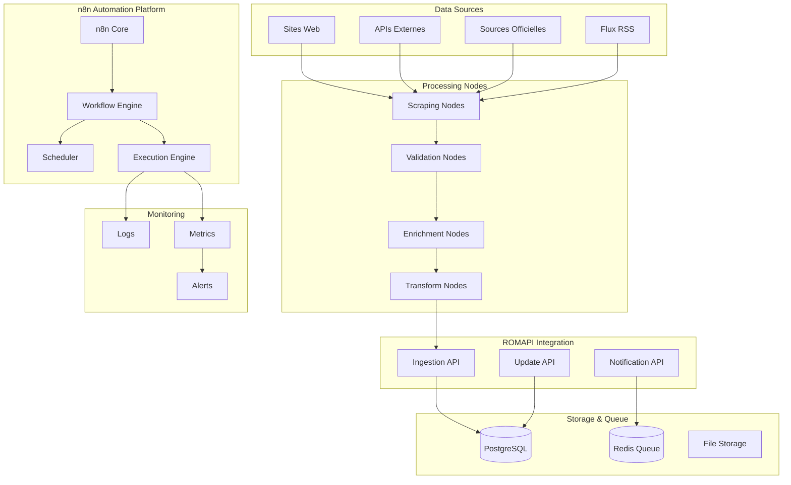
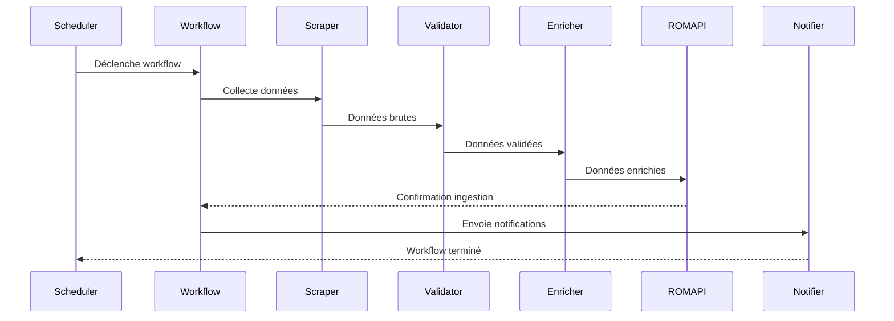

# Design Document - Automation n8n

## Overview

Le système d'automation avec n8n gère les workflows de scraping, l'ingestion automatique de données, l'enrichissement des informations et la synchronisation avec les sources externes. Il orchestre les tâches automatisées pour maintenir l'écosystème ROMAPI à jour sans intervention manuelle.

## Architecture

### High-Level Architecture



### Workflow Architecture



## Components and Interfaces

### 1. Workflow Management

```typescript
interface WorkflowManager {
  // Gestion des workflows
  createWorkflow(config: WorkflowConfig): Promise<Workflow>;
  updateWorkflow(id: string, config: WorkflowConfig): Promise<Workflow>;
  deleteWorkflow(id: string): Promise<void>;
  
  // Exécution
  executeWorkflow(id: string, params?: WorkflowParams): Promise<WorkflowExecution>;
  scheduleWorkflow(id: string, schedule: CronSchedule): Promise<void>;
  
  // Monitoring
  getWorkflowStatus(id: string): Promise<WorkflowStatus>;
  getExecutionHistory(id: string, limit?: number): Promise<WorkflowExecution[]>;
  
  // Templates
  getWorkflowTemplates(): Promise<WorkflowTemplate[]>;
  createFromTemplate(templateId: string, params: TemplateParams): Promise<Workflow>;
}

interface WorkflowConfig {
  name: string;
  description?: string;
  nodes: WorkflowNode[];
  connections: WorkflowConnection[];
  settings: WorkflowSettings;
  variables: Record<string, any>;
}

interface WorkflowNode {
  id: string;
  type: NodeType;
  name: string;
  parameters: Record<string, any>;
  position: { x: number; y: number };
  credentials?: string;
}

interface WorkflowConnection {
  source: { node: string; output: string };
  target: { node: string; input: string };
}

enum NodeType {
  HTTP_REQUEST = 'http_request',
  HTML_EXTRACT = 'html_extract',
  DATA_TRANSFORM = 'data_transform',
  VALIDATE = 'validate',
  ROMAPI_INGEST = 'romapi_ingest',
  NOTIFICATION = 'notification',
  CONDITION = 'condition',
  LOOP = 'loop'
}
```

### 2. Scraping Service

```typescript
interface ScrapingService {
  // Configuration de scraping
  createScrapingJob(config: ScrapingConfig): Promise<ScrapingJob>;
  
  // Exécution
  executeScraping(jobId: string): Promise<ScrapingResult>;
  
  // Gestion des erreurs
  handleScrapingError(error: ScrapingError): Promise<ErrorResolution>;
  
  // Respect des robots.txt
  checkRobotsTxt(url: string): Promise<RobotsPermission>;
  
  // Rate limiting
  getRateLimit(domain: string): Promise<RateLimit>;
  setRateLimit(domain: string, limit: RateLimit): Promise<void>;
}

interface ScrapingConfig {
  name: string;
  targetUrl: string;
  selectors: CSSSelector[];
  headers?: Record<string, string>;
  userAgent?: string;
  respectRobotsTxt: boolean;
  rateLimit: {
    requestsPerMinute: number;
    delayBetweenRequests: number;
  };
  retryConfig: {
    maxRetries: number;
    backoffStrategy: 'linear' | 'exponential';
    baseDelay: number;
  };
}

interface CSSSelector {
  name: string;
  selector: string;
  attribute?: string;
  multiple: boolean;
  required: boolean;
  transform?: TransformFunction;
}

interface ScrapingResult {
  jobId: string;
  url: string;
  data: ExtractedData[];
  metadata: ScrapingMetadata;
  errors?: ScrapingError[];
  executedAt: Date;
}

interface ExtractedData {
  [key: string]: string | string[] | null;
}
```

### 3. Data Validation Service

```typescript
interface DataValidationService {
  // Validation des données
  validateData(data: any, schema: ValidationSchema): Promise<ValidationResult>;
  
  // Schémas de validation
  createValidationSchema(config: SchemaConfig): Promise<ValidationSchema>;
  getValidationSchemas(): Promise<ValidationSchema[]>;
  
  // Déduplication
  detectDuplicates(data: any[], config: DeduplicationConfig): Promise<DuplicateDetectionResult>;
  
  // Nettoyage des données
  cleanData(data: any, rules: CleaningRule[]): Promise<any>;
}

interface ValidationSchema {
  id: string;
  name: string;
  fields: FieldValidation[];
  rules: ValidationRule[];
}

interface FieldValidation {
  name: string;
  type: 'string' | 'number' | 'email' | 'phone' | 'url';
  required: boolean;
  minLength?: number;
  maxLength?: number;
  pattern?: string;
  enum?: string[];
}

interface ValidationRule {
  name: string;
  condition: string;
  message: string;
  severity: 'error' | 'warning' | 'info';
}

interface ValidationResult {
  isValid: boolean;
  errors: ValidationError[];
  warnings: ValidationWarning[];
  cleanedData: any;
}
```

### 4. Data Enrichment Service

```typescript
interface DataEnrichmentService {
  // Enrichissement automatique
  enrichData(data: any, enrichmentRules: EnrichmentRule[]): Promise<EnrichedData>;
  
  // Géocodage
  geocodeAddress(address: string): Promise<GeocodingResult>;
  
  // Classification automatique
  classifyBusiness(businessData: BusinessData): Promise<ClassificationResult>;
  
  // Enrichissement d'images
  processImages(imageUrls: string[]): Promise<ProcessedImage[]>;
  
  // Validation de contact
  validateContactInfo(contact: ContactInfo): Promise<ContactValidationResult>;
}

interface EnrichmentRule {
  name: string;
  condition: string;
  action: EnrichmentAction;
  priority: number;
}

interface EnrichmentAction {
  type: 'geocode' | 'classify' | 'validate' | 'transform' | 'fetch';
  parameters: Record<string, any>;
  fallback?: EnrichmentAction;
}

interface EnrichedData {
  original: any;
  enriched: any;
  enrichmentLog: EnrichmentLogEntry[];
  confidence: number;
}

interface EnrichmentLogEntry {
  rule: string;
  action: string;
  success: boolean;
  result?: any;
  error?: string;
  executedAt: Date;
}
```

### 5. External Sync Service

```typescript
interface ExternalSyncService {
  // Configuration des sources
  addSyncSource(config: SyncSourceConfig): Promise<SyncSource>;
  updateSyncSource(id: string, config: SyncSourceConfig): Promise<SyncSource>;
  
  // Synchronisation
  syncWithSource(sourceId: string): Promise<SyncResult>;
  scheduledSync(sourceId: string, schedule: CronSchedule): Promise<void>;
  
  // Gestion des conflits
  resolveConflict(conflict: DataConflict): Promise<ConflictResolution>;
  
  // Monitoring
  getSyncStatus(sourceId: string): Promise<SyncStatus>;
  getSyncHistory(sourceId: string): Promise<SyncExecution[]>;
}

interface SyncSourceConfig {
  name: string;
  type: 'api' | 'database' | 'file' | 'rss';
  endpoint: string;
  authentication?: AuthConfig;
  mapping: FieldMapping[];
  conflictResolution: ConflictResolutionStrategy;
  schedule?: CronSchedule;
}

interface SyncResult {
  sourceId: string;
  recordsProcessed: number;
  recordsCreated: number;
  recordsUpdated: number;
  recordsSkipped: number;
  conflicts: DataConflict[];
  errors: SyncError[];
  executedAt: Date;
  duration: number;
}

enum ConflictResolutionStrategy {
  OVERWRITE = 'overwrite',
  MERGE = 'merge',
  SKIP = 'skip',
  MANUAL = 'manual'
}
```

## Workflow Templates

### 1. Business Scraping Template

```json
{
  "name": "Business Directory Scraping",
  "description": "Template pour scraper des annuaires d'entreprises",
  "nodes": [
    {
      "id": "start",
      "type": "trigger",
      "name": "Déclencheur programmé",
      "parameters": {
        "schedule": "0 2 * * *"
      }
    },
    {
      "id": "fetch_pages",
      "type": "http_request",
      "name": "Récupérer pages",
      "parameters": {
        "method": "GET",
        "url": "{{ $json.baseUrl }}/page/{{ $json.pageNumber }}",
        "headers": {
          "User-Agent": "ROMAPI Scraper 1.0"
        }
      }
    },
    {
      "id": "extract_data",
      "type": "html_extract",
      "name": "Extraire données",
      "parameters": {
        "selectors": [
          {
            "name": "name",
            "selector": ".business-name",
            "required": true
          },
          {
            "name": "address",
            "selector": ".business-address"
          },
          {
            "name": "phone",
            "selector": ".business-phone"
          },
          {
            "name": "website",
            "selector": ".business-website a",
            "attribute": "href"
          }
        ]
      }
    },
    {
      "id": "validate_data",
      "type": "validate",
      "name": "Valider données",
      "parameters": {
        "schema": "business_validation_schema"
      }
    },
    {
      "id": "enrich_data",
      "type": "enrich",
      "name": "Enrichir données",
      "parameters": {
        "rules": [
          "geocode_address",
          "classify_business",
          "validate_contact"
        ]
      }
    },
    {
      "id": "ingest_romapi",
      "type": "romapi_ingest",
      "name": "Ingérer dans ROMAPI",
      "parameters": {
        "endpoint": "/api/v1/resources/ingest",
        "batchSize": 50
      }
    },
    {
      "id": "notify_completion",
      "type": "notification",
      "name": "Notifier fin",
      "parameters": {
        "type": "email",
        "recipients": ["admin@romapi.com"],
        "template": "scraping_completion"
      }
    }
  ],
  "connections": [
    { "source": { "node": "start", "output": "main" }, "target": { "node": "fetch_pages", "input": "main" } },
    { "source": { "node": "fetch_pages", "output": "main" }, "target": { "node": "extract_data", "input": "main" } },
    { "source": { "node": "extract_data", "output": "main" }, "target": { "node": "validate_data", "input": "main" } },
    { "source": { "node": "validate_data", "output": "main" }, "target": { "node": "enrich_data", "input": "main" } },
    { "source": { "node": "enrich_data", "output": "main" }, "target": { "node": "ingest_romapi", "input": "main" } },
    { "source": { "node": "ingest_romapi", "output": "main" }, "target": { "node": "notify_completion", "input": "main" } }
  ]
}
```

### 2. API Sync Template

```json
{
  "name": "Official Registry Sync",
  "description": "Synchronisation avec registres officiels",
  "nodes": [
    {
      "id": "trigger_sync",
      "type": "trigger",
      "name": "Déclencheur sync",
      "parameters": {
        "schedule": "0 */6 * * *"
      }
    },
    {
      "id": "fetch_updates",
      "type": "http_request",
      "name": "Récupérer mises à jour",
      "parameters": {
        "method": "GET",
        "url": "{{ $env.OFFICIAL_API_URL }}/updates",
        "headers": {
          "Authorization": "Bearer {{ $env.OFFICIAL_API_TOKEN }}"
        },
        "qs": {
          "since": "{{ $json.lastSyncDate }}"
        }
      }
    },
    {
      "id": "transform_data",
      "type": "data_transform",
      "name": "Transformer données",
      "parameters": {
        "mappings": [
          { "source": "company_name", "target": "name" },
          { "source": "registration_number", "target": "registrationNumber" },
          { "source": "status", "target": "status" },
          { "source": "address", "target": "address" }
        ]
      }
    },
    {
      "id": "detect_changes",
      "type": "condition",
      "name": "Détecter changements",
      "parameters": {
        "condition": "{{ $json.length > 0 }}"
      }
    },
    {
      "id": "update_romapi",
      "type": "romapi_update",
      "name": "Mettre à jour ROMAPI",
      "parameters": {
        "endpoint": "/api/v1/resources/sync",
        "method": "PATCH"
      }
    },
    {
      "id": "log_sync",
      "type": "log",
      "name": "Logger sync",
      "parameters": {
        "level": "info",
        "message": "Sync completed: {{ $json.recordsUpdated }} records updated"
      }
    }
  ]
}
```

## Custom Nodes Development

### 1. ROMAPI Integration Nodes

```typescript
// Node pour ingestion ROMAPI
class ROMAPIIngestNode implements INodeType {
  description: INodeTypeDescription = {
    displayName: 'ROMAPI Ingest',
    name: 'romapi-ingest',
    group: ['transform'],
    version: 1,
    description: 'Ingère des données dans ROMAPI',
    defaults: {
      name: 'ROMAPI Ingest'
    },
    inputs: ['main'],
    outputs: ['main'],
    credentials: [
      {
        name: 'romapi',
        required: true
      }
    ],
    properties: [
      {
        displayName: 'Endpoint',
        name: 'endpoint',
        type: 'string',
        default: '/api/v1/resources/ingest',
        required: true,
        description: 'ROMAPI endpoint pour ingestion'
      },
      {
        displayName: 'Batch Size',
        name: 'batchSize',
        type: 'number',
        default: 50,
        description: 'Nombre d\'éléments par batch'
      },
      {
        displayName: 'Resource Type',
        name: 'resourceType',
        type: 'options',
        options: [
          { name: 'Business', value: 'business' },
          { name: 'Service', value: 'service' },
          { name: 'API', value: 'api' }
        ],
        default: 'business'
      }
    ]
  };

  async execute(this: IExecuteFunctions): Promise<INodeExecutionData[][]> {
    const items = this.getInputData();
    const credentials = await this.getCredentials('romapi');
    const endpoint = this.getNodeParameter('endpoint', 0) as string;
    const batchSize = this.getNodeParameter('batchSize', 0) as number;
    const resourceType = this.getNodeParameter('resourceType', 0) as string;

    const results: INodeExecutionData[] = [];
    
    // Traiter par batches
    for (let i = 0; i < items.length; i += batchSize) {
      const batch = items.slice(i, i + batchSize);
      
      const payload = {
        resourceType,
        data: batch.map(item => item.json)
      };

      try {
        const response = await this.helpers.request({
          method: 'POST',
          url: `${credentials.baseUrl}${endpoint}`,
          headers: {
            'Authorization': `Bearer ${credentials.apiKey}`,
            'Content-Type': 'application/json'
          },
          body: payload,
          json: true
        });

        results.push({
          json: {
            success: true,
            batchIndex: Math.floor(i / batchSize),
            recordsProcessed: batch.length,
            response: response
          }
        });
      } catch (error) {
        results.push({
          json: {
            success: false,
            batchIndex: Math.floor(i / batchSize),
            error: error.message,
            failedRecords: batch.length
          }
        });
      }
    }

    return [results];
  }
}
```

### 2. Data Validation Node

```typescript
class DataValidationNode implements INodeType {
  description: INodeTypeDescription = {
    displayName: 'Data Validation',
    name: 'data-validation',
    group: ['transform'],
    version: 1,
    description: 'Valide les données selon un schéma',
    defaults: {
      name: 'Data Validation'
    },
    inputs: ['main'],
    outputs: ['main', 'errors'],
    properties: [
      {
        displayName: 'Validation Schema',
        name: 'schema',
        type: 'json',
        default: '{}',
        description: 'Schéma de validation JSON Schema'
      },
      {
        displayName: 'Stop on Error',
        name: 'stopOnError',
        type: 'boolean',
        default: false,
        description: 'Arrêter l\'exécution en cas d\'erreur'
      }
    ]
  };

  async execute(this: IExecuteFunctions): Promise<INodeExecutionData[][]> {
    const items = this.getInputData();
    const schema = JSON.parse(this.getNodeParameter('schema', 0) as string);
    const stopOnError = this.getNodeParameter('stopOnError', 0) as boolean;

    const validItems: INodeExecutionData[] = [];
    const errorItems: INodeExecutionData[] = [];

    const ajv = new Ajv({ allErrors: true });
    const validate = ajv.compile(schema);

    for (const item of items) {
      const isValid = validate(item.json);
      
      if (isValid) {
        validItems.push(item);
      } else {
        const errorItem = {
          json: {
            originalData: item.json,
            errors: validate.errors,
            timestamp: new Date().toISOString()
          }
        };
        
        errorItems.push(errorItem);
        
        if (stopOnError) {
          throw new NodeOperationError(
            this.getNode(),
            `Validation failed: ${validate.errors?.map(e => e.message).join(', ')}`
          );
        }
      }
    }

    return [validItems, errorItems];
  }
}
```

## Error Handling and Recovery

### Error Management System

```typescript
class WorkflowErrorManager {
  async handleWorkflowError(execution: WorkflowExecution, error: WorkflowError): Promise<ErrorResolution> {
    // Classifier l'erreur
    const errorType = this.classifyError(error);
    
    // Déterminer la stratégie de récupération
    const strategy = this.getRecoveryStrategy(errorType, execution.workflow);
    
    switch (strategy.type) {
      case 'retry':
        return await this.retryExecution(execution, strategy.config);
        
      case 'skip':
        return await this.skipFailedNode(execution, error.nodeId);
        
      case 'fallback':
        return await this.executeFallbackWorkflow(execution, strategy.fallbackWorkflowId);
        
      case 'manual':
        return await this.createManualIntervention(execution, error);
        
      default:
        return await this.logAndFail(execution, error);
    }
  }
  
  private classifyError(error: WorkflowError): ErrorType {
    if (error.message.includes('timeout')) {
      return ErrorType.TIMEOUT;
    } else if (error.message.includes('rate limit')) {
      return ErrorType.RATE_LIMIT;
    } else if (error.message.includes('network')) {
      return ErrorType.NETWORK;
    } else if (error.message.includes('validation')) {
      return ErrorType.VALIDATION;
    } else {
      return ErrorType.UNKNOWN;
    }
  }
  
  private async retryExecution(execution: WorkflowExecution, config: RetryConfig): Promise<ErrorResolution> {
    const maxRetries = config.maxRetries || 3;
    const backoffMultiplier = config.backoffMultiplier || 2;
    const baseDelay = config.baseDelay || 1000;
    
    for (let attempt = 1; attempt <= maxRetries; attempt++) {
      try {
        // Attendre avant retry
        const delay = baseDelay * Math.pow(backoffMultiplier, attempt - 1);
        await this.sleep(delay);
        
        // Réexécuter depuis le nœud qui a échoué
        const result = await this.resumeExecution(execution);
        
        return {
          type: 'success',
          message: `Execution succeeded on attempt ${attempt}`,
          result
        };
      } catch (retryError) {
        if (attempt === maxRetries) {
          return {
            type: 'failure',
            message: `All ${maxRetries} retry attempts failed`,
            error: retryError
          };
        }
      }
    }
  }
}
```

### Circuit Breaker Pattern

```typescript
class CircuitBreaker {
  private failures: number = 0;
  private lastFailureTime: Date | null = null;
  private state: 'CLOSED' | 'OPEN' | 'HALF_OPEN' = 'CLOSED';
  
  constructor(
    private readonly threshold: number = 5,
    private readonly timeout: number = 60000,
    private readonly resetTimeout: number = 30000
  ) {}
  
  async execute<T>(operation: () => Promise<T>): Promise<T> {
    if (this.state === 'OPEN') {
      if (this.shouldAttemptReset()) {
        this.state = 'HALF_OPEN';
      } else {
        throw new Error('Circuit breaker is OPEN');
      }
    }
    
    try {
      const result = await operation();
      this.onSuccess();
      return result;
    } catch (error) {
      this.onFailure();
      throw error;
    }
  }
  
  private onSuccess(): void {
    this.failures = 0;
    this.state = 'CLOSED';
  }
  
  private onFailure(): void {
    this.failures++;
    this.lastFailureTime = new Date();
    
    if (this.failures >= this.threshold) {
      this.state = 'OPEN';
    }
  }
  
  private shouldAttemptReset(): boolean {
    return this.lastFailureTime !== null &&
           Date.now() - this.lastFailureTime.getTime() >= this.resetTimeout;
  }
}
```

## Monitoring and Observability

### Workflow Monitoring

```typescript
class WorkflowMonitor {
  async collectMetrics(execution: WorkflowExecution): Promise<void> {
    const metrics = {
      workflowId: execution.workflowId,
      executionId: execution.id,
      duration: execution.finishedAt.getTime() - execution.startedAt.getTime(),
      status: execution.status,
      nodesExecuted: execution.data.resultData.runData ? Object.keys(execution.data.resultData.runData).length : 0,
      dataProcessed: this.calculateDataProcessed(execution),
      errorsCount: execution.data.resultData.error ? 1 : 0
    };
    
    // Envoyer vers Prometheus
    this.prometheusService.recordWorkflowExecution(metrics);
    
    // Envoyer vers analytics
    await this.analyticsService.trackEvent({
      type: 'workflow_execution',
      properties: metrics,
      timestamp: new Date()
    });
  }
  
  async checkWorkflowHealth(): Promise<HealthStatus> {
    const activeExecutions = await this.getActiveExecutions();
    const failedExecutions = await this.getRecentFailedExecutions();
    const avgExecutionTime = await this.getAverageExecutionTime();
    
    const status = this.determineHealthStatus(activeExecutions, failedExecutions, avgExecutionTime);
    
    return {
      status,
      activeExecutions: activeExecutions.length,
      failedExecutionsLast24h: failedExecutions.length,
      averageExecutionTime: avgExecutionTime,
      timestamp: new Date()
    };
  }
  
  private determineHealthStatus(active: any[], failed: any[], avgTime: number): 'healthy' | 'degraded' | 'unhealthy' {
    if (failed.length > 10 || avgTime > 300000) { // Plus de 10 échecs ou plus de 5 minutes
      return 'unhealthy';
    } else if (failed.length > 5 || avgTime > 120000) { // Plus de 5 échecs ou plus de 2 minutes
      return 'degraded';
    } else {
      return 'healthy';
    }
  }
}
```

### Alert System

```typescript
class WorkflowAlertSystem {
  async checkAlertConditions(): Promise<void> {
    const conditions = await this.getAlertConditions();
    
    for (const condition of conditions) {
      const shouldAlert = await this.evaluateCondition(condition);
      
      if (shouldAlert && !condition.isTriggered) {
        await this.triggerAlert(condition);
      } else if (!shouldAlert && condition.isTriggered) {
        await this.resolveAlert(condition);
      }
    }
  }
  
  private async evaluateCondition(condition: AlertCondition): Promise<boolean> {
    switch (condition.type) {
      case 'workflow_failure_rate':
        const failureRate = await this.getWorkflowFailureRate(condition.workflowId, condition.timeWindow);
        return failureRate > condition.threshold;
        
      case 'execution_duration':
        const avgDuration = await this.getAverageExecutionDuration(condition.workflowId, condition.timeWindow);
        return avgDuration > condition.threshold;
        
      case 'data_freshness':
        const lastSuccessfulRun = await this.getLastSuccessfulRun(condition.workflowId);
        const staleness = Date.now() - lastSuccessfulRun.getTime();
        return staleness > condition.threshold;
        
      default:
        return false;
    }
  }
  
  private async triggerAlert(condition: AlertCondition): Promise<void> {
    const alert: Alert = {
      id: generateId(),
      conditionId: condition.id,
      type: condition.type,
      severity: condition.severity,
      message: this.generateAlertMessage(condition),
      triggeredAt: new Date(),
      status: 'active'
    };
    
    // Sauvegarder l'alerte
    await this.alertRepository.save(alert);
    
    // Envoyer notifications
    await Promise.all([
      this.sendEmailAlert(alert),
      this.sendSlackAlert(alert),
      this.sendWebhookAlert(alert)
    ]);
    
    // Marquer la condition comme déclenchée
    await this.updateConditionStatus(condition.id, true);
  }
}
```

## Security and Compliance

### Secure Credential Management

```typescript
class CredentialManager {
  async storeCredential(credential: WorkflowCredential): Promise<string> {
    // Chiffrer les données sensibles
    const encryptedData = await this.encrypt(credential.data);
    
    const storedCredential = {
      id: generateId(),
      name: credential.name,
      type: credential.type,
      encryptedData,
      userId: credential.userId,
      createdAt: new Date(),
      updatedAt: new Date()
    };
    
    await this.credentialRepository.save(storedCredential);
    
    // Audit log
    await this.auditService.log({
      action: 'credential_created',
      userId: credential.userId,
      resourceId: storedCredential.id,
      details: { name: credential.name, type: credential.type }
    });
    
    return storedCredential.id;
  }
  
  async getCredential(id: string, userId: string): Promise<WorkflowCredential> {
    const stored = await this.credentialRepository.findOne({
      where: { id, userId }
    });
    
    if (!stored) {
      throw new Error('Credential not found');
    }
    
    // Déchiffrer les données
    const decryptedData = await this.decrypt(stored.encryptedData);
    
    // Audit log
    await this.auditService.log({
      action: 'credential_accessed',
      userId,
      resourceId: id,
      details: { name: stored.name }
    });
    
    return {
      id: stored.id,
      name: stored.name,
      type: stored.type,
      data: decryptedData
    };
  }
  
  private async encrypt(data: any): Promise<string> {
    const key = await this.getEncryptionKey();
    const cipher = crypto.createCipher('aes-256-gcm', key);
    
    let encrypted = cipher.update(JSON.stringify(data), 'utf8', 'hex');
    encrypted += cipher.final('hex');
    
    const authTag = cipher.getAuthTag();
    
    return `${encrypted}:${authTag.toString('hex')}`;
  }
}
```

### Data Privacy and GDPR

```typescript
class DataPrivacyManager {
  async anonymizeWorkflowData(workflowId: string): Promise<void> {
    // Récupérer toutes les exécutions du workflow
    const executions = await this.executionRepository.find({
      where: { workflowId }
    });
    
    for (const execution of executions) {
      // Anonymiser les données sensibles
      const anonymizedData = this.anonymizeExecutionData(execution.data);
      
      await this.executionRepository.update(execution.id, {
        data: anonymizedData
      });
    }
    
    // Logger l'anonymisation
    await this.auditService.log({
      action: 'data_anonymized',
      resourceId: workflowId,
      details: { executionsProcessed: executions.length }
    });
  }
  
  private anonymizeExecutionData(data: any): any {
    const sensitiveFields = ['email', 'phone', 'address', 'name'];
    
    return this.deepTransform(data, (key, value) => {
      if (sensitiveFields.includes(key.toLowerCase()) && typeof value === 'string') {
        return this.hashValue(value);
      }
      return value;
    });
  }
  
  async handleDataDeletionRequest(userId: string): Promise<void> {
    // Supprimer tous les workflows de l'utilisateur
    const workflows = await this.workflowRepository.find({
      where: { userId }
    });
    
    for (const workflow of workflows) {
      await this.deleteWorkflowCompletely(workflow.id);
    }
    
    // Supprimer les credentials
    await this.credentialRepository.delete({ userId });
    
    // Logger la suppression
    await this.auditService.log({
      action: 'user_data_deleted',
      userId,
      details: { workflowsDeleted: workflows.length }
    });
  }
}
```

## Testing Strategy

### Unit Tests

```typescript
describe('WorkflowManager', () => {
  describe('executeWorkflow', () => {
    it('should execute workflow successfully', async () => {
      const workflow = createMockWorkflow();
      const execution = await workflowManager.executeWorkflow(workflow.id);
      
      expect(execution.status).toBe('success');
      expect(execution.data).toBeDefined();
    });
    
    it('should handle node failures gracefully', async () => {
      const workflow = createMockWorkflowWithFailingNode();
      const execution = await workflowManager.executeWorkflow(workflow.id);
      
      expect(execution.status).toBe('error');
      expect(execution.error).toBeDefined();
    });
  });
});

describe('ScrapingService', () => {
  describe('executeScraping', () => {
    it('should respect robots.txt', async () => {
      mockRobotsTxt.mockResolvedValue({ allowed: false });
      
      const config = createScrapingConfig('https://example.com');
      
      await expect(scrapingService.executeScraping(config))
        .rejects.toThrow('Scraping not allowed by robots.txt');
    });
    
    it('should handle rate limiting', async () => {
      const config = createScrapingConfig('https://example.com', {
        rateLimit: { requestsPerMinute: 1 }
      });
      
      const start = Date.now();
      await scrapingService.executeScraping(config);
      await scrapingService.executeScraping(config);
      const duration = Date.now() - start;
      
      expect(duration).toBeGreaterThan(60000); // Au moins 1 minute
    });
  });
});
```

### Integration Tests

```typescript
describe('n8n Integration', () => {
  beforeEach(async () => {
    await setupTestN8nInstance();
    await seedTestWorkflows();
  });
  
  it('should execute complete scraping workflow', async () => {
    const workflow = await createTestScrapingWorkflow();
    const execution = await n8nService.executeWorkflow(workflow.id);
    
    expect(execution.status).toBe('success');
    
    // Vérifier que les données ont été ingérées
    const resources = await db.apiResource.findMany({
      where: { source: 'test_scraping' }
    });
    
    expect(resources.length).toBeGreaterThan(0);
  });
  
  it('should handle webhook triggers', async () => {
    const workflow = await createWebhookTriggeredWorkflow();
    
    // Déclencher via webhook
    const response = await request(app)
      .post(`/webhook/${workflow.webhookId}`)
      .send({ test: 'data' })
      .expect(200);
    
    // Vérifier l'exécution
    const executions = await n8nService.getExecutions(workflow.id);
    expect(executions.length).toBe(1);
    expect(executions[0].status).toBe('success');
  });
});
```