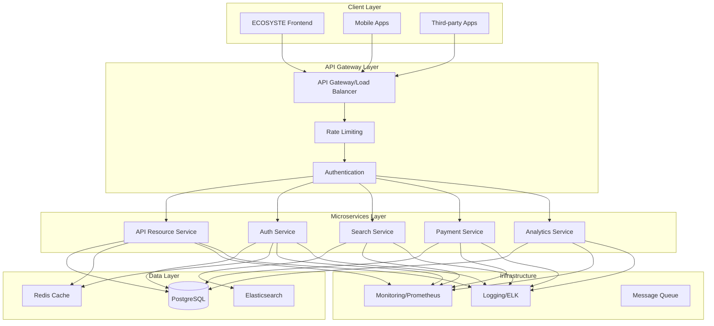
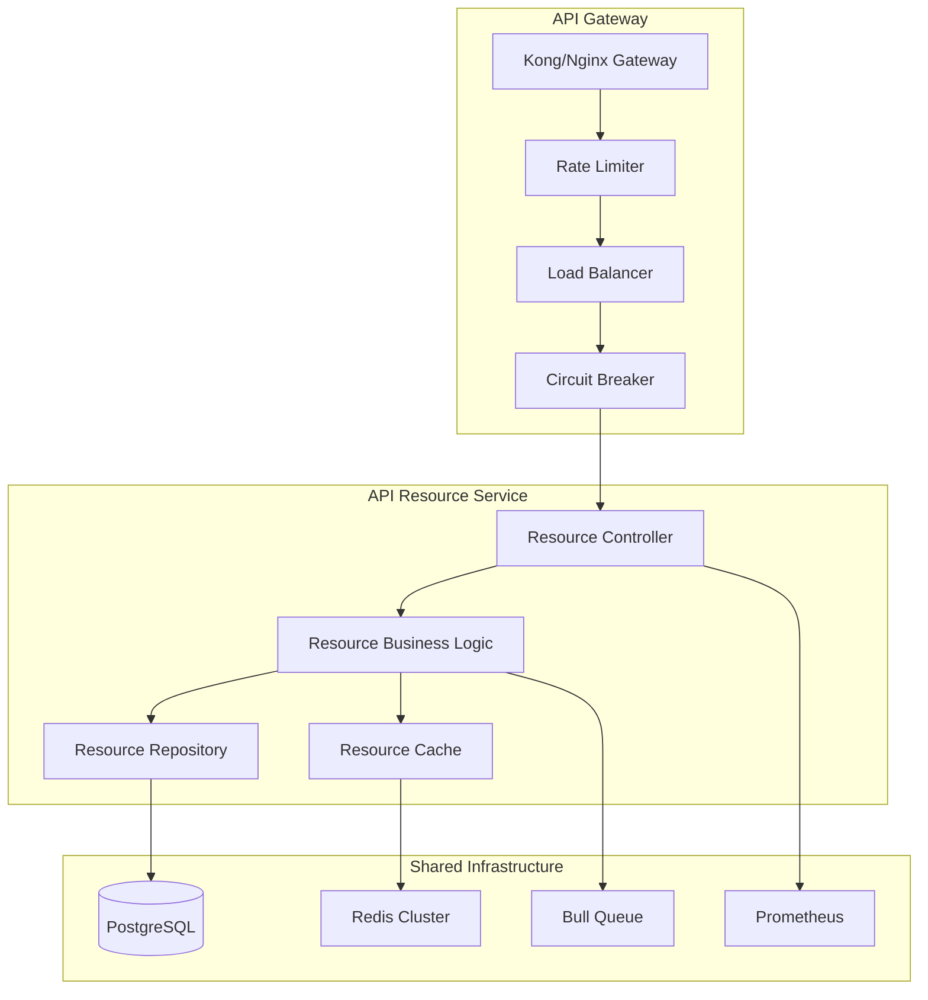

# Design Document - Backend API Core ROMAPI

## Overview

Le Backend API Core ROMAPI constitue l'épine dorsale de l'écosystème d'API, implémentant une architecture microservices moderne avec NestJS. Ce design couvre l'API Gateway, le service de gestion des ressources API, l'infrastructure de données avec PostgreSQL/Prisma, le système de cache Redis, et les mécanismes de monitoring et sécurité.

L'architecture suit les principes de Domain-Driven Design (DDD) et adopte une approche API-first avec documentation automatique via OpenAPI/Swagger.

## Architecture

### Architecture Globale



### Architecture Microservices Détaillée



## Components and Interfaces

### 1. API Gateway

**Responsabilités :**
- Routage des requêtes vers les microservices appropriés
- Load balancing et circuit breaker
- Rate limiting global et par utilisateur
- Authentification centralisée
- Logging et monitoring des requêtes

**Technologies :**
- Kong ou Nginx avec modules personnalisés
- Redis pour le rate limiting distribué
- JWT pour l'authentification

**Configuration :**
```typescript
// gateway.config.ts
export interface GatewayConfig {
  services: {
    [serviceName: string]: {
      url: string;
      healthCheck: string;
      timeout: number;
      retries: number;
    };
  };
  rateLimiting: {
    global: number;
    perUser: number;
    perApiKey: number;
  };
  circuitBreaker: {
    failureThreshold: number;
    resetTimeout: number;
  };
}
```

### 2. API Resource Service

**Architecture en couches :**

```typescript
// Couche Controller
@Controller('api-resources')
@ApiTags('API Resources')
export class ApiResourceController {
  constructor(private readonly apiResourceService: ApiResourceService) {}

  @Get()
  @ApiOperation({ summary: 'List API resources' })
  async findAll(@Query() query: FindApiResourcesDto): Promise<ApiResourceResponseDto[]> {
    return this.apiResourceService.findAll(query);
  }

  @Post()
  @ApiOperation({ summary: 'Create API resource' })
  async create(@Body() createDto: CreateApiResourceDto): Promise<ApiResourceResponseDto> {
    return this.apiResourceService.create(createDto);
  }

  @Post('ingest')
  @ApiOperation({ summary: 'Bulk ingest API resources' })
  async ingest(@Body() ingestDto: IngestApiResourcesDto): Promise<IngestResultDto> {
    return this.apiResourceService.ingest(ingestDto);
  }
}

// Couche Service (Business Logic)
@Injectable()
export class ApiResourceService {
  constructor(
    private readonly repository: ApiResourceRepository,
    private readonly cacheService: CacheService,
    private readonly validationService: ValidationService,
    private readonly enrichmentService: EnrichmentService
  ) {}

  async findAll(query: FindApiResourcesDto): Promise<ApiResourceResponseDto[]> {
    const cacheKey = this.buildCacheKey('list', query);
    
    // Try cache first
    const cached = await this.cacheService.get<ApiResourceResponseDto[]>(cacheKey);
    if (cached) return cached;

    // Query database
    const resources = await this.repository.findMany({
      where: this.buildWhereClause(query),
      include: { category: true, images: { where: { isPrimary: true } } },
      orderBy: this.buildOrderBy(query),
      take: query.limit || 20,
      skip: query.offset || 0,
    });

    const result = resources.map(resource => this.toResponseDto(resource));
    
    // Cache result
    await this.cacheService.set(cacheKey, result, CACHE_TTL.API_RESOURCES);
    
    return result;
  }

  async create(createDto: CreateApiResourceDto): Promise<ApiResourceResponseDto> {
    // Validation
    await this.validationService.validateCreateDto(createDto);
    
    // Enrichment
    const enrichedData = await this.enrichmentService.enrich(createDto);
    
    // Create resource
    const resource = await this.repository.create(enrichedData);
    
    // Invalidate cache
    await this.cacheService.invalidatePattern('api-resources:*');
    
    return this.toResponseDto(resource);
  }
}

// Couche Repository
@Injectable()
export class ApiResourceRepository {
  constructor(private readonly prisma: PrismaService) {}

  async findMany(params: FindManyParams): Promise<ApiResource[]> {
    return this.prisma.apiResource.findMany(params);
  }

  async create(data: CreateApiResourceData): Promise<ApiResource> {
    return this.prisma.apiResource.create({ data });
  }

  async update(id: string, data: UpdateApiResourceData): Promise<ApiResource> {
    return this.prisma.apiResource.update({ where: { id }, data });
  }

  async softDelete(id: string): Promise<ApiResource> {
    return this.prisma.apiResource.update({
      where: { id },
      data: { deletedAt: new Date() }
    });
  }
}
```

### 3. Cache Service

**Stratégie de cache multi-niveaux :**

```typescript
@Injectable()
export class CacheService {
  constructor(
    @Inject('REDIS_CLIENT') private readonly redis: Redis,
    private readonly logger: Logger
  ) {}

  async get<T>(key: string): Promise<T | null> {
    try {
      const value = await this.redis.get(key);
      return value ? JSON.parse(value) : null;
    } catch (error) {
      this.logger.warn(`Cache get failed for key ${key}:`, error);
      return null;
    }
  }

  async set(key: string, value: any, ttl?: number): Promise<void> {
    try {
      const serialized = JSON.stringify(value);
      if (ttl) {
        await this.redis.setex(key, ttl, serialized);
      } else {
        await this.redis.set(key, serialized);
      }
    } catch (error) {
      this.logger.warn(`Cache set failed for key ${key}:`, error);
    }
  }

  async invalidatePattern(pattern: string): Promise<void> {
    try {
      const keys = await this.redis.keys(pattern);
      if (keys.length > 0) {
        await this.redis.del(...keys);
      }
    } catch (error) {
      this.logger.warn(`Cache invalidation failed for pattern ${pattern}:`, error);
    }
  }

  async getOrSet<T>(
    key: string,
    factory: () => Promise<T>,
    ttl?: number
  ): Promise<T> {
    const cached = await this.get<T>(key);
    if (cached) return cached;

    const value = await factory();
    await this.set(key, value, ttl);
    return value;
  }
}

// Cache Keys Strategy
export const CACHE_KEYS = {
  API_RESOURCE: {
    BY_ID: (id: string) => `api-resource:${id}`,
    BY_SLUG: (slug: string) => `api-resource:slug:${slug}`,
    LIST: (filters: string) => `api-resources:list:${filters}`,
    SEARCH: (query: string) => `api-resources:search:${query}`,
  },
  CATEGORIES: 'categories:all',
  USER: {
    BY_ID: (id: string) => `user:${id}`,
    API_USAGE: (userId: string) => `api:usage:${userId}`,
  },
} as const;

export const CACHE_TTL = {
  API_RESOURCE: 3600, // 1 hour
  CATEGORIES: 86400, // 24 hours
  SEARCH: 1800, // 30 minutes
  USER: 1800, // 30 minutes
} as const;
```

## Data Models

### Prisma Schema

```prisma
generator client {
  provider = "prisma-client-js"
}

datasource db {
  provider = "postgresql"
  url      = env("DATABASE_URL")
}

model User {
  id           String   @id @default(dbgenerated("gen_random_uuid()")) @db.Uuid
  email        String   @unique
  passwordHash String   @map("password_hash")
  name         String
  userType     UserType @default(INDIVIDUAL) @map("user_type")
  plan         Plan     @default(FREE)
  apiQuota     Int      @default(1000) @map("api_quota")
  apiUsage     Int      @default(0) @map("api_usage")
  pricingTier  PricingTier @default(STANDARD) @map("pricing_tier")
  createdAt    DateTime @default(now()) @map("created_at")
  updatedAt    DateTime @updatedAt @map("updated_at")

  apiResources  ApiResource[]
  apiKeys       ApiKey[]
  subscriptions Subscription[]

  @@map("users")
}

model Category {
  id          String   @id @default(dbgenerated("gen_random_uuid()")) @db.Uuid
  name        String
  slug        String   @unique
  description String?
  icon        String?
  parentId    String?  @map("parent_id") @db.Uuid
  createdAt   DateTime @default(now()) @map("created_at")

  parent       Category?     @relation("CategoryHierarchy", fields: [parentId], references: [id])
  children     Category[]    @relation("CategoryHierarchy")
  apiResources ApiResource[]

  @@map("categories")
}

model ApiResource {
  id           String       @id @default(dbgenerated("gen_random_uuid()")) @db.Uuid
  userId       String       @map("user_id") @db.Uuid
  name         String
  slug         String       @unique
  description  String?
  resourceType ResourceType @default(BUSINESS) @map("resource_type")
  categoryId   String       @map("category_id") @db.Uuid
  
  // Address
  addressLine1 String? @map("address_line1")
  addressLine2 String? @map("address_line2")
  city         String?
  region       String?
  postalCode   String? @map("postal_code")
  country      String  @default("CM")
  latitude     Decimal? @db.Decimal(10, 8)
  longitude    Decimal? @db.Decimal(11, 8)
  
  // Contact
  phone   String?
  email   String?
  website String?
  
  // Business info
  status    ResourceStatus @default(PENDING)
  plan      ResourcePlan   @default(FREE)
  verified  Boolean        @default(false)
  
  // SEO
  metaTitle       String? @map("meta_title")
  metaDescription String? @map("meta_description")
  
  // Audit
  createdAt   DateTime  @default(now()) @map("created_at")
  updatedAt   DateTime  @updatedAt @map("updated_at")
  publishedAt DateTime? @map("published_at")
  deletedAt   DateTime? @map("deleted_at")

  user            User              @relation(fields: [userId], references: [id], onDelete: Cascade)
  category        Category          @relation(fields: [categoryId], references: [id])
  hours           BusinessHour[]
  images          ResourceImage[]
  analyticsEvents AnalyticsEvent[]

  @@index([categoryId])
  @@index([latitude, longitude])
  @@index([status, plan])
  @@index([createdAt(sort: Desc)])
  @@fulltext([name, description])
  @@map("api_resources")
}

model BusinessHour {
  id           String  @id @default(dbgenerated("gen_random_uuid()")) @db.Uuid
  resourceId   String  @map("resource_id") @db.Uuid
  dayOfWeek    Int     @map("day_of_week")
  openTime     String? @map("open_time") @db.Time
  closeTime    String? @map("close_time") @db.Time
  isClosed     Boolean @default(false) @map("is_closed")

  resource ApiResource @relation(fields: [resourceId], references: [id], onDelete: Cascade)

  @@map("business_hours")
}

model ResourceImage {
  id         String   @id @default(dbgenerated("gen_random_uuid()")) @db.Uuid
  resourceId String   @map("resource_id") @db.Uuid
  url        String
  altText    String?  @map("alt_text")
  isPrimary  Boolean  @default(false) @map("is_primary")
  orderIndex Int      @default(0) @map("order_index")
  createdAt  DateTime @default(now()) @map("created_at")

  resource ApiResource @relation(fields: [resourceId], references: [id], onDelete: Cascade)

  @@map("resource_images")
}

model ApiKey {
  id          String    @id @default(dbgenerated("gen_random_uuid()")) @db.Uuid
  userId      String    @map("user_id") @db.Uuid
  name        String
  keyHash     String    @map("key_hash")
  keyPrefix   String    @map("key_prefix")
  permissions Json      @default("[]")
  rateLimit   Int       @default(1000) @map("rate_limit")
  isActive    Boolean   @default(true) @map("is_active")
  lastUsedAt  DateTime? @map("last_used_at")
  expiresAt   DateTime? @map("expires_at")
  createdAt   DateTime  @default(now()) @map("created_at")

  user User @relation(fields: [userId], references: [id], onDelete: Cascade)

  @@index([userId, isActive])
  @@map("api_keys")
}

model AnalyticsEvent {
  id         String   @id @default(dbgenerated("gen_random_uuid()")) @db.Uuid
  resourceId String   @map("resource_id") @db.Uuid
  eventType  String   @map("event_type")
  userAgent  String?  @map("user_agent")
  ipAddress  String?  @map("ip_address") @db.Inet
  referrer   String?
  metadata   Json     @default("{}")
  createdAt  DateTime @default(now()) @map("created_at")

  resource ApiResource @relation(fields: [resourceId], references: [id], onDelete: Cascade)

  @@index([resourceId, createdAt(sort: Desc)])
  @@map("analytics_events")
}

enum UserType {
  INDIVIDUAL
  BUSINESS
  ADMIN
}

enum Plan {
  FREE
  PRO
  PREMIUM
  ENTERPRISE
}

enum PricingTier {
  STANDARD
  BUSINESS
  ENTERPRISE
}

enum ResourceType {
  BUSINESS
  SERVICE
  DATA
  API
}

enum ResourceStatus {
  ACTIVE
  PENDING
  SUSPENDED
}

enum ResourcePlan {
  FREE
  PREMIUM
  FEATURED
}
```

### Domain Models et DTOs

```typescript
// Domain Models
export class ApiResourceDomain {
  constructor(
    public readonly id: string,
    public readonly userId: string,
    public readonly name: string,
    public readonly slug: string,
    public readonly description: string | null,
    public readonly resourceType: ResourceType,
    public readonly categoryId: string,
    public readonly address: Address | null,
    public readonly contact: Contact | null,
    public readonly status: ResourceStatus,
    public readonly plan: ResourcePlan,
    public readonly verified: boolean,
    public readonly seo: SeoData | null,
    public readonly createdAt: Date,
    public readonly updatedAt: Date,
    public readonly publishedAt: Date | null,
    public readonly deletedAt: Date | null
  ) {}

  isPublished(): boolean {
    return this.status === ResourceStatus.ACTIVE && this.publishedAt !== null;
  }

  canBeUpdatedBy(userId: string): boolean {
    return this.userId === userId;
  }

  generateSlug(): string {
    return this.name
      .toLowerCase()
      .replace(/[^a-z0-9]+/g, '-')
      .replace(/(^-|-$)/g, '');
  }
}

// DTOs
export class CreateApiResourceDto {
  @IsString()
  @IsNotEmpty()
  @ApiProperty({ description: 'Resource name' })
  name: string;

  @IsString()
  @IsOptional()
  @ApiProperty({ description: 'Resource description', required: false })
  description?: string;

  @IsEnum(ResourceType)
  @ApiProperty({ enum: ResourceType, description: 'Type of resource' })
  resourceType: ResourceType;

  @IsUUID()
  @ApiProperty({ description: 'Category ID' })
  categoryId: string;

  @ValidateNested()
  @Type(() => AddressDto)
  @IsOptional()
  @ApiProperty({ type: AddressDto, required: false })
  address?: AddressDto;

  @ValidateNested()
  @Type(() => ContactDto)
  @IsOptional()
  @ApiProperty({ type: ContactDto, required: false })
  contact?: ContactDto;
}

export class ApiResourceResponseDto {
  @ApiProperty()
  id: string;

  @ApiProperty()
  name: string;

  @ApiProperty()
  slug: string;

  @ApiProperty({ required: false })
  description?: string;

  @ApiProperty({ enum: ResourceType })
  resourceType: ResourceType;

  @ApiProperty()
  categoryId: string;

  @ApiProperty({ type: CategoryResponseDto })
  category: CategoryResponseDto;

  @ApiProperty({ type: AddressDto, required: false })
  address?: AddressDto;

  @ApiProperty({ type: ContactDto, required: false })
  contact?: ContactDto;

  @ApiProperty({ enum: ResourceStatus })
  status: ResourceStatus;

  @ApiProperty({ enum: ResourcePlan })
  plan: ResourcePlan;

  @ApiProperty()
  verified: boolean;

  @ApiProperty({ type: [ResourceImageDto] })
  images: ResourceImageDto[];

  @ApiProperty()
  createdAt: Date;

  @ApiProperty()
  updatedAt: Date;
}
```

## Error Handling

### Stratégie de Gestion d'Erreurs

```typescript
// Custom Exception Classes
export class ApiResourceNotFoundException extends NotFoundException {
  constructor(id: string) {
    super(`API Resource with ID ${id} not found`);
  }
}

export class ApiResourceValidationException extends BadRequestException {
  constructor(errors: ValidationError[]) {
    const messages = errors.map(error => 
      Object.values(error.constraints || {}).join(', ')
    ).join('; ');
    super(`Validation failed: ${messages}`);
  }
}

// Global Exception Filter
@Catch()
export class GlobalExceptionFilter implements ExceptionFilter {
  constructor(private readonly logger: Logger) {}

  catch(exception: unknown, host: ArgumentsHost) {
    const ctx = host.switchToHttp();
    const response = ctx.getResponse<Response>();
    const request = ctx.getRequest<Request>();

    let status = HttpStatus.INTERNAL_SERVER_ERROR;
    let message = 'Internal server error';
    let code = 'INTERNAL_ERROR';

    if (exception instanceof HttpException) {
      status = exception.getStatus();
      const exceptionResponse = exception.getResponse();
      
      if (typeof exceptionResponse === 'string') {
        message = exceptionResponse;
      } else if (typeof exceptionResponse === 'object') {
        message = (exceptionResponse as any).message || message;
        code = (exceptionResponse as any).code || this.getErrorCode(status);
      }
    }

    const errorResponse = {
      success: false,
      error: {
        code,
        message,
        timestamp: new Date().toISOString(),
        path: request.url,
        method: request.method,
      },
    };

    // Log error
    this.logger.error(
      `${request.method} ${request.url} - ${status} - ${message}`,
      exception instanceof Error ? exception.stack : exception
    );

    response.status(status).json(errorResponse);
  }

  private getErrorCode(status: number): string {
    const codes = {
      400: 'BAD_REQUEST',
      401: 'UNAUTHORIZED',
      403: 'FORBIDDEN',
      404: 'NOT_FOUND',
      409: 'CONFLICT',
      422: 'VALIDATION_ERROR',
      429: 'RATE_LIMIT_EXCEEDED',
      500: 'INTERNAL_ERROR',
    };
    return codes[status] || 'UNKNOWN_ERROR';
  }
}

// Response Interceptor for Standardization
@Injectable()
export class ResponseInterceptor<T> implements NestInterceptor<T, StandardResponse<T>> {
  intercept(context: ExecutionContext, next: CallHandler): Observable<StandardResponse<T>> {
    return next.handle().pipe(
      map(data => ({
        success: true,
        data,
        timestamp: new Date().toISOString(),
      }))
    );
  }
}

interface StandardResponse<T> {
  success: boolean;
  data: T;
  timestamp: string;
}
```

## Testing Strategy

### Architecture de Tests

```typescript
// Unit Tests
describe('ApiResourceService', () => {
  let service: ApiResourceService;
  let repository: jest.Mocked<ApiResourceRepository>;
  let cacheService: jest.Mocked<CacheService>;

  beforeEach(async () => {
    const module: TestingModule = await Test.createTestingModule({
      providers: [
        ApiResourceService,
        {
          provide: ApiResourceRepository,
          useValue: createMockRepository(),
        },
        {
          provide: CacheService,
          useValue: createMockCacheService(),
        },
      ],
    }).compile();

    service = module.get<ApiResourceService>(ApiResourceService);
    repository = module.get(ApiResourceRepository);
    cacheService = module.get(CacheService);
  });

  describe('findAll', () => {
    it('should return cached results when available', async () => {
      const cachedData = [createMockApiResource()];
      cacheService.get.mockResolvedValue(cachedData);

      const result = await service.findAll({});

      expect(result).toEqual(cachedData);
      expect(repository.findMany).not.toHaveBeenCalled();
    });

    it('should query database and cache results when cache miss', async () => {
      const dbData = [createMockApiResource()];
      cacheService.get.mockResolvedValue(null);
      repository.findMany.mockResolvedValue(dbData);

      const result = await service.findAll({});

      expect(repository.findMany).toHaveBeenCalled();
      expect(cacheService.set).toHaveBeenCalledWith(
        expect.any(String),
        expect.any(Array),
        CACHE_TTL.API_RESOURCES
      );
    });
  });
});

// Integration Tests
describe('ApiResourceController (e2e)', () => {
  let app: INestApplication;
  let prisma: PrismaService;

  beforeEach(async () => {
    const moduleFixture: TestingModule = await Test.createTestingModule({
      imports: [AppModule],
    }).compile();

    app = moduleFixture.createNestApplication();
    prisma = moduleFixture.get<PrismaService>(PrismaService);
    
    await app.init();
  });

  afterEach(async () => {
    await prisma.cleanDatabase();
    await app.close();
  });

  describe('/api-resources (GET)', () => {
    it('should return paginated results', async () => {
      // Setup test data
      await prisma.apiResource.createMany({
        data: [
          createTestApiResource({ name: 'Resource 1' }),
          createTestApiResource({ name: 'Resource 2' }),
        ],
      });

      return request(app.getHttpServer())
        .get('/api-resources')
        .expect(200)
        .expect(res => {
          expect(res.body.success).toBe(true);
          expect(res.body.data).toHaveLength(2);
        });
    });
  });
});

// Performance Tests
describe('ApiResourceService Performance', () => {
  it('should handle high load efficiently', async () => {
    const startTime = Date.now();
    const promises = Array.from({ length: 100 }, () => 
      service.findAll({ limit: 10 })
    );

    await Promise.all(promises);
    const endTime = Date.now();

    expect(endTime - startTime).toBeLessThan(5000); // 5 seconds max
  });
});
```

## Monitoring et Observabilité

### Métriques Prometheus

```typescript
// Metrics Service
@Injectable()
export class MetricsService {
  private readonly httpRequestsTotal = new Counter({
    name: 'http_requests_total',
    help: 'Total number of HTTP requests',
    labelNames: ['method', 'route', 'status_code'],
  });

  private readonly httpRequestDuration = new Histogram({
    name: 'http_request_duration_seconds',
    help: 'Duration of HTTP requests in seconds',
    labelNames: ['method', 'route'],
    buckets: [0.1, 0.5, 1, 2, 5],
  });

  private readonly apiResourcesTotal = new Gauge({
    name: 'api_resources_total',
    help: 'Total number of API resources',
    labelNames: ['status', 'plan', 'type'],
  });

  private readonly cacheHitRate = new Gauge({
    name: 'cache_hit_rate',
    help: 'Cache hit rate percentage',
    labelNames: ['cache_type'],
  });

  recordHttpRequest(method: string, route: string, statusCode: number, duration: number) {
    this.httpRequestsTotal.inc({ method, route, status_code: statusCode });
    this.httpRequestDuration.observe({ method, route }, duration);
  }

  async updateApiResourceMetrics() {
    const stats = await this.prisma.apiResource.groupBy({
      by: ['status', 'plan', 'resourceType'],
      _count: true,
      where: { deletedAt: null },
    });

    stats.forEach(stat => {
      this.apiResourcesTotal.set(
        { 
          status: stat.status, 
          plan: stat.plan, 
          type: stat.resourceType 
        },
        stat._count
      );
    });
  }

  recordCacheHit(cacheType: string, hit: boolean) {
    // Implementation for cache hit rate tracking
  }

  getMetrics() {
    return register.metrics();
  }
}

// Health Check
@Controller('health')
export class HealthController {
  constructor(
    private readonly prisma: PrismaService,
    private readonly redis: Redis
  ) {}

  @Get()
  async check(): Promise<HealthCheckResult> {
    const checks = await Promise.allSettled([
      this.checkDatabase(),
      this.checkRedis(),
      this.checkExternalServices(),
    ]);

    const status = checks.every(check => check.status === 'fulfilled') 
      ? 'healthy' 
      : 'unhealthy';

    return {
      status,
      timestamp: new Date().toISOString(),
      services: {
        database: checks[0].status === 'fulfilled' ? 'up' : 'down',
        redis: checks[1].status === 'fulfilled' ? 'up' : 'down',
        external: checks[2].status === 'fulfilled' ? 'up' : 'down',
      },
    };
  }

  private async checkDatabase(): Promise<void> {
    await this.prisma.$queryRaw`SELECT 1`;
  }

  private async checkRedis(): Promise<void> {
    await this.redis.ping();
  }

  private async checkExternalServices(): Promise<void> {
    // Check external dependencies
  }
}
```

Ce design document fournit une architecture solide et scalable pour le Backend API Core ROMAPI, avec tous les composants nécessaires pour supporter l'écosystème d'API. L'architecture microservices permet une évolution indépendante des services, tandis que les patterns de cache et monitoring assurent performance et observabilité.