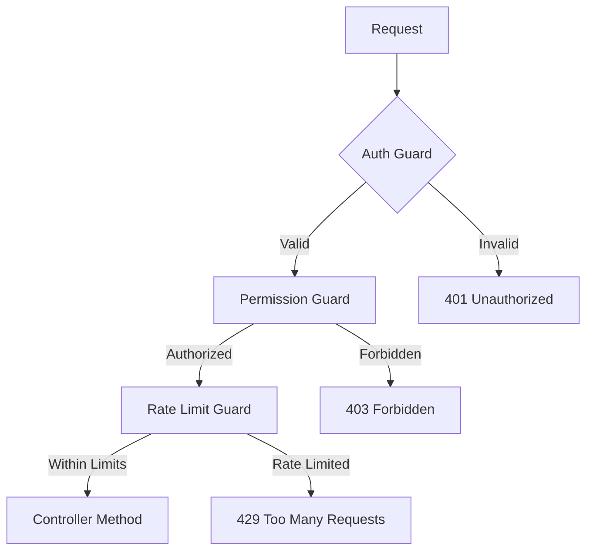

# Guide d'Intégration des Guards d'Authentification ROMAPI

Ce guide explique comment utiliser les guards d'authentification ROMAPI dans vos modules et contrôleurs pour sécuriser vos endpoints.

## Table des Matières

1. [Vue d'ensemble des Guards](#vue-densemble-des-guards)
2. [Configuration des Guards](#configuration-des-guards)
3. [Utilisation dans les Contrôleurs](#utilisation-dans-les-contrôleurs)
4. [Guards Personnalisés](#guards-personnalisés)
5. [Gestion des Erreurs](#gestion-des-erreurs)
6. [Exemples d'Intégration](#exemples-dintégration)
7. [Bonnes Pratiques](#bonnes-pratiques)

## Vue d'ensemble des Guards

ROMAPI fournit plusieurs guards d'authentification et d'autorisation :

### Guards Disponibles

- **`JwtAuthGuard`** - Authentification JWT pour les utilisateurs
- **`ApiKeyAuthGuard`** - Authentification par API Key pour les applications
- **`PermissionGuard`** - Contrôle d'accès basé sur les permissions
- **`RateLimitGuard`** - Limitation du taux de requêtes
- **`LocalAuthGuard`** - Authentification locale (login)
- **`OptionalAuthGuard`** - Authentification optionnelle

### Architecture des Guards



## Configuration des Guards

### 1. Import des Guards

```typescript
// Dans votre module
import { 
  JwtAuthGuard, 
  ApiKeyAuthGuard, 
  PermissionGuard,
  RateLimitGuard 
} from '../auth/guards';

@Module({
  imports: [AuthModule],
  controllers: [YourController],
  providers: [YourService]
})
export class YourModule {}
```

### 2. Configuration Globale

```typescript
// main.ts - Application globale des guards
import { NestFactory, Reflector } from '@nestjs/core';
import { JwtAuthGuard } from './auth/guards/jwt-auth.guard';

async function bootstrap() {
  const app = await NestFactory.create(AppModule);
  
  // Guard global pour tous les endpoints (optionnel)
  const reflector = app.get(Reflector);
  app.useGlobalGuards(new JwtAuthGuard(reflector));
  
  await app.listen(3000);
}
```

### 3. Configuration par Module

```typescript
// your.module.ts
import { Module } from '@nestjs/common';
import { APP_GUARD } from '@nestjs/core';
import { JwtAuthGuard } from '../auth/guards/jwt-auth.guard';

@Module({
  providers: [
    {
      provide: APP_GUARD,
      useClass: JwtAuthGuard,
    },
  ],
})
export class YourModule {}
```

## Utilisation dans les Contrôleurs

### 1. Authentification JWT

```typescript
import { Controller, Get, Post, UseGuards, Req } from '@nestjs/common';
import { JwtAuthGuard } from '../auth/guards/jwt-auth.guard';
import { AuthenticatedRequest } from '../auth/interfaces/authenticated-request.interface';

@Controller('users')
@UseGuards(JwtAuthGuard) // Appliqué à tous les endpoints du contrôleur
export class UsersController {
  
  @Get('profile')
  getProfile(@Req() req: AuthenticatedRequest) {
    // req.user contient les informations de l'utilisateur authentifié
    return {
      user: req.user,
      message: 'Profile retrieved successfully'
    };
  }

  @Post('update')
  updateProfile(@Req() req: AuthenticatedRequest, @Body() updateDto: UpdateUserDto) {
    const userId = req.user.id;
    return this.usersService.update(userId, updateDto);
  }
}
```

### 2. Authentification par API Key

```typescript
import { Controller, Get, UseGuards, Req } from '@nestjs/common';
import { ApiKeyAuthGuard } from '../auth/guards/api-key-auth.guard';
import { ApiKeyRequest } from '../auth/interfaces/api-key-request.interface';

@Controller('api/v1/data')
@UseGuards(ApiKeyAuthGuard)
export class DataController {
  
  @Get()
  getData(@Req() req: ApiKeyRequest) {
    // req.apiKey contient les informations de la clé API
    // req.user contient les informations du propriétaire de la clé
    return {
      data: this.dataService.getData(),
      apiKey: {
        id: req.apiKey.id,
        name: req.apiKey.name,
        permissions: req.apiKey.permissions
      }
    };
  }
}
```

### 3. Contrôle des Permissions

```typescript
import { Controller, Get, Post, Delete, UseGuards } from '@nestjs/common';
import { JwtAuthGuard } from '../auth/guards/jwt-auth.guard';
import { PermissionGuard } from '../auth/guards/permission.guard';
import { RequirePermissions } from '../auth/decorators/require-permissions.decorator';

@Controller('admin')
@UseGuards(JwtAuthGuard, PermissionGuard)
export class AdminController {
  
  @Get('users')
  @RequirePermissions('admin:read', 'users:list')
  listUsers() {
    return this.adminService.listUsers();
  }

  @Post('users')
  @RequirePermissions('admin:write', 'users:create')
  createUser(@Body() createUserDto: CreateUserDto) {
    return this.adminService.createUser(createUserDto);
  }

  @Delete('users/:id')
  @RequirePermissions('admin:delete', 'users:delete')
  deleteUser(@Param('id') id: string) {
    return this.adminService.deleteUser(id);
  }
}
```

### 4. Rate Limiting

```typescript
import { Controller, Post, UseGuards } from '@nestjs/common';
import { RateLimitGuard } from '../auth/guards/rate-limit.guard';
import { RateLimit } from '../auth/decorators/rate-limit.decorator';

@Controller('api')
export class ApiController {
  
  @Post('process')
  @UseGuards(RateLimitGuard)
  @RateLimit({ limit: 10, window: 60000 }) // 10 requêtes par minute
  processData(@Body() data: ProcessDataDto) {
    return this.apiService.processData(data);
  }

  @Post('heavy-operation')
  @UseGuards(RateLimitGuard)
  @RateLimit({ limit: 2, window: 300000 }) // 2 requêtes par 5 minutes
  heavyOperation(@Body() data: HeavyOperationDto) {
    return this.apiService.heavyOperation(data);
  }
}
```

### 5. Combinaison de Guards

```typescript
import { Controller, Get, Post, UseGuards } from '@nestjs/common';
import { JwtAuthGuard } from '../auth/guards/jwt-auth.guard';
import { PermissionGuard } from '../auth/guards/permission.guard';
import { RateLimitGuard } from '../auth/guards/rate-limit.guard';
import { RequirePermissions } from '../auth/decorators/require-permissions.decorator';
import { RateLimit } from '../auth/decorators/rate-limit.decorator';

@Controller('premium')
@UseGuards(JwtAuthGuard, PermissionGuard, RateLimitGuard)
export class PremiumController {
  
  @Get('data')
  @RequirePermissions('premium:read')
  @RateLimit({ limit: 100, window: 3600000 }) // 100 requêtes par heure
  getPremiumData(@Req() req: AuthenticatedRequest) {
    return this.premiumService.getData(req.user.id);
  }

  @Post('analysis')
  @RequirePermissions('premium:analysis')
  @RateLimit({ limit: 5, window: 3600000 }) // 5 analyses par heure
  runAnalysis(@Body() analysisDto: AnalysisDto, @Req() req: AuthenticatedRequest) {
    return this.premiumService.runAnalysis(analysisDto, req.user.id);
  }
}
```

### 6. Authentification Optionnelle

```typescript
import { Controller, Get, UseGuards, Req } from '@nestjs/common';
import { OptionalAuthGuard } from '../auth/guards/optional-auth.guard';
import { OptionalAuthRequest } from '../auth/interfaces/optional-auth-request.interface';

@Controller('public')
export class PublicController {
  
  @Get('content')
  @UseGuards(OptionalAuthGuard)
  getContent(@Req() req: OptionalAuthRequest) {
    // req.user peut être null si non authentifié
    const isAuthenticated = !!req.user;
    
    return {
      content: this.contentService.getContent(isAuthenticated),
      user: req.user || null,
      authenticated: isAuthenticated
    };
  }
}
```

## Guards Personnalisés

### 1. Créer un Guard Personnalisé

```typescript
// custom-role.guard.ts
import { Injectable, CanActivate, ExecutionContext, ForbiddenException } from '@nestjs/common';
import { Reflector } from '@nestjs/core';
import { ROLES_KEY } from '../decorators/roles.decorator';
import { UserRole } from '../enums/user-role.enum';

@Injectable()
export class RolesGuard implements CanActivate {
  constructor(private reflector: Reflector) {}

  canActivate(context: ExecutionContext): boolean {
    const requiredRoles = this.reflector.getAllAndOverride<UserRole[]>(ROLES_KEY, [
      context.getHandler(),
      context.getClass(),
    ]);

    if (!requiredRoles) {
      return true;
    }

    const request = context.switchToHttp().getRequest();
    const user = request.user;

    if (!user) {
      throw new ForbiddenException('User not authenticated');
    }

    const hasRole = requiredRoles.some(role => user.roles?.includes(role));
    
    if (!hasRole) {
      throw new ForbiddenException(`Required roles: ${requiredRoles.join(', ')}`);
    }

    return true;
  }
}
```

### 2. Décorateur Personnalisé

```typescript
// roles.decorator.ts
import { SetMetadata } from '@nestjs/common';
import { UserRole } from '../enums/user-role.enum';

export const ROLES_KEY = 'roles';
export const Roles = (...roles: UserRole[]) => SetMetadata(ROLES_KEY, roles);
```

### 3. Utilisation du Guard Personnalisé

```typescript
import { Controller, Get, UseGuards } from '@nestjs/common';
import { JwtAuthGuard } from '../auth/guards/jwt-auth.guard';
import { RolesGuard } from '../auth/guards/roles.guard';
import { Roles } from '../auth/decorators/roles.decorator';
import { UserRole } from '../auth/enums/user-role.enum';

@Controller('admin')
@UseGuards(JwtAuthGuard, RolesGuard)
export class AdminController {
  
  @Get('dashboard')
  @Roles(UserRole.ADMIN, UserRole.SUPER_ADMIN)
  getDashboard() {
    return this.adminService.getDashboard();
  }

  @Get('system')
  @Roles(UserRole.SUPER_ADMIN)
  getSystemInfo() {
    return this.adminService.getSystemInfo();
  }
}
```

## Gestion des Erreurs

### 1. Exception Filter Personnalisé

```typescript
// auth-exception.filter.ts
import { ExceptionFilter, Catch, ArgumentsHost, HttpException, UnauthorizedException, ForbiddenException } from '@nestjs/common';
import { Response } from 'express';

@Catch(UnauthorizedException, ForbiddenException)
export class AuthExceptionFilter implements ExceptionFilter {
  catch(exception: HttpException, host: ArgumentsHost) {
    const ctx = host.switchToHttp();
    const response = ctx.getResponse<Response>();
    const status = exception.getStatus();
    const message = exception.message;

    const errorResponse = {
      success: false,
      error: {
        code: status === 401 ? 'UNAUTHORIZED' : 'FORBIDDEN',
        message,
        timestamp: new Date().toISOString(),
      }
    };

    // Log pour audit
    console.error(`Auth Error [${status}]: ${message}`);

    response.status(status).json(errorResponse);
  }
}
```

### 2. Application du Filter

```typescript
// Dans votre contrôleur
@Controller('protected')
@UseFilters(AuthExceptionFilter)
@UseGuards(JwtAuthGuard, PermissionGuard)
export class ProtectedController {
  // Vos endpoints protégés
}

// Ou globalement dans main.ts
app.useGlobalFilters(new AuthExceptionFilter());
```

## Exemples d'Intégration

### 1. Module E-commerce

```typescript
// products.controller.ts
import { Controller, Get, Post, Put, Delete, UseGuards, Param, Body, Req } from '@nestjs/common';
import { JwtAuthGuard } from '../auth/guards/jwt-auth.guard';
import { ApiKeyAuthGuard } from '../auth/guards/api-key-auth.guard';
import { PermissionGuard } from '../auth/guards/permission.guard';
import { RateLimitGuard } from '../auth/guards/rate-limit.guard';
import { RequirePermissions } from '../auth/decorators/require-permissions.decorator';
import { RateLimit } from '../auth/decorators/rate-limit.decorator';

@Controller('products')
export class ProductsController {
  
  // Endpoint public avec rate limiting
  @Get()
  @UseGuards(RateLimitGuard)
  @RateLimit({ limit: 1000, window: 3600000 }) // 1000 requêtes par heure
  getProducts(@Query() query: GetProductsDto) {
    return this.productsService.getProducts(query);
  }

  // Endpoint protégé par JWT pour les utilisateurs
  @Get('favorites')
  @UseGuards(JwtAuthGuard, RateLimitGuard)
  @RateLimit({ limit: 100, window: 3600000 })
  getFavorites(@Req() req: AuthenticatedRequest) {
    return this.productsService.getFavorites(req.user.id);
  }

  // Endpoint admin avec permissions
  @Post()
  @UseGuards(JwtAuthGuard, PermissionGuard, RateLimitGuard)
  @RequirePermissions('products:create')
  @RateLimit({ limit: 50, window: 3600000 })
  createProduct(@Body() createProductDto: CreateProductDto, @Req() req: AuthenticatedRequest) {
    return this.productsService.create(createProductDto, req.user.id);
  }

  // Endpoint API pour les partenaires
  @Get('api/sync')
  @UseGuards(ApiKeyAuthGuard, RateLimitGuard)
  @RateLimit({ limit: 10, window: 60000 }) // 10 requêtes par minute
  syncProducts(@Req() req: ApiKeyRequest) {
    return this.productsService.syncForPartner(req.apiKey.id);
  }
}
```

### 2. Module de Notifications

```typescript
// notifications.controller.ts
import { Controller, Get, Post, UseGuards, Body, Req, Param } from '@nestjs/common';
import { JwtAuthGuard } from '../auth/guards/jwt-auth.guard';
import { PermissionGuard } from '../auth/guards/permission.guard';
import { RequirePermissions } from '../auth/decorators/require-permissions.decorator';

@Controller('notifications')
@UseGuards(JwtAuthGuard)
export class NotificationsController {
  
  @Get()
  getUserNotifications(@Req() req: AuthenticatedRequest) {
    return this.notificationsService.getUserNotifications(req.user.id);
  }

  @Post('mark-read/:id')
  markAsRead(@Param('id') id: string, @Req() req: AuthenticatedRequest) {
    return this.notificationsService.markAsRead(id, req.user.id);
  }

  // Endpoint admin pour envoyer des notifications globales
  @Post('broadcast')
  @UseGuards(PermissionGuard)
  @RequirePermissions('notifications:broadcast')
  broadcastNotification(@Body() notificationDto: BroadcastNotificationDto) {
    return this.notificationsService.broadcast(notificationDto);
  }
}
```

### 3. Module de Reporting

```typescript
// reports.controller.ts
import { Controller, Get, Post, UseGuards, Query, Body, Req } from '@nestjs/common';
import { JwtAuthGuard } from '../auth/guards/jwt-auth.guard';
import { PermissionGuard } from '../auth/guards/permission.guard';
import { RateLimitGuard } from '../auth/guards/rate-limit.guard';
import { RequirePermissions } from '../auth/decorators/require-permissions.decorator';
import { RateLimit } from '../auth/decorators/rate-limit.decorator';

@Controller('reports')
@UseGuards(JwtAuthGuard, PermissionGuard, RateLimitGuard)
export class ReportsController {
  
  @Get('sales')
  @RequirePermissions('reports:sales:read')
  @RateLimit({ limit: 20, window: 3600000 }) // 20 rapports par heure
  getSalesReport(@Query() query: SalesReportDto, @Req() req: AuthenticatedRequest) {
    return this.reportsService.getSalesReport(query, req.user.id);
  }

  @Post('custom')
  @RequirePermissions('reports:custom:create')
  @RateLimit({ limit: 5, window: 3600000 }) // 5 rapports personnalisés par heure
  generateCustomReport(@Body() reportDto: CustomReportDto, @Req() req: AuthenticatedRequest) {
    return this.reportsService.generateCustomReport(reportDto, req.user.id);
  }

  @Get('analytics')
  @RequirePermissions('reports:analytics:read')
  @RateLimit({ limit: 10, window: 3600000 })
  getAnalytics(@Query() query: AnalyticsDto, @Req() req: AuthenticatedRequest) {
    return this.reportsService.getAnalytics(query, req.user.id);
  }
}
```

## Bonnes Pratiques

### 1. Ordre des Guards

```typescript
// ✅ Ordre recommandé
@UseGuards(
  JwtAuthGuard,        // 1. Authentification d'abord
  PermissionGuard,     // 2. Puis autorisation
  RateLimitGuard       // 3. Enfin rate limiting
)
```

### 2. Gestion des Erreurs Cohérente

```typescript
// ✅ Réponses d'erreur standardisées
{
  "success": false,
  "error": {
    "code": "UNAUTHORIZED",
    "message": "Invalid or expired token",
    "timestamp": "2024-01-15T10:30:00.000Z"
  }
}
```

### 3. Logging et Audit

```typescript
// Dans vos guards personnalisés
@Injectable()
export class CustomGuard implements CanActivate {
  constructor(
    private readonly auditService: AuditService,
    private readonly logger: Logger
  ) {}

  async canActivate(context: ExecutionContext): Promise<boolean> {
    const request = context.switchToHttp().getRequest();
    
    try {
      // Logique de validation
      const isValid = await this.validateRequest(request);
      
      if (!isValid) {
        await this.auditService.logFailedAccess(request);
        this.logger.warn(`Access denied for ${request.ip}`);
      }
      
      return isValid;
    } catch (error) {
      this.logger.error(`Guard error: ${error.message}`);
      return false;
    }
  }
}
```

### 4. Tests des Guards

```typescript
// custom.guard.spec.ts
describe('CustomGuard', () => {
  let guard: CustomGuard;
  let mockExecutionContext: ExecutionContext;

  beforeEach(() => {
    const module = Test.createTestingModule({
      providers: [CustomGuard, AuditService, Logger],
    }).compile();

    guard = module.get<CustomGuard>(CustomGuard);
  });

  it('should allow access with valid permissions', async () => {
    const mockRequest = {
      user: { id: '123', permissions: ['read:data'] }
    };
    
    mockExecutionContext = createMockExecutionContext(mockRequest);
    
    const result = await guard.canActivate(mockExecutionContext);
    expect(result).toBe(true);
  });

  it('should deny access without permissions', async () => {
    const mockRequest = {
      user: { id: '123', permissions: [] }
    };
    
    mockExecutionContext = createMockExecutionContext(mockRequest);
    
    const result = await guard.canActivate(mockExecutionContext);
    expect(result).toBe(false);
  });
});
```

### 5. Configuration Flexible

```typescript
// auth.config.ts
export interface AuthConfig {
  jwt: {
    secret: string;
    expiresIn: string;
  };
  rateLimit: {
    default: { limit: number; window: number };
    strict: { limit: number; window: number };
  };
  permissions: {
    hierarchical: boolean;
    cacheTimeout: number;
  };
}

// Utilisation dans les guards
@Injectable()
export class ConfigurableRateLimitGuard implements CanActivate {
  constructor(
    @Inject('AUTH_CONFIG') private config: AuthConfig,
    private rateLimitService: RateLimitService
  ) {}

  async canActivate(context: ExecutionContext): Promise<boolean> {
    const { limit, window } = this.config.rateLimit.default;
    // Logique de rate limiting avec configuration
  }
}
```

Ce guide fournit une base complète pour intégrer les guards d'authentification ROMAPI dans vos modules. Adaptez les exemples selon vos besoins spécifiques et n'hésitez pas à créer des guards personnalisés pour des cas d'usage particuliers.