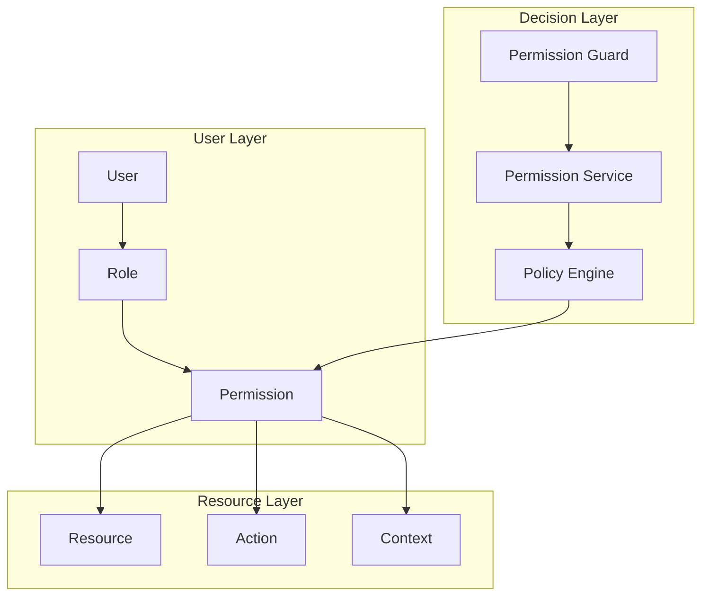

# Guide des Patterns de Permissions ROMAPI

Ce guide détaille les patterns d'utilisation du système de permissions RBAC (Role-Based Access Control) de ROMAPI, avec des exemples concrets et des bonnes pratiques.

## Table des Matières

1. [Vue d'ensemble du Système RBAC](#vue-densemble-du-système-rbac)
2. [Structure des Permissions](#structure-des-permissions)
3. [Patterns de Base](#patterns-de-base)
4. [Patterns Avancés](#patterns-avancés)
5. [Gestion des Rôles](#gestion-des-rôles)
6. [Permissions Dynamiques](#permissions-dynamiques)
7. [Cas d'Usage Métier](#cas-dusage-métier)
8. [Bonnes Pratiques](#bonnes-pratiques)
9. [Exemples d'Implémentation](#exemples-dimplémentation)

## Vue d'ensemble du Système RBAC

### Architecture des Permissions



### Composants du Système

- **User**: Utilisateur du système
- **Role**: Rôle assigné à l'utilisateur (USER, ADMIN, SUPER_ADMIN)
- **Permission**: Permission spécifique (read:users, write:products)
- **Resource**: Ressource protégée (users, products, orders)
- **Action**: Action sur la ressource (read, write, delete)
- **Context**: Contexte d'exécution (ownership, tenant, conditions)

## Structure des Permissions

### Format des Permissions

Les permissions suivent le format : `action:resource:scope`

```typescript
// Exemples de permissions
'read:users'           // Lire les utilisateurs
'write:products'       // Écrire les produits
'delete:orders:own'    // Supprimer ses propres commandes
'admin:*'              // Toutes les permissions admin
'*:users:tenant'       // Toutes les actions sur les utilisateurs du tenant
```

### Hiérarchie des Permissions

```typescript
// Permissions hiérarchiques
const PERMISSION_HIERARCHY = {
  'admin:*': [
    'read:*',
    'write:*',
    'delete:*',
    'manage:*'
  ],
  'manage:users': [
    'read:users',
    'write:users',
    'delete:users'
  ],
  'write:products': [
    'read:products'
  ]
};
```

### Scopes de Permissions

```typescript
enum PermissionScope {
  GLOBAL = 'global',    // Accès global
  TENANT = 'tenant',    // Accès au tenant
  OWN = 'own',         // Accès aux ressources propres
  TEAM = 'team',       // Accès à l'équipe
  DEPARTMENT = 'dept'   // Accès au département
}
```

## Patterns de Base

### 1. Pattern Simple - Vérification Directe

```typescript
// Décorateur simple
@Controller('users')
export class UsersController {
  
  @Get()
  @RequirePermissions('read:users')
  listUsers() {
    return this.usersService.findAll();
  }

  @Post()
  @RequirePermissions('write:users')
  createUser(@Body() createUserDto: CreateUserDto) {
    return this.usersService.create(createUserDto);
  }

  @Delete(':id')
  @RequirePermissions('delete:users')
  deleteUser(@Param('id') id: string) {
    return this.usersService.delete(id);
  }
}
```

### 2. Pattern Multiple - Permissions Alternatives

```typescript
// Plusieurs permissions possibles (OR)
@Controller('reports')
export class ReportsController {
  
  @Get('sales')
  @RequirePermissions(['read:reports:sales', 'admin:reports'])
  getSalesReport() {
    // Accessible avec read:reports:sales OU admin:reports
    return this.reportsService.getSalesReport();
  }
}
```

### 3. Pattern Combiné - Permissions Requises

```typescript
// Toutes les permissions requises (AND)
@Controller('admin')
export class AdminController {
  
  @Post('system/backup')
  @RequirePermissions(['admin:system', 'write:backups'], { operator: 'AND' })
  createBackup() {
    // Nécessite admin:system ET write:backups
    return this.systemService.createBackup();
  }
}
```

### 4. Pattern Conditionnel - Permissions Contextuelles

```typescript
// Permissions basées sur le contexte
@Controller('documents')
export class DocumentsController {
  
  @Get(':id')
  @RequirePermissions('read:documents')
  @CheckOwnership() // Vérification supplémentaire
  getDocument(@Param('id') id: string, @Req() req: AuthenticatedRequest) {
    return this.documentsService.findOne(id, req.user.id);
  }
}
```

## Patterns Avancés

### 1. Pattern Ownership - Ressources Propres

```typescript
// Guard personnalisé pour l'ownership
@Injectable()
export class OwnershipGuard implements CanActivate {
  constructor(
    private readonly permissionService: PermissionService,
    private readonly reflector: Reflector
  ) {}

  async canActivate(context: ExecutionContext): Promise<boolean> {
    const request = context.switchToHttp().getRequest();
    const user = request.user;
    const resourceId = request.params.id;
    
    // Vérifier si l'utilisateur est propriétaire
    const isOwner = await this.checkOwnership(user.id, resourceId);
    
    if (isOwner) {
      return true;
    }
    
    // Sinon, vérifier les permissions globales
    const requiredPermissions = this.reflector.get<string[]>('permissions', context.getHandler());
    return this.permissionService.hasPermissions(user, requiredPermissions);
  }

  private async checkOwnership(userId: string, resourceId: string): Promise<boolean> {
    // Logique de vérification d'ownership
    return true; // Implémentation spécifique
  }
}

// Utilisation
@Controller('posts')
export class PostsController {
  
  @Put(':id')
  @UseGuards(OwnershipGuard)
  @RequirePermissions(['write:posts:own', 'admin:posts'])
  updatePost(@Param('id') id: string, @Body() updateDto: UpdatePostDto, @Req() req: AuthenticatedRequest) {
    // Accessible si propriétaire OU admin
    return this.postsService.update(id, updateDto, req.user.id);
  }
}
```

### 2. Pattern Tenant - Multi-tenancy

```typescript
// Guard pour multi-tenancy
@Injectable()
export class TenantGuard implements CanActivate {
  constructor(private readonly permissionService: PermissionService) {}

  async canActivate(context: ExecutionContext): Promise<boolean> {
    const request = context.switchToHttp().getRequest();
    const user = request.user;
    const tenantId = request.headers['x-tenant-id'] || user.tenantId;
    
    // Vérifier l'accès au tenant
    const hasAccess = await this.permissionService.hasTenantAccess(user.id, tenantId);
    
    if (hasAccess) {
      request.tenantId = tenantId;
      return true;
    }
    
    return false;
  }
}

// Utilisation
@Controller('tenant-data')
@UseGuards(TenantGuard)
export class TenantDataController {
  
  @Get()
  @RequirePermissions('read:data:tenant')
  getTenantData(@Req() req: AuthenticatedRequest) {
    return this.dataService.findByTenant(req.tenantId);
  }
}
```

### 3. Pattern Hiérarchique - Permissions Héritées

```typescript
// Service de permissions hiérarchiques
@Injectable()
export class HierarchicalPermissionService {
  private readonly hierarchy = {
    'admin:*': ['manage:*', 'read:*', 'write:*', 'delete:*'],
    'manage:users': ['read:users', 'write:users', 'delete:users'],
    'write:users': ['read:users'],
    'manage:products': ['read:products', 'write:products', 'delete:products'],
    'write:products': ['read:products']
  };

  hasPermission(userPermissions: string[], requiredPermission: string): boolean {
    // Vérification directe
    if (userPermissions.includes(requiredPermission)) {
      return true;
    }

    // Vérification hiérarchique
    for (const userPerm of userPermissions) {
      if (this.inheritsPermission(userPerm, requiredPermission)) {
        return true;
      }
    }

    return false;
  }

  private inheritsPermission(parentPermission: string, childPermission: string): boolean {
    const children = this.hierarchy[parentPermission] || [];
    
    if (children.includes(childPermission)) {
      return true;
    }

    // Vérification récursive
    for (const child of children) {
      if (this.inheritsPermission(child, childPermission)) {
        return true;
      }
    }

    return false;
  }
}
```

### 4. Pattern Temporel - Permissions Temporaires

```typescript
// Permissions avec expiration
interface TemporalPermission {
  permission: string;
  expiresAt: Date;
  grantedBy: string;
  context?: any;
}

@Injectable()
export class TemporalPermissionService {
  async grantTemporaryPermission(
    userId: string,
    permission: string,
    duration: number,
    grantedBy: string
  ): Promise<void> {
    const expiresAt = new Date(Date.now() + duration);
    
    await this.temporalPermissionRepository.create({
      userId,
      permission,
      expiresAt,
      grantedBy
    });
  }

  async hasTemporaryPermission(userId: string, permission: string): Promise<boolean> {
    const tempPerm = await this.temporalPermissionRepository.findActive(userId, permission);
    return !!tempPerm && tempPerm.expiresAt > new Date();
  }

  async revokeTemporaryPermission(userId: string, permission: string): Promise<void> {
    await this.temporalPermissionRepository.revoke(userId, permission);
  }
}

// Guard avec permissions temporaires
@Injectable()
export class TemporalPermissionGuard implements CanActivate {
  constructor(
    private readonly permissionService: PermissionService,
    private readonly temporalPermissionService: TemporalPermissionService
  ) {}

  async canActivate(context: ExecutionContext): Promise<boolean> {
    const request = context.switchToHttp().getRequest();
    const user = request.user;
    const requiredPermissions = this.getRequiredPermissions(context);

    // Vérifier permissions permanentes
    const hasPermanent = await this.permissionService.hasPermissions(user, requiredPermissions);
    if (hasPermanent) {
      return true;
    }

    // Vérifier permissions temporaires
    for (const permission of requiredPermissions) {
      const hasTemporary = await this.temporalPermissionService.hasTemporaryPermission(
        user.id,
        permission
      );
      if (hasTemporary) {
        return true;
      }
    }

    return false;
  }
}
```

## Gestion des Rôles

### 1. Rôles Statiques

```typescript
enum UserRole {
  USER = 'USER',
  MODERATOR = 'MODERATOR',
  ADMIN = 'ADMIN',
  SUPER_ADMIN = 'SUPER_ADMIN'
}

const ROLE_PERMISSIONS = {
  [UserRole.USER]: [
    'read:profile',
    'write:profile',
    'read:products',
    'write:orders:own'
  ],
  [UserRole.MODERATOR]: [
    ...ROLE_PERMISSIONS[UserRole.USER],
    'read:users',
    'moderate:content',
    'write:products'
  ],
  [UserRole.ADMIN]: [
    ...ROLE_PERMISSIONS[UserRole.MODERATOR],
    'write:users',
    'delete:users',
    'read:analytics',
    'manage:system'
  ],
  [UserRole.SUPER_ADMIN]: [
    'admin:*' // Toutes les permissions
  ]
};
```

### 2. Rôles Dynamiques

```typescript
// Modèle de rôle dynamique
interface DynamicRole {
  id: string;
  name: string;
  description: string;
  permissions: string[];
  isActive: boolean;
  createdBy: string;
  createdAt: Date;
  updatedAt: Date;
}

@Injectable()
export class DynamicRoleService {
  async createRole(createRoleDto: CreateRoleDto): Promise<DynamicRole> {
    // Valider les permissions
    const validPermissions = await this.validatePermissions(createRoleDto.permissions);
    
    return this.roleRepository.create({
      ...createRoleDto,
      permissions: validPermissions
    });
  }

  async assignRoleToUser(userId: string, roleId: string): Promise<void> {
    const role = await this.roleRepository.findById(roleId);
    if (!role || !role.isActive) {
      throw new NotFoundException('Role not found or inactive');
    }

    await this.userRoleRepository.create({ userId, roleId });
    
    // Invalider le cache des permissions utilisateur
    await this.permissionService.invalidateUserPermissions(userId);
  }

  async getUserRoles(userId: string): Promise<DynamicRole[]> {
    return this.roleRepository.findByUserId(userId);
  }
}
```

### 3. Rôles Contextuels

```typescript
// Rôles basés sur le contexte
interface ContextualRole {
  userId: string;
  role: string;
  context: {
    type: 'project' | 'team' | 'department';
    id: string;
  };
  permissions: string[];
  expiresAt?: Date;
}

@Injectable()
export class ContextualRoleService {
  async assignContextualRole(
    userId: string,
    role: string,
    context: { type: string; id: string },
    permissions: string[]
  ): Promise<void> {
    await this.contextualRoleRepository.create({
      userId,
      role,
      context,
      permissions
    });
  }

  async getUserContextualPermissions(
    userId: string,
    context: { type: string; id: string }
  ): Promise<string[]> {
    const roles = await this.contextualRoleRepository.findByUserAndContext(userId, context);
    
    return roles.reduce((permissions, role) => {
      return [...permissions, ...role.permissions];
    }, []);
  }
}
```

## Permissions Dynamiques

### 1. Permissions Basées sur les Attributs

```typescript
// ABAC (Attribute-Based Access Control)
interface AttributeBasedRule {
  id: string;
  name: string;
  resource: string;
  action: string;
  conditions: {
    userAttributes?: Record<string, any>;
    resourceAttributes?: Record<string, any>;
    environmentAttributes?: Record<string, any>;
  };
  effect: 'ALLOW' | 'DENY';
}

@Injectable()
export class ABACService {
  async evaluateAccess(
    user: any,
    resource: any,
    action: string,
    environment: any
  ): Promise<boolean> {
    const rules = await this.getRulesForResource(resource.type, action);
    
    for (const rule of rules) {
      const matches = this.evaluateRule(rule, user, resource, environment);
      
      if (matches) {
        return rule.effect === 'ALLOW';
      }
    }
    
    return false; // Deny by default
  }

  private evaluateRule(
    rule: AttributeBasedRule,
    user: any,
    resource: any,
    environment: any
  ): boolean {
    // Évaluer les conditions utilisateur
    if (rule.conditions.userAttributes) {
      if (!this.matchesAttributes(user, rule.conditions.userAttributes)) {
        return false;
      }
    }

    // Évaluer les conditions ressource
    if (rule.conditions.resourceAttributes) {
      if (!this.matchesAttributes(resource, rule.conditions.resourceAttributes)) {
        return false;
      }
    }

    // Évaluer les conditions environnement
    if (rule.conditions.environmentAttributes) {
      if (!this.matchesAttributes(environment, rule.conditions.environmentAttributes)) {
        return false;
      }
    }

    return true;
  }

  private matchesAttributes(object: any, conditions: Record<string, any>): boolean {
    for (const [key, expectedValue] of Object.entries(conditions)) {
      const actualValue = this.getNestedValue(object, key);
      
      if (!this.compareValues(actualValue, expectedValue)) {
        return false;
      }
    }
    
    return true;
  }
}
```

### 2. Permissions Basées sur les Politiques

```typescript
// Policy-Based Access Control
interface AccessPolicy {
  id: string;
  name: string;
  description: string;
  rules: PolicyRule[];
  isActive: boolean;
}

interface PolicyRule {
  condition: string; // Expression JavaScript
  effect: 'ALLOW' | 'DENY';
  priority: number;
}

@Injectable()
export class PolicyBasedPermissionService {
  async evaluatePolicy(
    policyId: string,
    context: {
      user: any;
      resource: any;
      action: string;
      environment: any;
    }
  ): Promise<boolean> {
    const policy = await this.policyRepository.findById(policyId);
    if (!policy || !policy.isActive) {
      return false;
    }

    // Trier les règles par priorité
    const sortedRules = policy.rules.sort((a, b) => b.priority - a.priority);

    for (const rule of sortedRules) {
      const matches = await this.evaluateRuleCondition(rule.condition, context);
      
      if (matches) {
        return rule.effect === 'ALLOW';
      }
    }

    return false;
  }

  private async evaluateRuleCondition(
    condition: string,
    context: any
  ): Promise<boolean> {
    try {
      // Utiliser un moteur d'évaluation sécurisé (ex: vm2)
      const { VM } = require('vm2');
      const vm = new VM({
        timeout: 1000,
        sandbox: {
          user: context.user,
          resource: context.resource,
          action: context.action,
          environment: context.environment,
          // Fonctions utilitaires
          hasRole: (role: string) => context.user.roles?.includes(role),
          isOwner: () => context.resource.ownerId === context.user.id,
          inTimeRange: (start: string, end: string) => {
            const now = new Date();
            return now >= new Date(start) && now <= new Date(end);
          }
        }
      });

      return vm.run(condition);
    } catch (error) {
      console.error('Policy evaluation error:', error);
      return false;
    }
  }
}

// Exemples de conditions de politique
const POLICY_CONDITIONS = {
  // Accès pendant les heures de bureau
  businessHours: `
    const now = new Date();
    const hour = now.getHours();
    return hour >= 9 && hour <= 17;
  `,
  
  // Propriétaire ou admin
  ownerOrAdmin: `
    return isOwner() || hasRole('ADMIN');
  `,
  
  // Accès basé sur le département
  departmentAccess: `
    return user.department === resource.department || hasRole('MANAGER');
  `,
  
  // Accès temporaire
  temporaryAccess: `
    return inTimeRange('2024-01-01', '2024-12-31');
  `
};
```

## Cas d'Usage Métier

### 1. E-commerce - Gestion des Produits

```typescript
@Controller('products')
export class ProductsController {
  
  // Lecture publique des produits
  @Get()
  @Public() // Pas d'authentification requise
  getProducts(@Query() query: GetProductsDto) {
    return this.productsService.findAll(query);
  }

  // Création de produit - Vendeurs et admins
  @Post()
  @RequirePermissions(['write:products:own', 'admin:products'])
  createProduct(@Body() createDto: CreateProductDto, @Req() req: AuthenticatedRequest) {
    return this.productsService.create(createDto, req.user.id);
  }

  // Modification - Propriétaire ou admin
  @Put(':id')
  @UseGuards(OwnershipGuard)
  @RequirePermissions(['write:products:own', 'admin:products'])
  updateProduct(@Param('id') id: string, @Body() updateDto: UpdateProductDto) {
    return this.productsService.update(id, updateDto);
  }

  // Suppression - Admin uniquement
  @Delete(':id')
  @RequirePermissions('admin:products')
  deleteProduct(@Param('id') id: string) {
    return this.productsService.delete(id);
  }

  // Modération - Modérateurs et admins
  @Post(':id/moderate')
  @RequirePermissions(['moderate:products', 'admin:products'])
  moderateProduct(@Param('id') id: string, @Body() moderateDto: ModerateProductDto) {
    return this.productsService.moderate(id, moderateDto);
  }
}
```

### 2. CRM - Gestion des Clients

```typescript
@Controller('customers')
export class CustomersController {
  
  // Liste des clients - Équipe commerciale
  @Get()
  @RequirePermissions(['read:customers', 'sales:read'])
  getCustomers(@Query() query: GetCustomersDto, @Req() req: AuthenticatedRequest) {
    // Filtrer par territoire si pas admin
    const hasAdminAccess = req.user.permissions.includes('admin:customers');
    return this.customersService.findAll(query, hasAdminAccess ? null : req.user.territory);
  }

  // Création de client - Commercial assigné
  @Post()
  @RequirePermissions('write:customers')
  createCustomer(@Body() createDto: CreateCustomerDto, @Req() req: AuthenticatedRequest) {
    return this.customersService.create({
      ...createDto,
      assignedTo: req.user.id
    });
  }

  // Modification - Propriétaire, manager ou admin
  @Put(':id')
  @UseGuards(CustomerAccessGuard) // Guard personnalisé
  @RequirePermissions(['write:customers:own', 'manage:customers', 'admin:customers'])
  updateCustomer(@Param('id') id: string, @Body() updateDto: UpdateCustomerDto) {
    return this.customersService.update(id, updateDto);
  }

  // Données sensibles - Manager et admin uniquement
  @Get(':id/financial')
  @RequirePermissions(['read:customers:financial', 'admin:customers'])
  getCustomerFinancialData(@Param('id') id: string) {
    return this.customersService.getFinancialData(id);
  }
}

// Guard personnalisé pour l'accès client
@Injectable()
export class CustomerAccessGuard implements CanActivate {
  constructor(private readonly customersService: CustomersService) {}

  async canActivate(context: ExecutionContext): Promise<boolean> {
    const request = context.switchToHttp().getRequest();
    const user = request.user;
    const customerId = request.params.id;

    // Admin a accès à tout
    if (user.permissions.includes('admin:customers')) {
      return true;
    }

    // Manager a accès à son équipe
    if (user.permissions.includes('manage:customers')) {
      const customer = await this.customersService.findOne(customerId);
      return customer.assignedTo === user.id || user.teamMembers.includes(customer.assignedTo);
    }

    // Commercial a accès à ses clients
    const customer = await this.customersService.findOne(customerId);
    return customer.assignedTo === user.id;
  }
}
```

### 3. Plateforme de Contenu - Gestion des Articles

```typescript
@Controller('articles')
export class ArticlesController {
  
  // Lecture publique des articles publiés
  @Get()
  @Public()
  getPublishedArticles(@Query() query: GetArticlesDto) {
    return this.articlesService.findPublished(query);
  }

  // Brouillons - Auteur uniquement
  @Get('drafts')
  @RequirePermissions('read:articles:own')
  getDrafts(@Req() req: AuthenticatedRequest) {
    return this.articlesService.findDrafts(req.user.id);
  }

  // Création d'article - Auteurs
  @Post()
  @RequirePermissions('write:articles')
  createArticle(@Body() createDto: CreateArticleDto, @Req() req: AuthenticatedRequest) {
    return this.articlesService.create({
      ...createDto,
      authorId: req.user.id,
      status: 'DRAFT'
    });
  }

  // Modification - Auteur ou éditeur
  @Put(':id')
  @UseGuards(ArticleAccessGuard)
  @RequirePermissions(['write:articles:own', 'edit:articles'])
  updateArticle(@Param('id') id: string, @Body() updateDto: UpdateArticleDto) {
    return this.articlesService.update(id, updateDto);
  }

  // Publication - Éditeurs et admins
  @Post(':id/publish')
  @RequirePermissions(['publish:articles', 'admin:articles'])
  publishArticle(@Param('id') id: string) {
    return this.articlesService.publish(id);
  }

  // Modération - Modérateurs
  @Post(':id/moderate')
  @RequirePermissions(['moderate:articles', 'admin:articles'])
  moderateArticle(@Param('id') id: string, @Body() moderateDto: ModerateArticleDto) {
    return this.articlesService.moderate(id, moderateDto);
  }
}
```

## Bonnes Pratiques

### 1. Principe du Moindre Privilège

```typescript
// ❌ Mauvais - Permissions trop larges
@RequirePermissions('admin:*')
getUserProfile() {
  // Fonction qui ne nécessite que la lecture du profil
}

// ✅ Bon - Permissions spécifiques
@RequirePermissions('read:profile')
getUserProfile() {
  // Permission minimale nécessaire
}
```

### 2. Séparation des Préoccupations

```typescript
// ✅ Séparer les permissions par domaine métier
const USER_PERMISSIONS = {
  READ_PROFILE: 'read:users:profile',
  WRITE_PROFILE: 'write:users:profile',
  READ_USERS: 'read:users:list',
  MANAGE_USERS: 'manage:users'
};

const PRODUCT_PERMISSIONS = {
  READ_PRODUCTS: 'read:products',
  WRITE_PRODUCTS: 'write:products',
  MANAGE_PRODUCTS: 'manage:products'
};
```

### 3. Gestion des Erreurs

```typescript
// Guard avec gestion d'erreurs détaillée
@Injectable()
export class DetailedPermissionGuard implements CanActivate {
  async canActivate(context: ExecutionContext): Promise<boolean> {
    try {
      const hasPermission = await this.checkPermissions(context);
      
      if (!hasPermission) {
        const requiredPermissions = this.getRequiredPermissions(context);
        const userPermissions = this.getUserPermissions(context);
        
        throw new ForbiddenException({
          message: 'Insufficient permissions',
          required: requiredPermissions,
          available: userPermissions,
          suggestion: this.suggestAlternativePermissions(requiredPermissions)
        });
      }
      
      return true;
    } catch (error) {
      if (error instanceof ForbiddenException) {
        throw error;
      }
      
      // Log l'erreur pour debug
      this.logger.error('Permission check failed', error);
      throw new InternalServerErrorException('Permission check failed');
    }
  }
}
```

### 4. Cache des Permissions

```typescript
@Injectable()
export class CachedPermissionService {
  constructor(
    @Inject('REDIS_CLIENT') private readonly redis: Redis,
    private readonly permissionService: PermissionService
  ) {}

  async getUserPermissions(userId: string): Promise<string[]> {
    const cacheKey = `permissions:${userId}`;
    
    // Vérifier le cache
    const cached = await this.redis.get(cacheKey);
    if (cached) {
      return JSON.parse(cached);
    }

    // Récupérer depuis la base de données
    const permissions = await this.permissionService.getUserPermissions(userId);
    
    // Mettre en cache pour 5 minutes
    await this.redis.setex(cacheKey, 300, JSON.stringify(permissions));
    
    return permissions;
  }

  async invalidateUserPermissions(userId: string): Promise<void> {
    const cacheKey = `permissions:${userId}`;
    await this.redis.del(cacheKey);
  }
}
```

### 5. Audit des Permissions

```typescript
@Injectable()
export class PermissionAuditService {
  async logPermissionCheck(
    userId: string,
    requiredPermissions: string[],
    granted: boolean,
    context?: any
  ): Promise<void> {
    await this.auditRepository.create({
      userId,
      action: 'PERMISSION_CHECK',
      details: {
        requiredPermissions,
        granted,
        context,
        timestamp: new Date(),
        ip: context?.ip,
        userAgent: context?.userAgent
      }
    });
  }

  async getPermissionUsageStats(timeRange: { start: Date; end: Date }): Promise<any> {
    return this.auditRepository.getPermissionStats(timeRange);
  }

  async detectUnusedPermissions(): Promise<string[]> {
    const allPermissions = await this.permissionService.getAllPermissions();
    const usedPermissions = await this.auditRepository.getUsedPermissions();
    
    return allPermissions.filter(perm => !usedPermissions.includes(perm));
  }
}
```

## Exemples d'Implémentation

### 1. Système de Permissions Complet

```typescript
// permission.module.ts
@Module({
  imports: [
    TypeOrmModule.forFeature([User, Role, Permission, UserRole]),
    RedisModule,
  ],
  providers: [
    PermissionService,
    PermissionGuard,
    CachedPermissionService,
    PermissionAuditService,
    HierarchicalPermissionService,
    ABACService,
    PolicyBasedPermissionService,
  ],
  exports: [
    PermissionService,
    PermissionGuard,
    CachedPermissionService,
  ],
})
export class PermissionModule {}
```

### 2. Configuration des Permissions par Défaut

```typescript
// permission.config.ts
export const DEFAULT_PERMISSIONS = {
  USER: [
    'read:profile',
    'write:profile',
    'read:products',
    'write:orders:own',
    'read:orders:own'
  ],
  MODERATOR: [
    'moderate:content',
    'read:users:basic',
    'write:products',
    'read:reports:basic'
  ],
  ADMIN: [
    'admin:users',
    'admin:products',
    'admin:orders',
    'read:analytics',
    'write:system:config'
  ],
  SUPER_ADMIN: [
    'admin:*'
  ]
};

export const PERMISSION_DESCRIPTIONS = {
  'read:profile': 'Lire son propre profil',
  'write:profile': 'Modifier son propre profil',
  'read:users': 'Lire la liste des utilisateurs',
  'write:users': 'Créer et modifier des utilisateurs',
  'delete:users': 'Supprimer des utilisateurs',
  'admin:users': 'Administration complète des utilisateurs',
  // ... autres descriptions
};
```

### 3. Tests des Permissions

```typescript
// permission.service.spec.ts
describe('PermissionService', () => {
  let service: PermissionService;

  beforeEach(async () => {
    const module = await Test.createTestingModule({
      providers: [PermissionService],
    }).compile();

    service = module.get<PermissionService>(PermissionService);
  });

  describe('hasPermission', () => {
    it('should return true for exact permission match', () => {
      const userPermissions = ['read:users', 'write:products'];
      const result = service.hasPermission(userPermissions, 'read:users');
      expect(result).toBe(true);
    });

    it('should return true for wildcard permission', () => {
      const userPermissions = ['admin:*'];
      const result = service.hasPermission(userPermissions, 'read:users');
      expect(result).toBe(true);
    });

    it('should return true for hierarchical permission', () => {
      const userPermissions = ['manage:users'];
      const result = service.hasPermission(userPermissions, 'read:users');
      expect(result).toBe(true);
    });

    it('should return false for insufficient permissions', () => {
      const userPermissions = ['read:products'];
      const result = service.hasPermission(userPermissions, 'write:users');
      expect(result).toBe(false);
    });
  });
});
```

Ce guide fournit une base complète pour implémenter et utiliser efficacement le système de permissions RBAC de ROMAPI, avec des patterns adaptés à différents cas d'usage métier et des bonnes pratiques de sécurité.