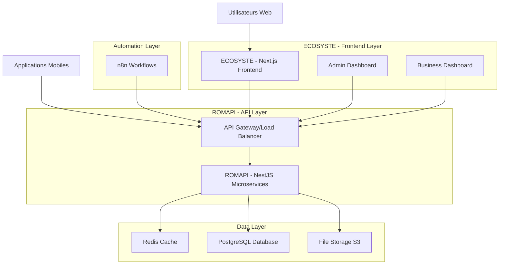
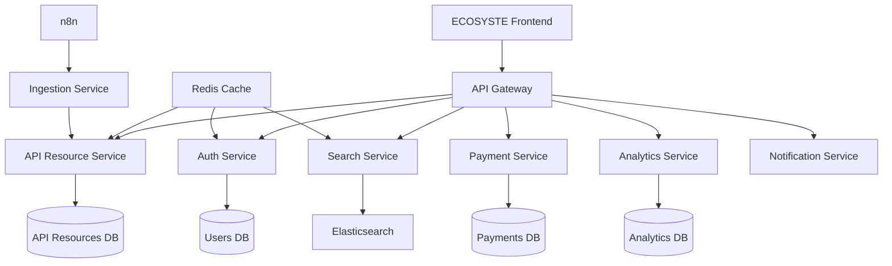

# Architecture Technique - ECOSYSTE/ROMAPI

## 1. Architecture Globale

### 1.1 Vue d'ensemble du système

**ECOSYSTE** est l'interface web frontend qui permet aux utilisateurs de parcourir l'écosystème d'API, similaire à RapidAPI. **ROMAPI** est le backend qui gère l'écosystème d'API et les ressources.



### 1.2 Architecture Microservices ROMAPI



## 2. Stack Technologique

### 2.1 Backend

* **Framework** : NestJS 10+ (TypeScript)

* **ORM** : Prisma 5+

* **Base de données** : PostgreSQL 15+

* **Cache** : Redis 7+

* **Queue** : Bull/BullMQ

* **Auth** : JWT + OAuth2

* **Documentation** : Swagger/OpenAPI 3.0

### 2.2 Frontend

* **Framework** : Next.js 14+ (App Router)

* **UI Library** : Tailwind CSS + Shadcn/ui

* **State Management** : Zustand

* **Forms** : React Hook Form + Zod

* **HTTP Client** : Axios/Fetch

### 2.3 Infrastructure

* **Containerisation** : Docker + Docker Compose

* **Orchestration** : Kubernetes (production)

* **CI/CD** : GitHub Actions

* **Monitoring** : Prometheus + Grafana

* **Logs** : ELK Stack (Elasticsearch, Logstash, Kibana)

### 2.4 Automation

* **Workflow Engine** : n8n

* **Scraping** : Puppeteer + Playwright

* **Scheduling** : Cron jobs + Bull Queue

## 3. Microservices Détaillés

### 3.1 Auth Service

**Responsabilités** :

* Authentification utilisateurs (JWT)

* Gestion des API Keys

* OAuth2 pour intégrations partenaires

* Rate limiting par utilisateur/API key

**Endpoints** :

```typescript
POST /auth/login
POST /auth/register
POST /auth/refresh
POST /auth/api-keys
GET /auth/me
```

**Technologies** :

* NestJS + Passport

* JWT + Redis pour sessions

* bcrypt pour hashing

### 3.2 API Resource Service

**Responsabilités** :

* CRUD des ressources API (entreprises, services, données)

* Gestion des catégories de ressources

* Validation et enrichissement des données

* Géolocalisation et métadonnées

**Endpoints** :

```typescript
GET /api-resources
GET /api-resources/:id
POST /api-resources
PUT /api-resources/:id
DELETE /api-resources/:id
POST /api-resources/ingest
GET /categories
GET /businesses  // Alias pour compatibilité
```

**Modèle de données** :

```typescript
interface APIResource {
  id: string;
  name: string;
  description: string;
  category: Category;
  resourceType: 'business' | 'service' | 'data';
  address: Address;
  contact: Contact;
  hours: OpeningHours[];
  images: string[];
  status: 'active' | 'pending' | 'suspended';
  plan: 'free' | 'premium' | 'featured';
  metadata: Record<string, any>;
  createdAt: Date;
  updatedAt: Date;
}

// Alias pour compatibilité
type Business = APIResource & { resourceType: 'business' };
```

### 3.3 Search Service

**Responsabilités** :

* Recherche textuelle avancée

* Filtres géographiques

* Suggestions auto-complete

* Indexation Elasticsearch

**Endpoints** :

```typescript
GET /search?q=query&category=cat&location=loc
GET /search/suggestions?q=query
GET /search/nearby?lat=lat&lng=lng&radius=radius
```

### 3.4 Payment Service

**Responsabilités** :

* Gestion des abonnements

* Paiements Mobile Money

* Facturation automatique

* Webhooks paiements

**Endpoints** :

```typescript
POST /payments/subscribe
POST /payments/mobile-money
GET /payments/invoices
POST /payments/webhooks
```

### 3.5 Analytics Service

**Responsabilités** :

* Tracking des vues/clics

* Métriques business

* Rapports personnalisés

* Export de données

**Endpoints** :

```typescript
POST /analytics/track
GET /analytics/dashboard/:businessId
GET /analytics/reports
```

## 4. Base de Données

### 4.1 Schéma PostgreSQL

```sql
-- Users table
-- Différenciation entre utilisateurs individuels et entreprises lors de l'inscription
-- avec des tarifs et quotas différents selon le type d'utilisateur
CREATE TABLE users (
    id UUID PRIMARY KEY DEFAULT gen_random_uuid(),
    email VARCHAR(255) UNIQUE NOT NULL,
    password_hash VARCHAR(255) NOT NULL,
    name VARCHAR(100) NOT NULL,
    user_type VARCHAR(20) DEFAULT 'individual' CHECK (user_type IN ('individual', 'business', 'admin')),
    plan VARCHAR(20) DEFAULT 'free' CHECK (plan IN ('free', 'pro', 'enterprise')),
    api_quota INTEGER DEFAULT 1000,
    api_usage INTEGER DEFAULT 0,
    -- Tarifs différenciés selon le type d'utilisateur
    pricing_tier VARCHAR(20) DEFAULT 'standard' CHECK (pricing_tier IN ('standard', 'business', 'enterprise')),
    created_at TIMESTAMP WITH TIME ZONE DEFAULT NOW(),
    updated_at TIMESTAMP WITH TIME ZONE DEFAULT NOW()
);

-- Categories table
CREATE TABLE categories (
    id UUID PRIMARY KEY DEFAULT gen_random_uuid(),
    name VARCHAR(100) NOT NULL,
    slug VARCHAR(100) UNIQUE NOT NULL,
    description TEXT,
    icon VARCHAR(50),
    parent_id UUID REFERENCES categories(id),
    created_at TIMESTAMP WITH TIME ZONE DEFAULT NOW()
);

-- API Resources table (remplace businesses pour plus de flexibilité)
-- Inclut entreprises, services et autres ressources de l'écosystème API
CREATE TABLE api_resources (
    id UUID PRIMARY KEY DEFAULT gen_random_uuid(),
    user_id UUID REFERENCES users(id) ON DELETE CASCADE,
    name VARCHAR(200) NOT NULL,
    slug VARCHAR(200) UNIQUE NOT NULL,
    description TEXT,
    resource_type VARCHAR(20) DEFAULT 'business' CHECK (resource_type IN ('business', 'service', 'data', 'api')),
    category_id UUID REFERENCES categories(id),
    
    -- Address
    address_line1 VARCHAR(255),
    address_line2 VARCHAR(255),
    city VARCHAR(100),
    region VARCHAR(100),
    postal_code VARCHAR(20),
    country VARCHAR(2) DEFAULT 'CM',
    latitude DECIMAL(10, 8),
    longitude DECIMAL(11, 8),
    
    -- Contact
    phone VARCHAR(20),
    email VARCHAR(255),
    website VARCHAR(255),
    
    -- Business info
    status VARCHAR(20) DEFAULT 'pending' CHECK (status IN ('active', 'pending', 'suspended')),
    plan VARCHAR(20) DEFAULT 'free' CHECK (plan IN ('free', 'premium', 'featured')),
    verified BOOLEAN DEFAULT FALSE,
    
    -- SEO
    meta_title VARCHAR(255),
    meta_description TEXT,
    
    -- Timestamps
    created_at TIMESTAMP WITH TIME ZONE DEFAULT NOW(),
    updated_at TIMESTAMP WITH TIME ZONE DEFAULT NOW(),
    published_at TIMESTAMP WITH TIME ZONE
);

-- Business hours
CREATE TABLE business_hours (
    id UUID PRIMARY KEY DEFAULT gen_random_uuid(),
    business_id UUID REFERENCES businesses(id) ON DELETE CASCADE,
    day_of_week INTEGER CHECK (day_of_week BETWEEN 0 AND 6), -- 0 = Sunday
    open_time TIME,
    close_time TIME,
    is_closed BOOLEAN DEFAULT FALSE
);

-- Business images
CREATE TABLE business_images (
    id UUID PRIMARY KEY DEFAULT gen_random_uuid(),
    business_id UUID REFERENCES businesses(id) ON DELETE CASCADE,
    url VARCHAR(500) NOT NULL,
    alt_text VARCHAR(255),
    is_primary BOOLEAN DEFAULT FALSE,
    order_index INTEGER DEFAULT 0,
    created_at TIMESTAMP WITH TIME ZONE DEFAULT NOW()
);

-- API Keys
CREATE TABLE api_keys (
    id UUID PRIMARY KEY DEFAULT gen_random_uuid(),
    user_id UUID REFERENCES users(id) ON DELETE CASCADE,
    name VARCHAR(100) NOT NULL,
    key_hash VARCHAR(255) NOT NULL,
    key_prefix VARCHAR(20) NOT NULL,
    permissions JSONB DEFAULT '[]',
    rate_limit INTEGER DEFAULT 1000,
    is_active BOOLEAN DEFAULT TRUE,
    last_used_at TIMESTAMP WITH TIME ZONE,
    expires_at TIMESTAMP WITH TIME ZONE,
    created_at TIMESTAMP WITH TIME ZONE DEFAULT NOW()
);

-- Subscriptions
CREATE TABLE subscriptions (
    id UUID PRIMARY KEY DEFAULT gen_random_uuid(),
    user_id UUID REFERENCES users(id) ON DELETE CASCADE,
    plan VARCHAR(20) NOT NULL,
    status VARCHAR(20) DEFAULT 'active' CHECK (status IN ('active', 'cancelled', 'expired')),
    current_period_start TIMESTAMP WITH TIME ZONE NOT NULL,
    current_period_end TIMESTAMP WITH TIME ZONE NOT NULL,
    created_at TIMESTAMP WITH TIME ZONE DEFAULT NOW(),
    updated_at TIMESTAMP WITH TIME ZONE DEFAULT NOW()
);

-- Analytics events
CREATE TABLE analytics_events (
    id UUID PRIMARY KEY DEFAULT gen_random_uuid(),
    business_id UUID REFERENCES businesses(id) ON DELETE CASCADE,
    event_type VARCHAR(50) NOT NULL, -- 'view', 'click', 'contact'
    user_agent TEXT,
    ip_address INET,
    referrer VARCHAR(500),
    metadata JSONB DEFAULT '{}',
    created_at TIMESTAMP WITH TIME ZONE DEFAULT NOW()
);

-- Indexes
CREATE INDEX idx_businesses_category ON businesses(category_id);
CREATE INDEX idx_businesses_location ON businesses(latitude, longitude);
CREATE INDEX idx_businesses_status_plan ON businesses(status, plan);
CREATE INDEX idx_businesses_created_at ON businesses(created_at DESC);
CREATE INDEX idx_analytics_events_business_created ON analytics_events(business_id, created_at DESC);
CREATE INDEX idx_api_keys_user_active ON api_keys(user_id, is_active);

-- Full text search
CREATE INDEX idx_businesses_search ON businesses USING gin(to_tsvector('french', name || ' ' || COALESCE(description, '')));
```

### 4.2 Prisma Schema

```prisma
generator client {
  provider = "prisma-client-js"
}

datasource db {
  provider = "postgresql"
  url      = env("DATABASE_URL")
}

model User {
  id        String   @id @default(dbgenerated("gen_random_uuid()")) @db.Uuid
  email     String   @unique
  passwordHash String @map("password_hash")
  name      String
  role      Role     @default(USER)
  plan      Plan     @default(FREE)
  apiQuota  Int      @default(1000) @map("api_quota")
  apiUsage  Int      @default(0) @map("api_usage")
  createdAt DateTime @default(now()) @map("created_at")
  updatedAt DateTime @updatedAt @map("updated_at")

  businesses    Business[]
  apiKeys       ApiKey[]
  subscriptions Subscription[]

  @@map("users")
}

model Category {
  id          String   @id @default(dbgenerated("gen_random_uuid()")) @db.Uuid
  name        String
  slug        String   @unique
  description String?
  icon        String?
  parentId    String?  @map("parent_id") @db.Uuid
  createdAt   DateTime @default(now()) @map("created_at")

  parent     Category?  @relation("CategoryHierarchy", fields: [parentId], references: [id])
  children   Category[] @relation("CategoryHierarchy")
  businesses Business[]

  @@map("categories")
}

model Business {
  id          String        @id @default(dbgenerated("gen_random_uuid()")) @db.Uuid
  userId      String        @map("user_id") @db.Uuid
  name        String
  slug        String        @unique
  description String?
  categoryId  String        @map("category_id") @db.Uuid
  
  // Address
  addressLine1 String? @map("address_line1")
  addressLine2 String? @map("address_line2")
  city         String?
  region       String?
  postalCode   String? @map("postal_code")
  country      String  @default("CM")
  latitude     Decimal? @db.Decimal(10, 8)
  longitude    Decimal? @db.Decimal(11, 8)
  
  // Contact
  phone   String?
  email   String?
  website String?
  
  // Business info
  status    BusinessStatus @default(PENDING)
  plan      BusinessPlan   @default(FREE)
  verified  Boolean        @default(false)
  
  // SEO
  metaTitle       String? @map("meta_title")
  metaDescription String? @map("meta_description")
  
  // Timestamps
  createdAt   DateTime  @default(now()) @map("created_at")
  updatedAt   DateTime  @updatedAt @map("updated_at")
  publishedAt DateTime? @map("published_at")

  user            User              @relation(fields: [userId], references: [id], onDelete: Cascade)
  category        Category          @relation(fields: [categoryId], references: [id])
  hours           BusinessHour[]
  images          BusinessImage[]
  analyticsEvents AnalyticsEvent[]

  @@map("businesses")
}

model BusinessHour {
  id         String  @id @default(dbgenerated("gen_random_uuid()")) @db.Uuid
  businessId String  @map("business_id") @db.Uuid
  dayOfWeek  Int     @map("day_of_week")
  openTime   String? @map("open_time") @db.Time
  closeTime  String? @map("close_time") @db.Time
  isClosed   Boolean @default(false) @map("is_closed")

  business Business @relation(fields: [businessId], references: [id], onDelete: Cascade)

  @@map("business_hours")
}

model BusinessImage {
  id         String   @id @default(dbgenerated("gen_random_uuid()")) @db.Uuid
  businessId String   @map("business_id") @db.Uuid
  url        String
  altText    String?  @map("alt_text")
  isPrimary  Boolean  @default(false) @map("is_primary")
  orderIndex Int      @default(0) @map("order_index")
  createdAt  DateTime @default(now()) @map("created_at")

  business Business @relation(fields: [businessId], references: [id], onDelete: Cascade)

  @@map("business_images")
}

enum Role {
  USER
  BUSINESS
  ADMIN
}

enum Plan {
  FREE
  PRO
  ENTERPRISE
}

enum BusinessStatus {
  ACTIVE
  PENDING
  SUSPENDED
}

enum BusinessPlan {
  FREE
  PREMIUM
  FEATURED
}
```

## 5. Configuration Redis

### 5.1 Structure de Cache

```typescript
// Cache keys structure
const CACHE_KEYS = {
  BUSINESS: {
    BY_ID: (id: string) => `business:${id}`,
    BY_SLUG: (slug: string) => `business:slug:${slug}`,
    LIST: (filters: string) => `businesses:list:${filters}`,
    SEARCH: (query: string) => `search:${query}`,
  },
  CATEGORIES: 'categories:all',
  USER: {
    BY_ID: (id: string) => `user:${id}`,
    API_USAGE: (userId: string) => `api:usage:${userId}`,
  },
  RATE_LIMIT: {
    API_KEY: (keyId: string) => `rate_limit:api:${keyId}`,
    IP: (ip: string) => `rate_limit:ip:${ip}`,
  },
};

// Cache TTL (Time To Live)
const CACHE_TTL = {
  BUSINESS: 3600, // 1 hour
  CATEGORIES: 86400, // 24 hours
  SEARCH: 1800, // 30 minutes
  USER: 1800, // 30 minutes
  RATE_LIMIT: 3600, // 1 hour
};
```

### 5.2 Configuration Redis

```typescript
// redis.config.ts
import { RedisOptions } from 'ioredis';

export const redisConfig: RedisOptions = {
  host: process.env.REDIS_HOST || 'localhost',
  port: parseInt(process.env.REDIS_PORT || '6379'),
  password: process.env.REDIS_PASSWORD,
  db: 0,
  retryDelayOnFailover: 100,
  maxRetriesPerRequest: 3,
  lazyConnect: true,
};

// Cache service
@Injectable()
export class CacheService {
  constructor(private readonly redis: Redis) {}

  async get<T>(key: string): Promise<T | null> {
    const value = await this.redis.get(key);
    return value ? JSON.parse(value) : null;
  }

  async set(key: string, value: any, ttl?: number): Promise<void> {
    const serialized = JSON.stringify(value);
    if (ttl) {
      await this.redis.setex(key, ttl, serialized);
    } else {
      await this.redis.set(key, serialized);
    }
  }

  async del(key: string): Promise<void> {
    await this.redis.del(key);
  }

  async invalidatePattern(pattern: string): Promise<void> {
    const keys = await this.redis.keys(pattern);
    if (keys.length > 0) {
      await this.redis.del(...keys);
    }
  }
}
```

## 6. Configuration n8n

### 6.1 Workflow de Scraping

```json
{
  "name": "Business Data Scraping",
  "nodes": [
    {
      "parameters": {
        "url": "={{ $json.source_url }}",
        "options": {
          "waitUntil": "networkidle2"
        }
      },
      "name": "HTTP Request",
      "type": "n8n-nodes-base.httpRequest",
      "position": [250, 300]
    },
    {
      "parameters": {
        "jsCode": "// Parse HTML and extract business data\nconst cheerio = require('cheerio');\nconst $ = cheerio.load($input.first().json.data);\n\nconst businesses = [];\n\n$('.business-item').each((i, element) => {\n  const business = {\n    name: $(element).find('.business-name').text().trim(),\n    address: $(element).find('.business-address').text().trim(),\n    phone: $(element).find('.business-phone').text().trim(),\n    category: $(element).find('.business-category').text().trim(),\n    description: $(element).find('.business-description').text().trim(),\n    website: $(element).find('.business-website').attr('href'),\n    source_url: $input.first().json.url\n  };\n  \n  if (business.name) {\n    businesses.push(business);\n  }\n});\n\nreturn businesses.map(business => ({ json: business }));"
      },
      "name": "Parse HTML",
      "type": "n8n-nodes-base.code",
      "position": [450, 300]
    },
    {
      "parameters": {
        "url": "http://localhost:3000/api/businesses/ingest",
        "options": {
          "headers": {
            "Authorization": "Bearer {{ $env.API_TOKEN }}",
            "Content-Type": "application/json"
          }
        },
        "requestMethod": "POST"
      },
      "name": "Send to API",
      "type": "n8n-nodes-base.httpRequest",
      "position": [650, 300]
    }
  ],
  "connections": {
    "HTTP Request": {
      "main": [
        [
          {
            "node": "Parse HTML",
            "type": "main",
            "index": 0
          }
        ]
      ]
    },
    "Parse HTML": {
      "main": [
        [
          {
            "node": "Send to API",
            "type": "main",
            "index": 0
          }
        ]
      ]
    }
  }
}
```

## 7. Sécurité et Performance

### 7.1 Sécurité

```typescript
// Rate limiting
@Injectable()
export class RateLimitGuard implements CanActivate {
  constructor(private readonly redis: Redis) {}

  async canActivate(context: ExecutionContext): Promise<boolean> {
    const request = context.switchToHttp().getRequest();
    const key = `rate_limit:${request.ip}`;
    
    const current = await this.redis.incr(key);
    if (current === 1) {
      await this.redis.expire(key, 3600); // 1 hour window
    }
    
    return current <= 1000; // 1000 requests per hour
  }
}

// API Key validation
@Injectable()
export class ApiKeyGuard implements CanActivate {
  async canActivate(context: ExecutionContext): Promise<boolean> {
    const request = context.switchToHttp().getRequest();
    const apiKey = request.headers['x-api-key'];
    
    if (!apiKey) return false;
    
    // Validate API key and check quota
    const keyData = await this.validateApiKey(apiKey);
    if (!keyData || keyData.usage >= keyData.quota) {
      return false;
    }
    
    // Increment usage
    await this.incrementApiUsage(keyData.id);
    request.user = keyData.user;
    
    return true;
  }
}
```

### 7.2 Performance

```typescript
// Database connection pooling
const prisma = new PrismaClient({
  datasources: {
    db: {
      url: process.env.DATABASE_URL,
    },
  },
  log: ['query', 'info', 'warn', 'error'],
});

// Query optimization
export class BusinessService {
  async findMany(filters: BusinessFilters) {
    const cacheKey = `businesses:list:${JSON.stringify(filters)}`;
    
    // Try cache first
    const cached = await this.cache.get(cacheKey);
    if (cached) return cached;
    
    // Database query with optimizations
    const businesses = await this.prisma.business.findMany({
      where: {
        status: 'ACTIVE',
        ...(filters.category && { categoryId: filters.category }),
        ...(filters.location && {
          AND: [
            { latitude: { gte: filters.location.minLat } },
            { latitude: { lte: filters.location.maxLat } },
            { longitude: { gte: filters.location.minLng } },
            { longitude: { lte: filters.location.maxLng } },
          ],
        }),
      },
      include: {
        category: true,
        images: {
          where: { isPrimary: true },
          take: 1,
        },
      },
      orderBy: [
        { plan: 'desc' }, // Featured first
        { createdAt: 'desc' },
      ],
      take: filters.limit || 20,
      skip: filters.offset || 0,
    });
    
    // Cache result
    await this.cache.set(cacheKey, businesses, CACHE_TTL.BUSINESS);
    
    return businesses;
  }
}
```

## 8. Monitoring et Observabilité

### 8.1 Métriques Prometheus

```typescript
// metrics.service.ts
import { register, Counter, Histogram, Gauge } from 'prom-client';

export class MetricsService {
  private readonly httpRequestsTotal = new Counter({
    name: 'http_requests_total',
    help: 'Total number of HTTP requests',
    labelNames: ['method', 'route', 'status_code'],
  });

  private readonly httpRequestDuration = new Histogram({
    name: 'http_request_duration_seconds',
    help: 'Duration of HTTP requests in seconds',
    labelNames: ['method', 'route'],
    buckets: [0.1, 0.5, 1, 2, 5],
  });

  private readonly activeConnections = new Gauge({
    name: 'active_connections',
    help: 'Number of active connections',
  });

  private readonly businessesTotal = new Gauge({
    name: 'businesses_total',
    help: 'Total number of businesses',
    labelNames: ['status', 'plan'],
  });

  recordHttpRequest(method: string, route: string, statusCode: number, duration: number) {
    this.httpRequestsTotal.inc({ method, route, status_code: statusCode });
    this.httpRequestDuration.observe({ method, route }, duration);
  }

  async updateBusinessMetrics() {
    const stats = await this.prisma.business.groupBy({
      by: ['status', 'plan'],
      _count: true,
    });

    stats.forEach(stat => {
      this.businessesTotal.set(
        { status: stat.status, plan: stat.plan },
        stat._count
      );
    });
  }

  getMetrics() {
    return register.metrics();
  }
}
```

### 8.2 Configuration Logging

```typescript
// logger.config.ts
import { WinstonModule } from 'nest-winston';
import * as winston from 'winston';

export const loggerConfig = WinstonModule.createLogger({
  transports: [
    new winston.transports.Console({
      format: winston.format.combine(
        winston.format.timestamp(),
        winston.format.colorize(),
        winston.format.printf(({ timestamp, level, message, context, trace }) => {
          return `${timestamp} [${context}] ${level}: ${message}${trace ? `\n${trace}` : ''}`;
        }),
      ),
    }),
    new winston.transports.File({
      filename: 'logs/error.log',
      level: 'error',
      format: winston.format.combine(
        winston.format.timestamp(),
        winston.format.json(),
      ),
    }),
    new winston.transports.File({
      filename: 'logs/combined.log',
      format: winston.format.combine(
        winston.format.timestamp(),
        winston.format.json(),
      ),
    }),
  ],
});
```

## 9. Déploiement

### 9.1 Docker Configuration

```dockerfile
# Dockerfile
FROM node:18-alpine AS builder

WORKDIR /app
COPY package*.json ./
RUN npm ci --only=production

COPY . .
RUN npm run build

FROM node:18-alpine AS runner
WORKDIR /app

RUN addgroup --system --gid 1001 nodejs
RUN adduser --system --uid 1001 nestjs

COPY --from=builder /app/dist ./dist
COPY --from=builder /app/node_modules ./node_modules
COPY --from=builder /app/package.json ./package.json

USER nestjs

EXPOSE 3000

CMD ["node", "dist/main"]
```

```yaml
# docker-compose.yml
version: '3.8'

services:
  app:
    build: .
    ports:
      - "3000:3000"
    environment:
      - DATABASE_URL=postgresql://postgres:password@db:5432/romapi
      - REDIS_URL=redis://redis:6379
    depends_on:
      - db
      - redis
    volumes:
      - ./logs:/app/logs

  db:
    image: postgres:15-alpine
    environment:
      - POSTGRES_DB=romapi
      - POSTGRES_USER=postgres
      - POSTGRES_PASSWORD=password
    volumes:
      - postgres_data:/var/lib/postgresql/data
    ports:
      - "5432:5432"

  redis:
    image: redis:7-alpine
    ports:
      - "6379:6379"
    volumes:
      - redis_data:/data

  n8n:
    image: n8nio/n8n
    ports:
      - "5678:5678"
    environment:
      - N8N_BASIC_AUTH_ACTIVE=true
      - N8N_BASIC_AUTH_USER=admin
      - N8N_BASIC_AUTH_PASSWORD=password
    volumes:
      - n8n_data:/home/node/.n8n

volumes:
  postgres_data:
  redis_data:
  n8n_data:
```

### 9.2 Kubernetes Deployment

```yaml
# k8s/deployment.yaml
apiVersion: apps/v1
kind: Deployment
metadata:
  name: romapi-backend
spec:
  replicas: 3
  selector:
    matchLabels:
      app: romapi-backend
  template:
    metadata:
      labels:
        app: romapi-backend
    spec:
      containers:
      - name: romapi-backend
        image: romapi/backend:latest
        ports:
        - containerPort: 3000
        env:
        - name: DATABASE_URL
          valueFrom:
            secretKeyRef:
              name: romapi-secrets
              key: database-url
        - name: REDIS_URL
          valueFrom:
            secretKeyRef:
              name: romapi-secrets
              key: redis-url
        resources:
          requests:
            memory: "256Mi"
            cpu: "250m"
          limits:
            memory: "512Mi"
            cpu: "500m"
        livenessProbe:
          httpGet:
            path: /health
            port: 3000
          initialDelaySeconds: 30
          periodSeconds: 10
        readinessProbe:
          httpGet:
            path: /health
            port: 3000
          initialDelaySeconds: 5
          periodSeconds: 5
```

## 10. Checklist de Déploiement

### 10.1 Pré-déploiement

* [ ] Tests unitaires et d'intégration passent

* [ ] Variables d'environnement configurées

* [ ] Base de données migrée

* [ ] Cache Redis configuré

* [ ] Certificats SSL en place

* [ ] Monitoring configuré

### 10.2 Post-déploiement

* [ ] Health checks fonctionnels

* [ ] Métriques remontées

* [ ] Logs accessibles

* [ ] Backup automatique configuré

* [ ] Alertes configurées

* [ ] Documentation mise à jour

